# Dermatoglyphics — Reverified Markdown Transcript

This transcript is generated from the scanned PDF page images, with a page image included for every page so figures, tables, and diagrams remain visible.

Source scan: 84 pages.

## Page 1

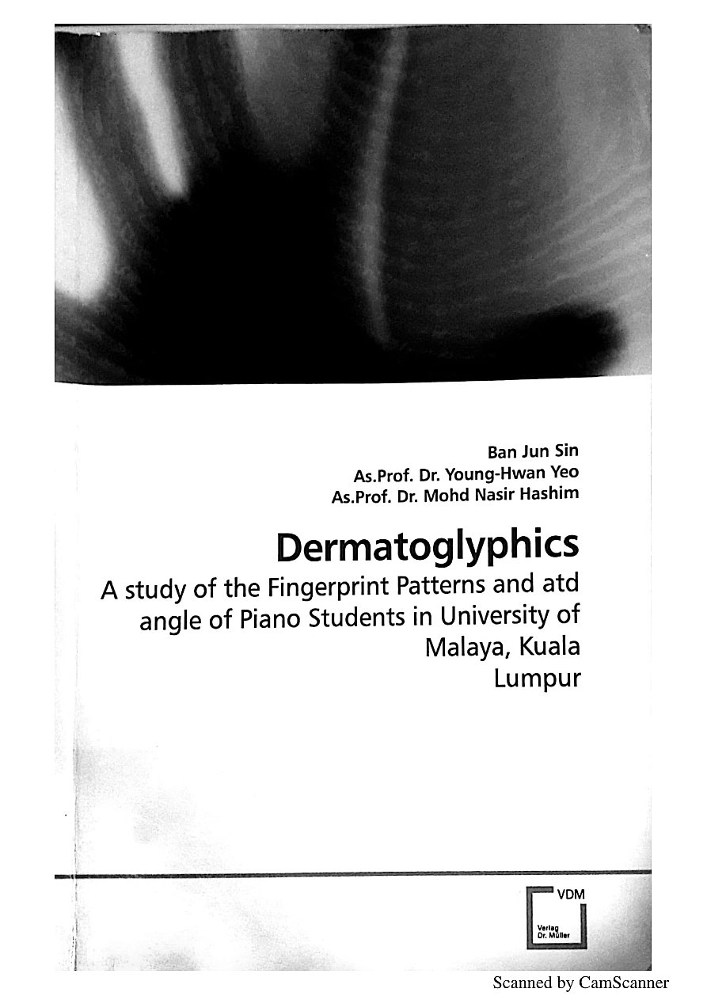

```text
‘ }

al
Ban Jun Sin
As.Prof. Dr. Young-Hwan Yeo
As.Prof. Dr. Mohd Nasir Hashim
Dermatoglyphics
A study of the Fingerprint Patterns and atd
angle of Piano Students in University of
Malaya, Kuala
Lumpur

a
VDM

Scanned by CamScanner
```

## Page 2

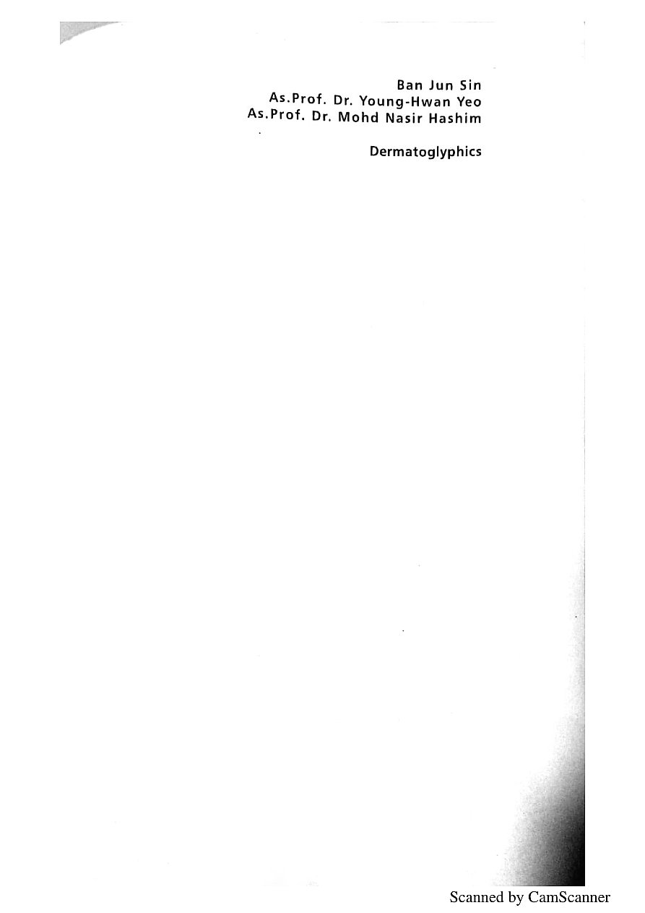

```text
Ban Jun Sin
As.Prof. Dr. Young-Hwan Yeo
As.Prof. Dr, Mohd Nasir Hashim
Dermatoglyphics

Scanned by CamScanner
```

## Page 3

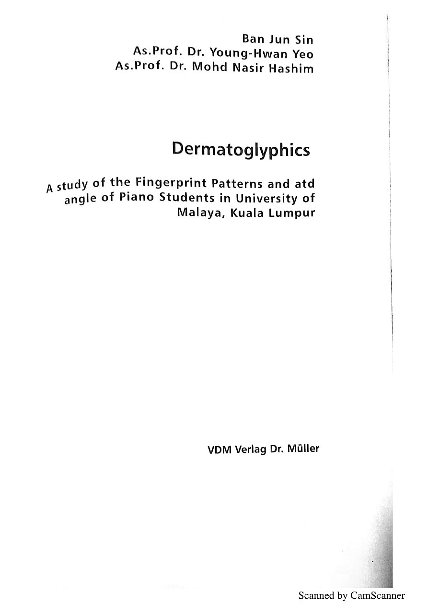

```text
Ban Jun Sin
As.Prof. Dr. Young-Hwan Yeo |
As.Prof. Dr. Mohd Nasir Hashim
Dermatoglyphics
astudy of the Fingerprint Patterns and atd
angle of Piano Students in University of
Malaya, Kuala Lumpur
|
|
|
|
VDM Verlag Dr. Miller
Scanned by CamScanner
```

## Page 4

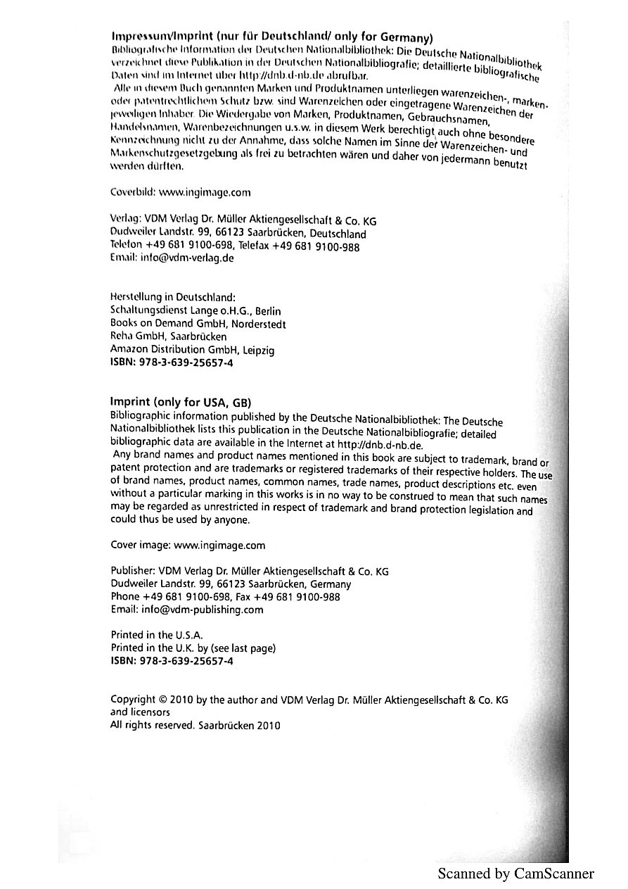

```text
Impressunvimprint (nur fdr Deutschland/ only for Germany)

Bidhograsche tnformation der Deutschen Nationaibliothek: Die Deutsche Nationa

verzeihnel ewe Publiation in ce Deutschen Nationalbibliogratie detaillente hig athe

Daten sind im tnternet uber http Zdnb.d-nb.de abrufbar, OGratische

Alem ever Buch genannten Marken und Produkinamen untrlegen warenzeichen

cater atoaicttichom Sct baw sind Worenzeehen oder cingetragene Warensee aan.

rewaligen Inhaber Die Wiedergabe von Marken, Produktnamen, Gebrauchsnore ne der

Manlelonamen, Warenbezeichnungen u..w. in diesem Werk berechtigt auch ohne beso

Kennzechnung nicht 2u der Annahme, dass sche Namen im Sinne dei Wareneeet tte

Markenschutzgesetzgetaing as rei zu betrachten waren und daher von jedermnona ee

wenden durtten, nutet

Coverbild: wawingimage.com

Verlag: VOM Verlag Dr, Milller Aktiengesellschaft & Co. KG

Oudweiler Landste, 99, 66123 Saarbriicken, Deutschland

Telefon +49 681 9100-698, Telefax +49 681 9100-988

Enmit: into@vdm-verlag.de

Herstellung in Deutschland:

Schaltungsdienst Lange 0.H.6., Berlin

Books on Demand GmbH, Norderstedt

Reha GmbH, Saarbriicken,

Amazon Distribution GmbH, Leipzig |

ISBN: 978-3-639-25657-4

Imprint (only for USA, GB)

Bibliographic information published by the Deutsche Nationalbibliothek: The Deutsche

Nationalbibliothek lists this publication in the Deutsche Nationalbibliografie: detailed

bibliographic data are available in the Internet at httpi/idnb.d-nb de.

Any brand names and product names mentioned in this book are subject to trademark, brand or

patent protection and are trademarks or registered trademarks of their respective holders, The use

of brand names, product names, common names, trade names, product descriptions ete even

without a particular marking in this works isin no way to be construed to mean that such names

may be regarded as unrestricted in respect of trademark and brand protection legislation and

could thus be used by anyone,

Cover image: wwwingimage.com

Publisher: VDM Verlag Dr, Miller Aktiengesellschaft & Co. KG

Dudweiler Landstr. 99, 66123 Saarbriicken, Germany

Phone +49 681 9100-698, Fax +49 681 9100-988

Email: info@vdm-publishing.com

Printed in the U.S.A.

Printed in the UK. by (see last page)

ISBN: 978-3-639-25657-4

Copyright © 2010 by the author and VDM Verlag Dr. Miller Aktiengesellschaft & Co. KG:

and licensors

All rights reserved. Saarbriicken 2010 a
Scanned by CamScanner
```

## Page 5

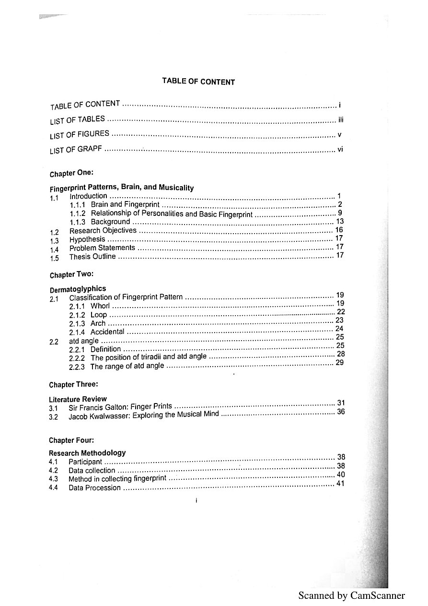

```text
TABLE OF CONTENT

TABLE OF CONTENT vssccsssssseesstesstsetsensstsesasae i
LIST OF TABLES..sssseessssssessstesstensetsssssessenereees ii
LIST OF FIGURES «..ssccesssessssesssetssetessesesstene ¥v
LIST OF GRAPF o.ssossssssscissssesussessnssesessnnenvsnsene vi
Chapter One:
Fingerprint Patterns, Brain, and Musicality
4A Introduction.......0.csssssssessvesseeeeseeereeesees 1

inal EinsSeetnk ttre nin

i BEM chine Reealict ta ae

4.1.3 Background «2... tere IMgEMFI wren
4.2. Research Objectives «ov ccscmssc III 6
44 Problem Statements «vs. swsvsovonosounsvonmovuvnnansnnenvnvenans 1
15 Thesis Oulline..,..:.:snsmsnunnnnnnnnrnunnnunnnnnnnnnnneninnnnnnnnane WT |
Chapter Two:
Dermatoglyphics
2.4 Classification of Fingerprint Pattern........ccccssssssusssssssseeneeesessertnnsssssssssseseseses 19

DAA WHOM...ccecsesessssecesscecsssvessssssescerssnsesscsssssnesenssetssnsnneseronnanesessssseceens 1)

QZ LOOP soesseesessssssssssesssssevvesessnssssnssesssnsnsecesssussnnsssnstnnnnnsensnamnsne 22

DAB ACH ceessesssesecsessssssssssnsevsssessssnssssssssssseseeeeessstissnssssssssseeseceesssssceseees 2B

D414 AcCideNtAl.......sseccssceceeeccecceceesesssetinatennnseseeeseeeesrssesssssssanencennteesesees BM

2.2.1 Definition.......cccssssseeeseeesssssseeeeseseenssssnsnsansennsnnnnnnsnssssesesescsssseseesesees 2D

2.2.2. The position of triradii and atd angle «...-.cssectseeensesseesseesseesnesneeseee 2B

2.2.3 The range of atd angle...........-sesssessseeseesneettessessssenstensscanennennennecenstts 29
Chapter Three:
Literature Review
3.4 Sir Francis Galton: Finger Prints......--osssssssssseceessersssesssectsnscnnnensnsscusss ones estes 3
3.2 Jacob Kwalwasser: Exploring the Musical Mind.......+-sssssss-sesssssssseestseenrenesrnnnnes 36
Chapter Four:
Research Methodology ‘
4A Participant s.scscsscesssenceeseeeeesesstseseeenieeceenaesniennenennenaeenaeners OB
4.2 Data collection «.-.---scssssssvvsssssssesssssssssssssnnensnsssssscossssssssssssssnanannannsnnnssssssssies 3B 7
4.3. Method in collecting fingerprint.......-ssssessesnseeeeessseeersseeestnneeessnnseeceeessetne MO
44° Data Procession.........csescsssseerenererenersterenenenen cseasensegeogaguansnvevaenutacennsensease 4D

i
B
Scanned by CamScanner
```

## Page 6

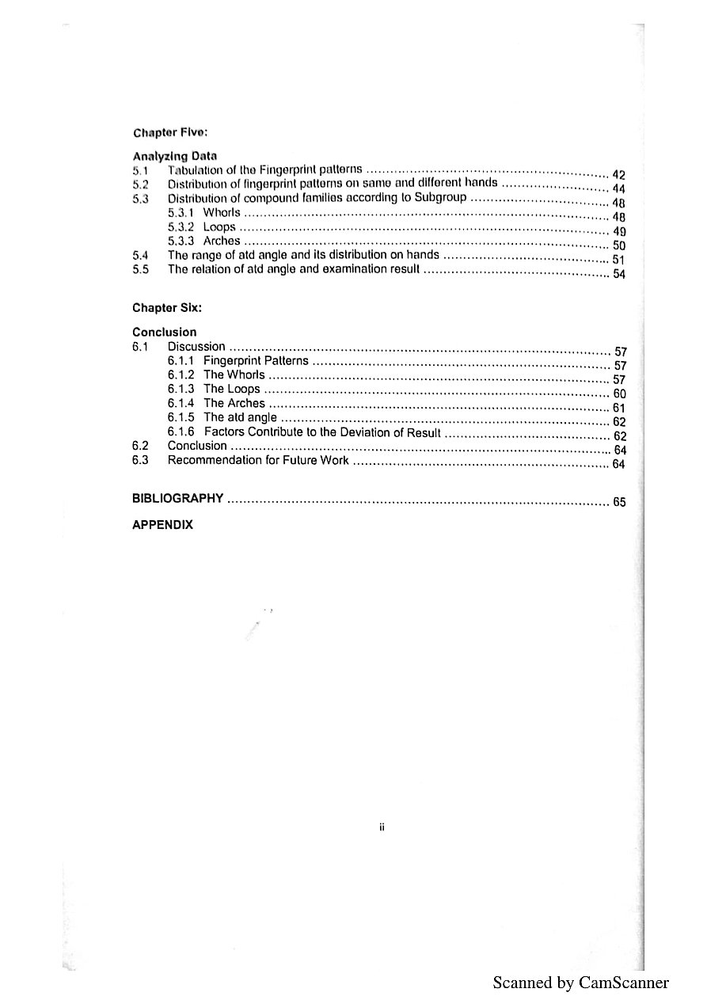

```text
Chapter Five:
Analyzing Data
5.1 Tabulation of tho Fingerprint pattorns.......:essssetessssesretesssneecensnsseceetesseseeeen AQ
5.2. Distribution of fingerprint pattoms on samo and different hands wees, 44
$.3 Distribution of compound familias according 10 SUBgrOUP....-..ssssesss erect AB
$13.2 LOOPS..ssessesssienestessstinnstenssensaneinenissneinsennssinntnnenenn
5.4 Tho range of ald angle and its distribution on hands «......seesssesssenettnence, Bf
5.5 The ralation of atd angle and examination result........ssssssesssssseesseeetititnenenes, 84
Chapter Six:
Conclusion
6.1 DISCUSSION.......cccsccssceeceesnsssseessnssnsssssssssssssssssssnsasessssnsseeeeeeeseessessseceses BT
6.1.1 Fingerprint Patterns.....sssseesesssssssssssessssecsessstecssseesseeeeeeeeeeeseessssscsnsnnenes ST
6.1.2 The WHOS 0.0.0... esses seseeeessesseeseeseeseescesnesseessesesesnsestsseeneneanecseeanes BT,
6.4.3 The LOOPS v.osicseescsssseeeeececsessesennsnssnnnnsnensensnsnsssesssseasssssesesttsneneessy BO
GAA, THE ACCES itecsscoccssssvsnsssssssssisnssasnsninninsdssiastssssssassiainatecsbubsnbnenreerveenec BA
6.1.5 The atd angle...scecsessessesesssessssssssssesssnsessnsssssssssssssssssesassssssessnstasenivees BQ
6.1.6 Factors Contribute to the Deviation of Result...........cssscsecsesssssessssnseesssrens 62
6.2 CONCIUSION........ssscsssssseseessssstsecesssssneeessossssnnneteteseennsnunetiteetetsenteeeesssseneeeens Gd
6.3 Recommendation for Future WOFk....ssssscssssssusssssssssstiesssssiissrtsessercnny Bh
|
BIBLIOGRAPHY......-csssssssssssssssstssssssssecesssnnsnssnnnsnsensssssonssnsnsasannssssssnsesseansannessees 6B
APPENDIX
|
|
ii |
|
|
Scanned by CamScanner
```

## Page 7

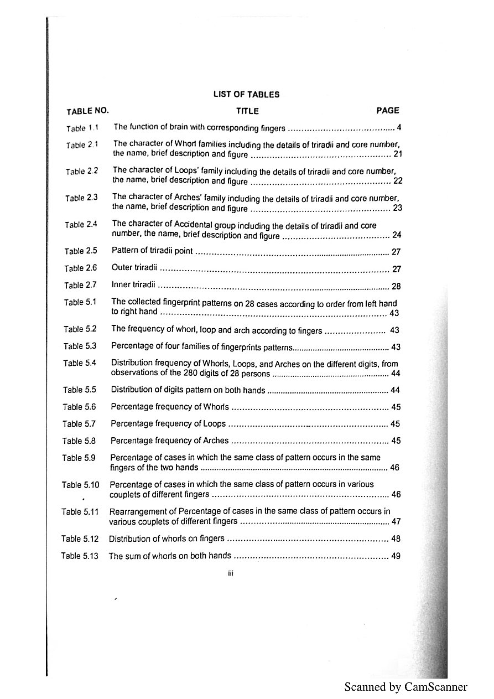

```text
LIST OF TABLES
TABLE NO. TILE PAGE
Table 11 The function of brain with corresponding fingers...ssssssecscssssseeeescerseesinen
Table 21 The character of Whorl families including the details of riradii and core number,
the name, brief descnption and figure.......s.sescesssssseivsssessssssserseeceeceessies 24
Table 22 The character of Loops’ family including the details of triradii and core number,
the name, brief description and figure.......esssseosssessscsssssssssssssesssessseseseres 22
Table 2.3 The character of Arches’ family including the details of triradii and core number,
the name, brief description and figure.........ssccsssseessssseeeesnssesentnnessseesns 2B
Table 24 The character of Accidental group including the details of tiradii and core
number, the name, brief description and figure..scajocsesssussssssseseessernsseee 24
Table 2.5 Pattern of tiradii point... sesseeecccccssssesesesesessssseeesennasansassneenseeeesnsens BT
Table 26 Outer triradii ee eeccecccsssssssevnetsstsesesstssessssasssssersiensessssssssssees 27
Table 2.7 Inmer Wiradl...eeseecceceecesceeensessssssseeeeeasssceeessenenentnnnenerseesee 2B
Table 5.1 The collected fingerprint patterns on 28 cases according to order from left hand
fOFiQHE HANG...sseessseseeestnsssceecteenseettessteressssesnnsseetinssesttansesessen AB
Table 5.2 The frequency of whorl, loop and arch according to fingers........ssseesen 43
Table 5.3 Percentage of four families of fingerprinis patlemS....cnunnenennnnnrenin 43 |
Table 5.4 _ Distribution frequency of Whorls, Loops, and Arches on the different digits, from |
observations of the 280 digits of 28 persOnS -ccrccnnrnnnteresnnnnnninne A,
Table 5.5 —_ Distribution of digits pattern on both hands...ssssscssssesssseessssesssnsserersssesceriee AA
Table 5.6 Percentage frequency of WhOnS......ccsescsseeeessssetnssstssnnseeteesssseeeeress 45
Table 5.7 Percentage frequency Of LOOpS........ssooseessssussssseseensssensnsnssssesececesessee AG
Table 5.8 Percentage frequency of Arches........-sscssussssssessssensssveseeseesestsseessessses 45
Table 5.9 Percentage of cases in which the same class of pattern occurs in the same
fingers of the WO ANUS -.rcmrcnsnnnennnnennnennennannennennnnneen 46
Table 5.10 Percentage of cases in which the same class of pattern occurs in various: couplets of different fingers...........csseesseseteereeesseeeneeaeeeeseteeecseseess 46 q
Table 5.11 Rearrangement of Percentage of cases in the same class of pattern occurs in
various couplets of different fingers..........ssesssssesesssssesecsssssssnneesssessssssssssnerses 47
Table 5.12 Distribution of whorls on fingers.......s..sssssesssssceessssssssssseesessesseesseessasesene 48, F
Table 5.13 The sum of whorls on both hands.......--sssecsesssseereeestseeetsstsseeesscessseessses 49
ii
Scanned by CamScanner
```

## Page 8

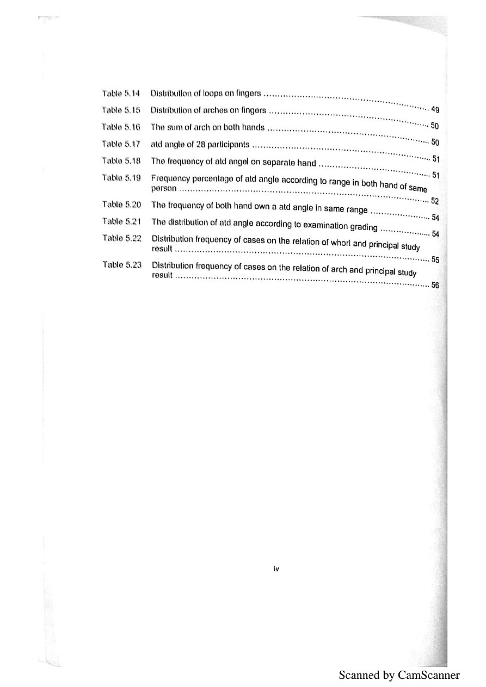

```text
Table 8.14 Distibutlon af loops On fINGOFS a. .scsesestestessee,
Tablo §,18 — Distibution of archos on INGOTS....sssssscseenannee, rn gg
Tato 5.16 Tho sum of arch on both HANS....sssssssesiseesessse: $9
Tablo S17 ate angle of 28 participants.....secastessaaitnenee. rn 8
Tablo 5.18 Tho froquoney of ate angol on soparate hand......... in,
Tablo 5.19 Froquoncy porcontage of ald angla according to range i
Table 5.20 Tho frequency of both hand own a ald angle in same range:
Table §.21 The distribution of atd angle according to examination grading d
Table 5.22 Distribution frequoncy of cases r inci

EO sr ortenraec sat oF who! and principal study
Table 5.23 Distribution frequency of cases on the relati inci

TOSI esunnttninnnecn a e en and principal study

Ww
Scanned by CamScanner
y
```

## Page 9

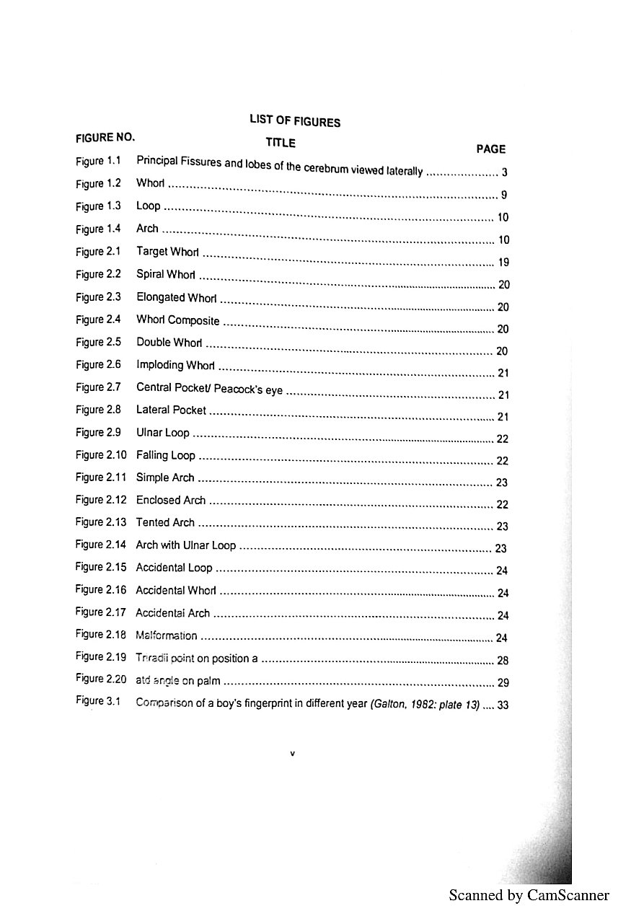

```text
UST OF FIGURES
FIGURE NO. TITLE PAGE
Figure 1.1. Principal Fissures and lobes of the cerebrum viewed laterally.....ccccs0eeecue 3
Figure 1.2 WHOM... eeeesessssseecssneeees settee ensesenenseesnsananseestacenessassesanseseesesssesees D
Figure 13° LOOP -ssseessseesssetsseecstesstinsttassees sreeeeeeeeeentecceteesstsstttettenteesreees 10
Figure 2.1 Target Whort.... Troeerteesseeectnssenssnnanssascessenssssananeneeeceeeessnnannesneeesssesaee 19)
Figure 2.2. Spiral WHOM oo. ccccsssseseeccsee esaeneesaaneeesrenasiesecaasnninoits 20)
Figure 2.3. Elongated Whorl vrtttenteteeseecansensasscteanesessansaesessssnnsanneeretntuatenstnatssninesss 20.
Figure 2.4 Whor Composite -....... 2... sossveeassnsssnneasecasesnuusnassensqessecceseennseeseesnees 20,
Figure 2.5 Double Whor srstecessaeeeseserenscessansncansecssenesanesueenesessasssreenvessecaneeneeneces 20
Figure 2.6 Imploding Whotl........sscsssssnsssneenetsesnsunteetntatantusiasinsatsese 24
Figure 2.7 Central Pockel/ Peacock’s eye ser eseaneneneeneaeeseeneneneeneaneacsesreatenestentaneaeeee 27
Figure 2.8 Lateral Pocket............ccceessescoeeeee seseseneensaneessoestentaneaneatenssesssartanennans 21
Figure 2.10 Falling LOOp -....ssseeosessccsssseeeeesseesssseesnsssesnestsassensnecsaseevnesseenses 22
Figure 2.11 Simple Arch........scssessessssssecscsssssnneveceeeeeeececessnsanssevevesseseesssngnnssnsanes 23
Figure 2.12 Enclosed Arch.......sssssssssssesssseesessssnseesesucssessttserassnesesnsssersersasasesnee 22
Figure 2.13 Tented APch......sssssssssssssssssseceecesesceeesesetessstttsntiseesessssssssssesseeseseeeerey 23
Figure 2.14 Arch with Ulnar Loop.......-csccsssssssssessesssssssssssstsvasseeneeasssseeeessassensees 23
Figure 2.15 Accidental Loop.........:ssssssssssssoeceeessssssssseecessessessetesanseseeeetesansersee 24
Figure 2.16 Accidental WHOM..........ssscsssccsseescsseescossvessessnveestunneneenesstssttsstsaetees 24
Figure 2.17 Accidental Arch...........ccccccssssssssssnssssnsnsssnsassssennssennssnsenessseecceeeeeeeenceae 24
Figure 2.18 Malformation.......sssssecssssseessessstsesseescessssetseseeseeeunseneeneentntnaseteatneeaten 24
Figure 2.19 Trradii point on position a........csssseseeesessssssssseeeseeneentetntiatstsntnnenenes 28
Figure 2.20 atd anole on palm.......sscsssssssssesessessessmensnssseeceeverssansaceeeeqtnasssaneseeses 29
Figure 3.1 Comparison of a boy's fingerprint in different year (Galton, 1982: plate 13)... 33
Scanned by 4
```

## Page 10

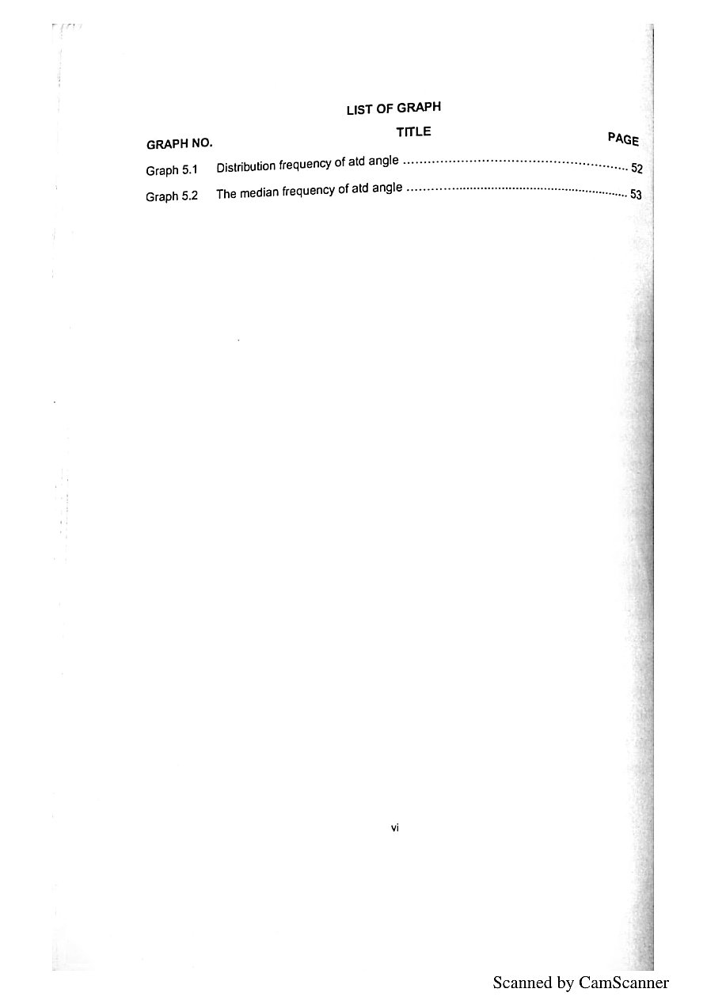

```text
LIST OF GRAPH |
GRAPH NO. THLE
PAGE
Graph 5.1 Distribution frequency of atd angle.....ssssecceeccesseeeeeeseeeeceensteesees
Graph 5.2 The median frequency of atd AINGIC...sssncssnsssereensnnsessennsrersen ses “=<
|
|
vi
|
|
Scanned by CamScanner
```

## Page 11

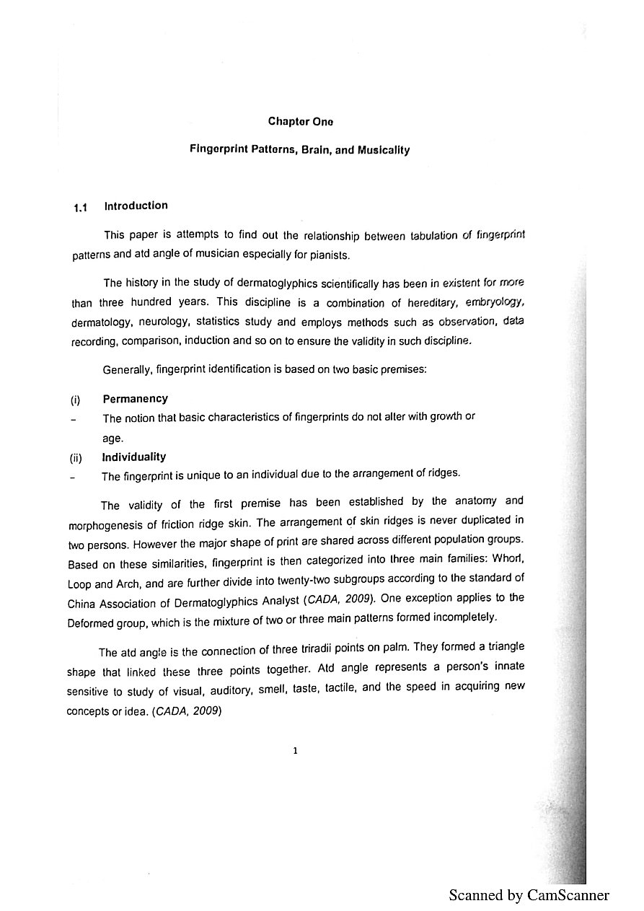

```text
Chaptor Ono
Fingerprint Patterns, Brain, and Musicality
4.4. Introduction
This paper is attempts to find out the relationship between tabulation of fingerprint
patterns and atd angle of musician especially for pianists.
The history in the study of dermatoglyphics scientifically has been in existent for more
than three hundred years. This discipline is a combination of hereditary, embryology,
dermatology, neurology, statistics study and employs methods such as observation, data
recording, comparison, induction and so on to ensure the validity in such discipline.
Generally, fingerprint identification is based on two basic premises:
(i) Permanency
- The notion that basic characteristics of fingerprints do not alter with growth or
age. |
(ii) Individuality |
— The fingerprint is unique to an individual due to the arrangement of ridges. |
|
The validity of the first premise has been established by the anatomy and
morphogenesis of friction ridge skin. The arrangement of skin ridges is never duplicated in
two persons. However the major shape of print are shared across different population groups.
Based on these similarities, fingerprint is then categorized into three main families: Whort,
Loop and Arch, and are further divide into twenty-two subgroups according to the standard of
China Association of Dermatoglyphics Analyst (CADA, 2009). One exception applies to the
Deformed group, which is the mixture of two or three main palterns formed incompletely. |
The ald angte is the connection of three triradil points on palm. They formed a triangle
shape that linked these three points together. Ald angle represents a person's innate
sensitive to study of visual, auditory, smell, taste, tactile, and the speed in acquiring new
concepts or idea. (CADA, 2009)
a
Scanned by CamScanner
```

## Page 12

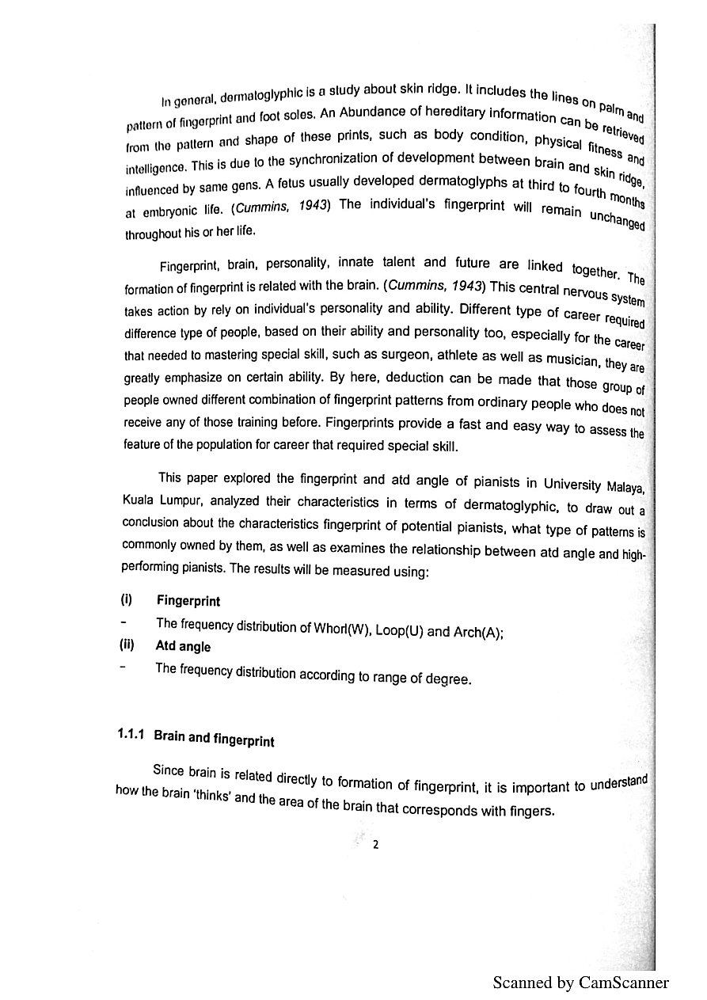

```text
dy about skin ridge. It includes the j,
in gonoral, dormatoglyphic is a study he lines on Palm
Ing t and foot soles. An Abundance of hereditary information CaN be ang
rin: Fetr
onto 4 shape of these prints, such as body condition, Physica} fitn Mtieveg
nani 18s:
tom the eT is due to the synchronization of development between brain ang Ski S ang
igence. This i i
inten ame gens. A fetus usually developed dermatoglyphs at third to fourth my idge,
influenced by s 7 nn ee Onthy
The individual's fingerprint will remai
at embryonic life. (Cummins, 1943) iain Unchangey
throughout his or her life.

Fingerprint, brain, personality, innate talent and future are linked together, The
formation of fingerprint is related with the brain. (Cummins, 1943) This central Nervous System
takes action by rely on individual's personality and ability. Different type of career Fequireg
difference type of people, based on their ability and personality too, especially for the career
that needed to mastering special skill, such as surgeon, athlete as well as musician, they are
greatly emphasize on certain ability. By here, deduction can be made that those Group of
people owned different combination of fingerprint patterns from ordinary people who does not
receive any of those training before. Fingerprints provide a fast and easy way to assess the
feature of the population for career that required special skill.

This paper explored the fingerprint and atd angle of pianists in Universi Malaya,

Pape pl ya,
Kuala Lumpur, analyzed their characteristics in terms of dermatoglyphic, to draw out a
Conclusion about the characteristics fingerprint of potential pianists, what type of pattems is
commonly owned by them, as well as examines the relationship between atd angle and highPerforming pianists. The results will be measured using:
(i) Fingerprint
~ The frequency distribution of Whorl(W), Loop(U) and Arch(A);
(ii) Atd angle
~The frequency distribution according to range of degree.
1.4.1 Brain and fingerprint, — ind
h then brain is related directly to formation of fingerprint, it is important to understa!
1ow the brain ‘thinks’ ;
rain ‘thinks’ and the area of the brain that Corresponds with fingers.
2
Scanned by CamScanner
```

## Page 13

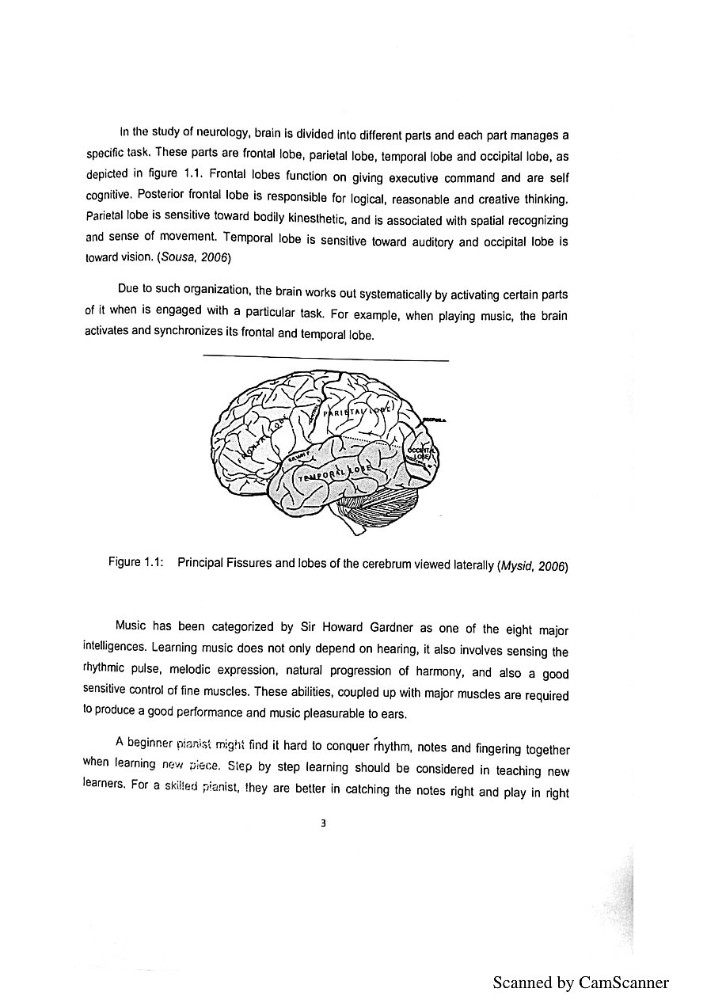

```text
In the study of neurology, brain is divided into different parts and each part manages a
specific task. These parts are frontal lobe, parietal lobe, temporal lobe and occipital lobe, as
depicted in figure 1.1. Frontal lobes function on giving executive command and are self
cognitive, Posterior frontal lobe is responsible for logical, reasonable and creative thinking,
Parietal lobe is sensitive toward bodily kinesthetic, and is associated with spatial recognizing
and sense of movement. Temporal lobe is sensitive toward auditory and occipital lobe is
toward vision. (Sousa, 2006)

Due to such organization, the brain works out systematically by activating certain parts
of it when is engaged with a particular task, For example, when playing music, the brain
activates and synchronizes its frontal and temporal lobe.

ee
a —_
FEO LD SLOEN
my, pKargray
Doyo uy ee)
Fa pate
Figure 1.1: Principal Fissures and lobes of the cerebrum viewed laterally (Mysid, 2006)

Music has been categorized by Sir Howard Gardner as one of the eight major
intelligences. Learning music does not only depend on hearing, it also involves sensing the
thythmic pulse, melodic expression, natural progression of harmony, and also a good
Sensitive control of fine muscles. These abilities, coupled up with major muscles are required
'o produce a good performance and music pleasurable to ears.

A beginner pianist might find it hard to conquer thythm, notes and fingering together
when leaming new viece. Step by step leaming should be considered in teaching new
teamers. For a skied pianist, they are betler in catching the notes right and play in right

3
Scanned by CamScanner
```

## Page 14

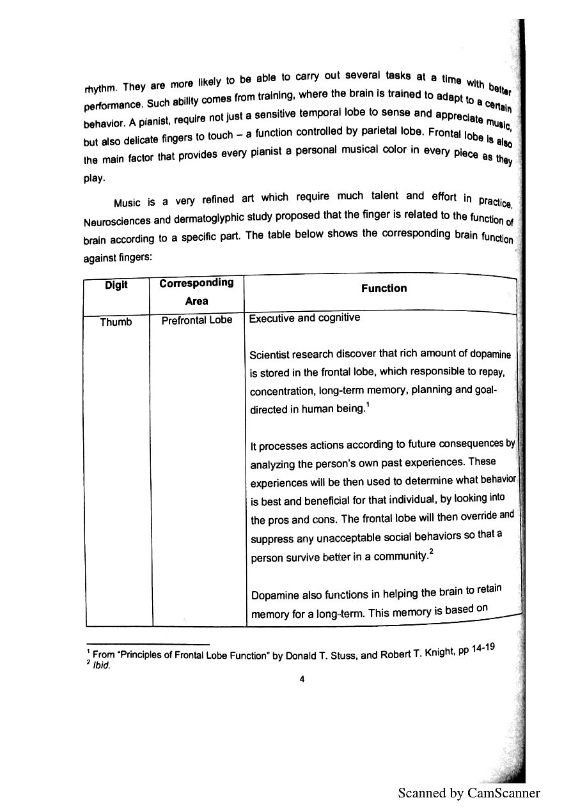

```text
rhythm. They are more likely to be able to carry out several tasks at a time with
performance, Such eilty comes from training, where the brain Is trained to adapt i g Dotter
behavior. A pianist, require not just @ sensitive temporal lobe to sense and appreciate Certain. m
but also delicate fingers to touch - a function controlled by parietal lobe. Frontal lobe i \Usic,
the main factor that provides every pianist a personal musical color in every Piece ag _
play. y
Music is a very fefined art which require much talent and effort in pract
Neurosciences and dermatoglyphic study proposed that the finger is related to the function of
brain according to a specific part. The table below shows the corresponding brain functig
n
against fingers:
Corresponding
Area
Thumb Prefrontal Lobe | Executive and cognitive
Scientist research discover that rich amount of dopamine
is stored in the frontal lobe, which responsible to repay,
concentration, long-term memory, planning and goal- |]
directed in human being."
It processes actions according to future consequences by |
analyzing the person's own past experiences. These |
experiences will be then used to determine what behavior jj
is best and beneficial for that individual, by looking into
the pros and cons. The frontal lobe will then override and
suppress any unacceptable social behaviors so that a
person survive better in a community.”
|
Dopamine also functions in helping the brain to retain |
memory for a long-term. This memory is based 07 I
} a “Principles of Frontal Lobe Function” by Donald T. Stuss, and Robert T. Knight, PP 14-19
4
Scanned by CamScanner
```

## Page 15

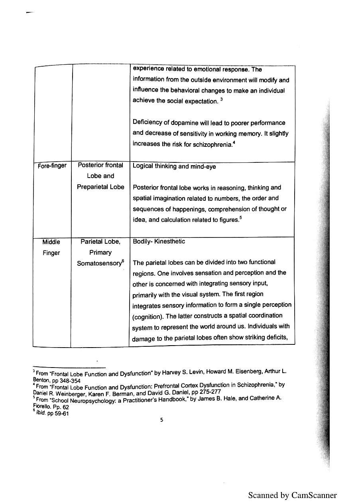

```text
‘experience related to emotional response. The
information from the outside environment will modify and
influence the behavioral changes to make an individual
achieve the social expectation. *
Deficiency of dopamine will lead to poorer performance j
and decrease of sensitivity in working memory. It slightly
increases the risk for schizophrenia.*
Fore-finger | Posterior frontal | Logical thinking and mind-eye
Lobe and
Preparietal Lobe | Posterior frontal lobe works in reasoning, thinking and
spatial imagination related to numbers, the order and
sequences of happenings, comprehension of thought or
idea, and calculation related to figures.
Middle Parietal Lobe, _| Bodily- Kinesthetic
Finger Primary
Somatosensory’ | The parietal lobes can be divided into two functional
regions. One involves sensation and perception and the
other is concerned with integrating sensory input, 4
primarily with the visual system. The first region
integrates sensory information to form a single perception 4
(cognition). The latter constructs a spatial coordination
system to represent the world around us. Individuals with
damage to the parietal lobes often show striking deficits, 3
From Frontal Lobe Function and Dysfunction” by Harvey S. Levin, Howard M. Eisenberg, Arthur L. F
Benton, pp 348-354 ee ia”
“From “Frontal Lobe Function and Dysfunction: Prefrontal Cortex Dysfunction in Schizophrenia,” by J
Daniel R. Weinberger, Karen F. Berman, and David G. Daniel, pp 275-277
From "School Neuropsychology: a Practitioner's Handbook,” by James B. Hale, and Catherine A.
Fiorello, Pp. 62
Ibid. pp 59-61
5
Scanned by CamScanner
```

## Page 16

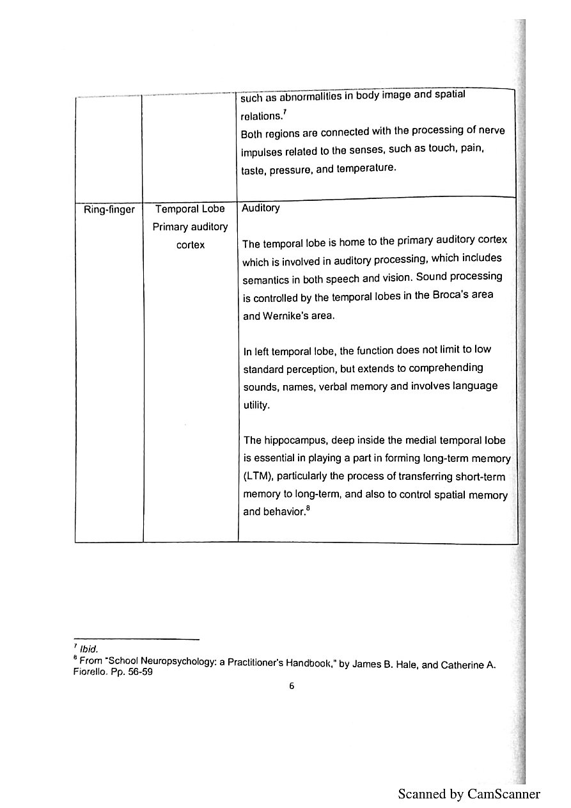

```text
|
|
|
a "Such as abnormalities in body image and spatial |
relations.” |
. |
Both regions are connected with the processing of nerve | |
: |
impulses related to the senses, such as touch, pain,
taste, pressure, and temperature. |
Ring-finger | Temporal Lobe | Auditory
Primary auditory
cortex ‘The temporal lobe is home to the primary auditory cortex
which is involved in auditory processing, which includes
semantics in both speech and vision. Sound processing
is controlled by the temporal lobes in the Broca’s area
and Wernike's area.
In left temporal lobe, the function does not limit to low
standard perception, but extends to comprehending
sounds, names, verbal memory and involves language
utility.
The hippocampus, deep inside the medial temporal lobe
is essential in playing a part in forming long-term memory
(LTM), particularly the process of transferring short-term
memory to long-term, and also to control spatial memory
and behavior.
" hid.
* From “Sche r it ‘ .
# From School Neuropsychology: a Practitioner's Handbook,” by James B. Hale, and Catherine A.
6
Scanned by CamScanner
```

## Page 17


```text
Titte Finger | Occipital lobe” "| Visual Processing and Visual Memory
Primary Visual
Cortex Occipital lobe contains the primary visual cortex which is
| sensitive towards multiple stimulus parameters, such as
| shape, size, wavelength, orientation, and direction of
| movement.
| The occipital lobe is the visual processing center of
| mammalian brain. It contains most of the anatomical
| region of the visual cortex.
The received stimuli from optic tracts are pre-processed
by retinal sensors and then comprehended by brain using
the visual cortex. The visual and lingual information are
received by different parts of visual cortex and the retinal
input is then projected to the cortex.
The spatial map is then arranged by cells on the posterior
| aspect in the grey matter of occipital lobes’, forming a
| 9
| neuroimage to reveal a shape when the retinal fields are
| exposed to an object.
| “i
If one part of the occipital lobe is damaged, it will result in
| homonymous vision loss, forming a “field cut” area in
| each eye.
Table 1.1 The function of brain with corresponding fingers |
=
From -Neuropsychological Assessment,” by M. D. Lezak. Pp. 65-74, |
7 i
Scanned by CamScanner
```

## Page 18

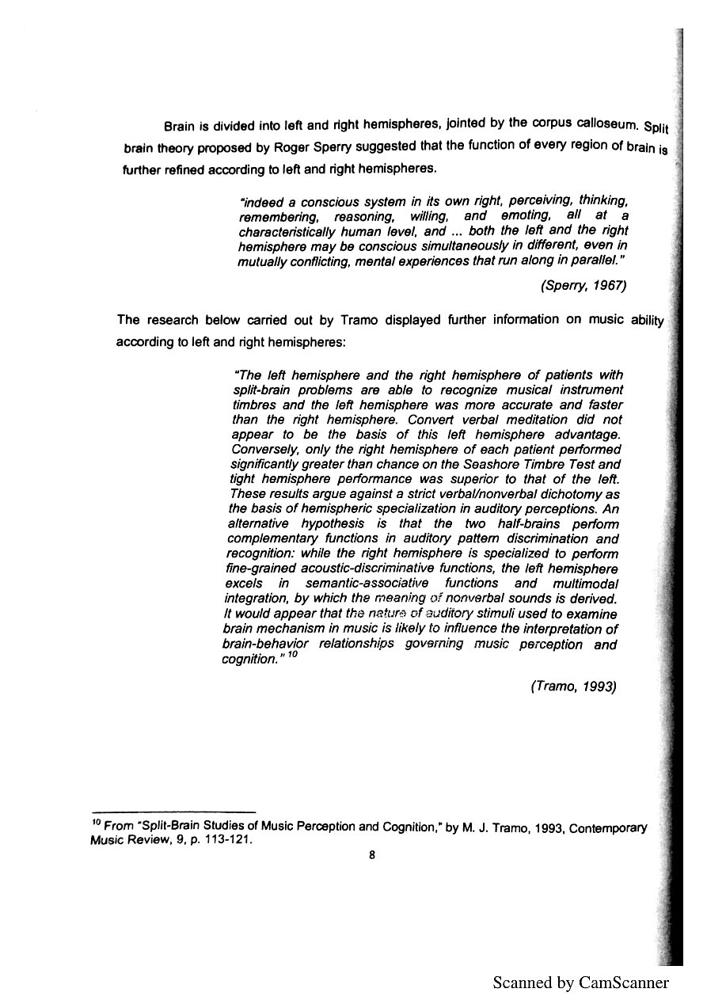

```text
Brain is divided into left and right hemispheres, jointed by the corpus calloseum. Spjit
brain theory proposed by Roger Sperry suggested that the function of every region of brain ig
further refined according to left and right hemispheres. |

‘indeed a conscious system in its own right, perceiving, thinking,
remembering, reasoning, willing, and emoting, all at a
characteristically human level, and... both the left and the right
hemisphere may be conscious simultaneously in different, even in
mutually conflicting, mental experiences that run along in paraltel.”
(Sperry, 1967)
The research below carried out by Tramo displayed further information on music ability
according to left and right hemispheres:
“The left hemisphere and the right hemisphere of patients with
Split-brain problems are able to recognize musical instrument
timbres and the left hemisphere was more accurate and faster
than the right hemisphere. Convert verbal meditation did not
appear to be the basis of this left hemisphere advantage.
Conversely, only the right hemisphere of each patient performed
significantly greater than chance on the Seashore Timbre Test and
tight hemisphere performance was superior to that of the left.
These results argue against a strict verbal/nonverbal dichotomy as
the basis of hemispheric specialization in auditory perceptions. An
alternative hypothesis is that the two half-brains perform
complementary functions in auditory pattem discrimination and
recognition: while the right hemisphere is specialized to perform
fine-grained acoustic-discriminative functions, the left hemisphere
excels in semantic-associative functions and multimodal
integration, by which the meaning of nonverbal sounds is derived.
it would appear that the nature of auditory stimuli used to examine 7
brain mechanism in music is tikely to influence the interpretation of
brain-behavior relationships governing music perception and
cognition.”
(Tramo, 1993)
' From “Split-Brain Studies of Music Perception and Cognition,” by M. J. Tramo, 1993, Contemporary
Music Review, 9, p. 113-121.
8
Scanned by CamScanner
```

## Page 19

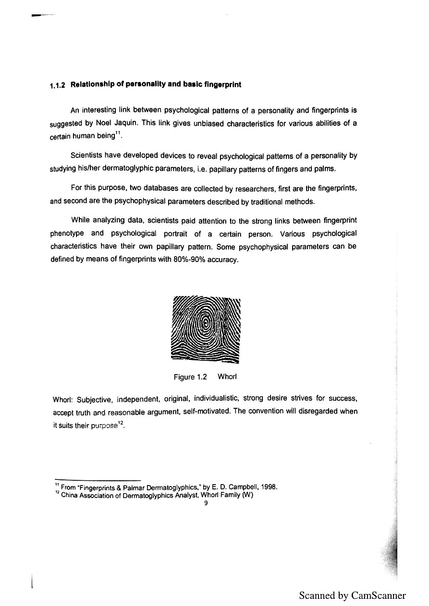

```text
4.4.2 Relationship of personality and basic fingerprint

An interesting link between psychological patterns of a personality and fingerprints is
suggested by Noel Jaquin. This link gives unbiased characteristics for various abilities of a
certain human being'’.

Scientists have developed devices to reveal psychological pattems of a personality by
studying his/her dermatoglyphic parameters, i.e. papillary patterns of fingers and palms.

For this purpose, two databases are collected by researchers, first are the fingerprints,
and second are the psychophysical parameters described by traditional methods.

While analyzing data, scientists paid attention to the strong links between fingerprint
phenotype and psychological portrait of a certain person. Various psychological
characteristics have their own papillary pattern. Some psychophysical parameters can be
defined by means of fingerprints with 80%-90% accuracy.

YAN
Wy Z
SSSss
Figure 1.2 Whorl
Whorl: Subjective, independent, original, individualistic, strong desire strives for success,
accept truth and reasonable argument, self-motivated. The convention will disregarded when
it suits their purpose",
1} From “Fingerprints & Palmar Dermatoglyphics,” by E. D. Campbell, 1998,
China Association of Dermatoglyphics Analyst, Whorl Family (W)
9
Scanned by CamScanner
```

## Page 20

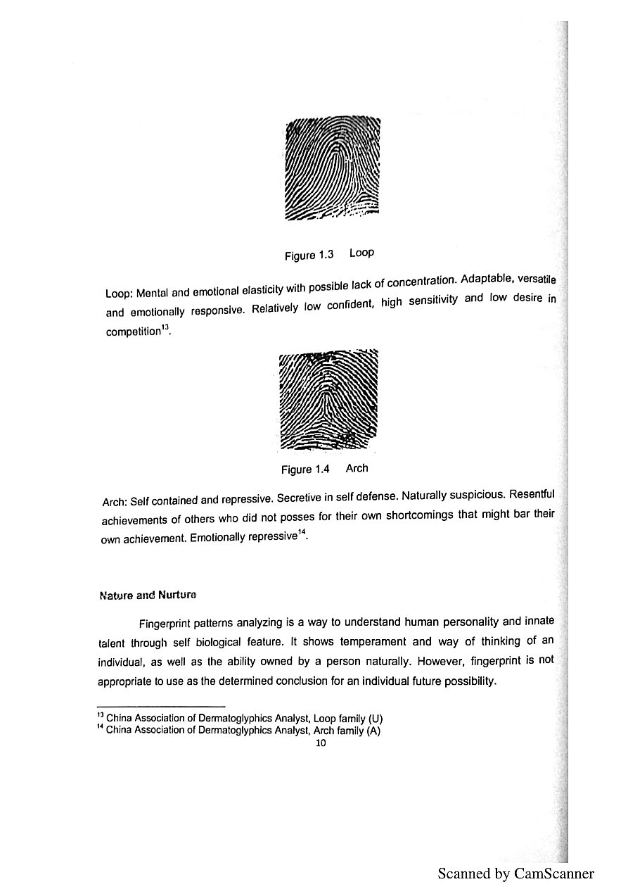

```text
|
YU EWN
Yi
NY
Mes,
Figure 1.3 Loop
city wi il ion. Adaptable, versati
Loop: Mental and emotional elasticity with possible lack of concent i _ en tile: r vi ire
and emotionally responsive. Relatively low confident, high sensiti in
competition”.
YN
7
i
Figure 1.4 Arch
‘Arch: Self contained and repressive. Secretive in self defense. Naturally suspicious. Resentful
achievements of others who did not posses for their own shortcomings that might bar their
‘own achievement. Emotionally repressive".
Nature and Nurture
Fingerprint patterns analyzing is a way to understand human personality and innate
talent through self biological feature. It shows temperament and way of thinking of an
individual, as well as the ability owned by a person naturally. However, fingerprint is not
appropriate to use as the determined conclusion for an individual future possibility.
China Association of Dermatoglyphies Analyst, Loop family (U)
China Association of Dermatoglyphics Analyst, Arch family (A)
10
|
|
Scanned by CamScanner
```

## Page 21

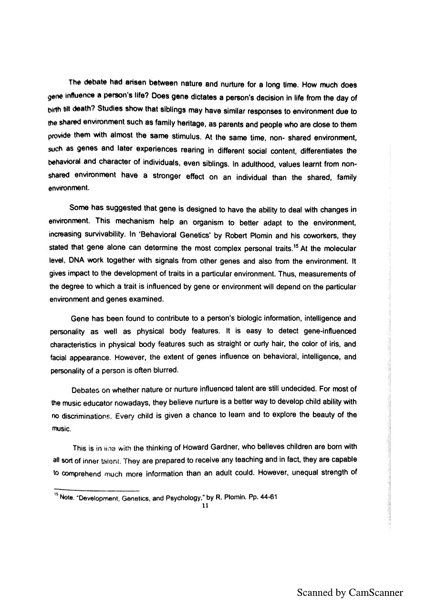

```text
The debate had arisen between nature and nurture for a long time. How much does
gene influence @ person's life? Does gene dictates a person's dacision in life from the day of
birth til death? Studies show that siblings may have similar responses to environment due to
the shared environment such as family heritage, as parents and people who are close to them
provide them with almost the same stimulus. At the same time, non- shared environment,
such as genes and later experiences rearing in different social content, differentiates the
behavioral and character of individuals, even siblings. In adulthood, values learnt from nonshared environment have a stronger effect on an individual than the shared, family
environment.

‘Some has suggested that gene is designed to have the ability to deal with changes in
environment. This mechanism help an organism to better adapt to the environment,
increasing survivability. In ‘Behavioral Genetics’ by Robert Plomin and his coworkers, they
stated that gene alone can determine the most complex personal traits.'* At the molecular
level, DNA work together with signals from other genes and also from the environment. It
gives impact to the development of traits in a particular environment. Thus, measurements of
the degree to which a trait is influenced by gene or environment will depend on the particular
environment and genes examined.

Gene has been found to contribute to a person's biologic information, intelligence and
personality as well as physical body features. It is easy to detect gene-influenced
characteristics in physical body features such as straight or curly hair, the color of iris, and
facial appearance. However, the extent of genes influence on behavioral, intelligence, and
personality of a person is often blurred.

Debates on whether nature or nurture influenced talent are still undecided. For most of
the music educator nowadays, they believe nurture is a better way to develop child ability with
no discriminations. Every child is given a chance to learn and to explore the beauty of the
music.

This is in tine with the thinking of Howard Gardner, who belleves children are born with
all sort of inner talant. They are prepared to receive any teaching and in fact, they are capable
to comprehend much more information than an adult could. However, unequal strength of

* Note. ‘Development, Genotics, and Psychology.” by R. Plomin. Pp. 44-61
Scanned by CamScanner
```

## Page 22

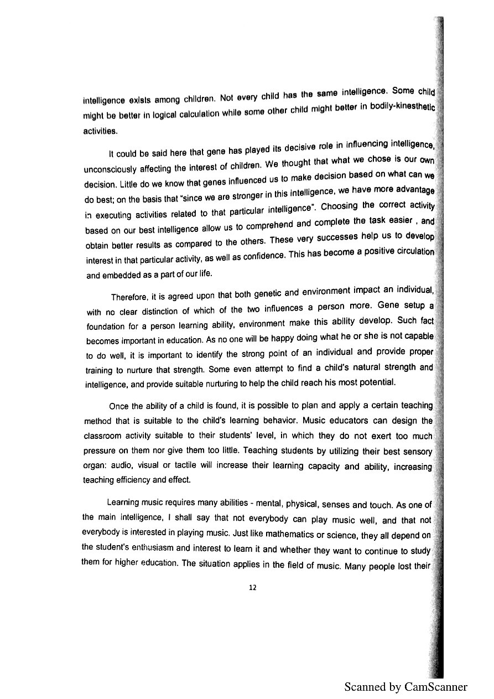

```text
intoligence exists among children, Not every child has the same inaligance. Some child
might be better in logical calculation while some other child might potter in bodily-kinesthetic
activities. {

It could be said here that gene has played its decisive role in influencing intelligence, |
unconsciously affecting the interest of children. We thought that wha we chose is our own
decision. Little do we know that genes Influenced us to make decision based on what can we
do best on the basis that “since we are stronger in this intaligance, we have more advantage
in executing activites related to that particular inteligence”. Choosing the corract activity
based on our best inteligence allow us to comprehend and complete the task easier, and
obtain better results as compared to the others. These very successes help us to develop)
interest in that particular activity, as well as confidence. This has become @ positive circulation
and embedded as a part of our life. .

Therefore, it is agreed upon that both genetic and environment impact an individual, |
with no clear distinction of which of the two influences a person more. Gene setup a
foundation for a person learning ability, environment make this abllity develop. Such fact
becomes important in education. As no one will be happy doing what he or she is not capable:
to do well, it is important to identify the strong point of an individual and provide proper
training to nurture that strength. Some even attempt to find a child's natural strength and 4
intelligence, and provide suitable nurturing to help the child reach his most potential.

Once the ability of a child is found, it is possible to plan and apply a certain teaching
method that is suitable to the child's leaming behavior. Music educators can design the
classroom activity suitable to their students’ level, in which they do not exert too much
pressure on them nor give them too little. Teaching students by utilizing their best sensory
organ: audio, visual or tactile will increase their learning capacity and ability, increasing
teaching efficiency and effect. ‘

Learning music requires many abilities - mental, physical, senses and touch. As one of
the main intelligence, | shall say that not everybody can play music well, and that not |
everybody is interested in playing music. Just ike mathematics or science, they all depend on
the student's enthusiasm and interest to leam it and whether they want to continue to study
them for higher education. The situation applies in the field of music. Many people lost their |

2
Scanned by CamScanner
```

## Page 23

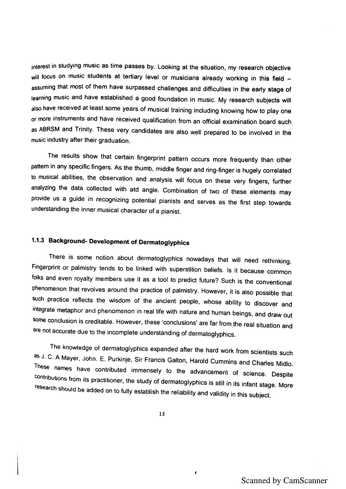

```text
interest in studying music as time passes by. Looking at the situation, my research objective
will focus on music students at tertiary level or musicians already working in this field —
assuming that most of them have surpassed challenges and difficulties in the early stage of
learning music and have established a good foundation in music. My research subjects will
also have received at least some years of musical training including knowing how to play one
or more instruments and have received qualification from an official examination board such
as ABRSM and Trinity. These very candidates are also well prepared to be involved in the
music industry after their graduation.

The results show that certain fingerprint pattern occurs more frequently than other
pattern in any specific fingers. As the thumb, middle finger and ring-finger is hugely correlated
to musical abilities, the observation and analysis will focus on these very fingers, further
analyzing the data collected with atd angle. Combination of two of these elements may
provide us a guide in recognizing potential pianists and serves as the first step towards
understanding the inner musical character of a pianist.

1.1.3 Background- Development of Dermatoglyphics

There is some notion about dermatoglyphics Nowadays that will need rethinking.
Fingerprint or palmistry tends to be linked with superstition beliefs. Is it because common
folks and even royalty members use it as a tool to Predict future? Such is the conventional
Phenomenon that revolves around the practice of palmistry. However, it is also Possible that
Such practice reflects the wisdom of the ancient people, whose ability to discover and
integrate metaphor and phenomenon in real life with nature and human beings, and draw out
‘Some conclusion is creditable. However, these ‘conclusions’ are far from the real situation and
31@ not accurate due to the incomplete understanding of dermatoglyphics.

The knowledge of dermatoglyphics expanded after the hard work from scientists such
8 J.C. A Mayer, John. E. Purkinje, Sir Francis Galton, Harold Cummins and Charles Midlo.

These names have contributed immensely to the advancement of science. Despite
Contributions from its practitioner, the study of dermatoglyphics is stil in its infant stage. More
research should be added on to fully establish the reliability and validity in this subject.
a
| ‘ Scanned by CamScanner
```

## Page 24

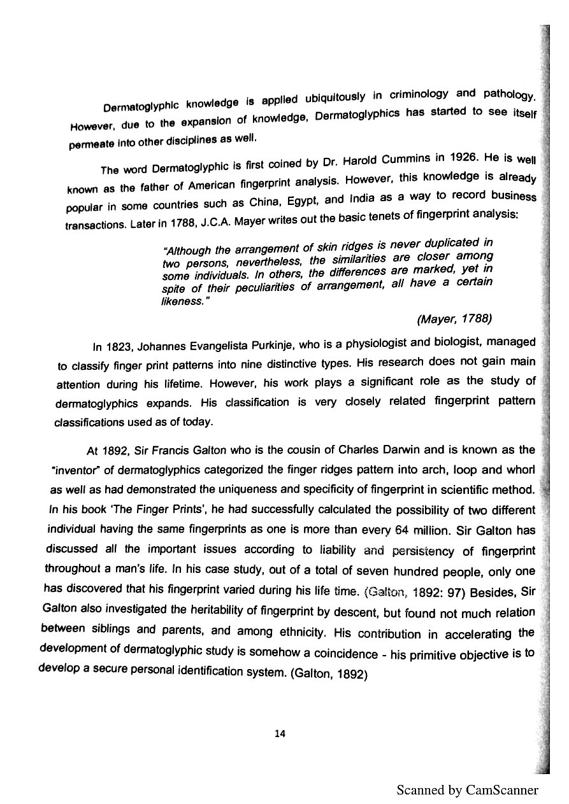

```text
Dermatoglyphle knowledge is applied ubiquitously in imine am Pathology. |
However, due to the expansion of knowledge, Dermatoglyphics has started to see itseir |
permeate into other disciplines as well.
The word Dermatoglyphic is first coined by Dr. Harold Cummins in 1926. He is well
known as the father of American fingerprint analysis. However, this knowledge is already
popular in some countries such as China, Egypt, and India as @ way 10 record business
transactions. Later in 1788, J.C.A. Mayer writes out the basic tenets of fingerprint analysis:
y in rie is never duplicated in
tae oeesons, arene simlartios are closer among
some individuals. In others, the differences are marked, yet in |
spite of their peculiarities of arrangement, all have a certain
likeness.”
(Mayer, 1788)
In 1823, Johannes Evangelista Purkinje, who is a physiologist and biologist, managed
to classify finger print patterns into nine distinctive types. His research does not gain main
attention during his lifetime. However, his work plays a significant role as the study of
dermatoglyphics expands. His classification is very closely related fingerprint pattern
classifications used as of today.
At 1892, Sir Francis Galton who is the cousin of Charles Darwin and is known as the
‘inventor’ of dermatoglyphics categorized the finger ridges pattern into arch, loop and whorl
as well as had demonstrated the uniqueness and specificity of fingerprint in scientific method. %
In his book ‘The Finger Prints’, he had successfully calculated the possibility of two different
individual having the same fingerprints as one is more than every 64 million. Sir Galton has
discussed all the important issues according to liability and persistency of fingerprint
throughout a man's life. In his case study, out of a total of seven hundred people, only one |
has discovered that his fingerprint varied during his life time. (Galton, 1892: 97) Besides, Sir |
Galton also investigated the heritability of fingerprint by descent, but found not much relation |
between siblings and parents, and among ethnicity. His contribution in accelerating the

development of dermatoglyphic study is somehow a coincidence - his primitive objective is to

develop a secure personal identification system. (Galton, 1892)

14 4

Scanned by CamScanner
```

## Page 25

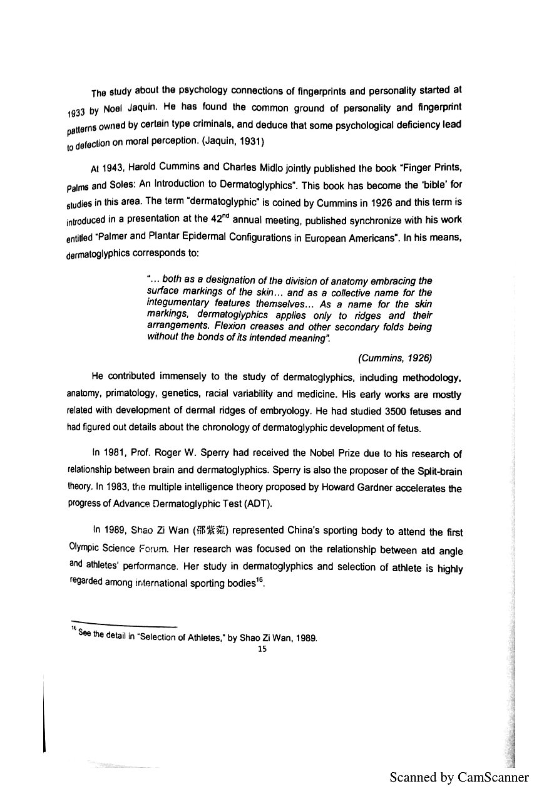

```text
The study about the psychology connections of fingerprints and personality started at
4933 by Noo! Jaquin. He has found the common ground of personality and fingerprint
pattarns owned by certain ‘ype criminals, and deduce that some psychological deficiency lead
io defection on moral perception. (Jaquin, 1931)
‘Al 1943, Harold Cummins and Charles Midlo jointly published the book “Finger Prints,
palms and Soles: An Introduction to Dermatoglyphics”. This book has become the ‘bible’ for
studies in this area. The term “dermatoglyphic" is coined by Cummins in 1926 and this term is
invoduced in a presentation at the 42” annual meeting, published synchronize with his work
entiled “Palmer and Plantar Epidermal Configurations in European Americans”. In his means,
dermatoglyphics corresponds to:
“... both as @ designation of the division of anatomy embracing the
surface markings of the skin... and as a collective name for the
integumentary features themselves... As a name for the skin
markings, dermatoglyphics applies only to ridges and their
arrangements. Flexion creases and other secondary folds being
without the bonds of its intended meaning’.
(Cummins, 1926)
He contributed immensely to the study of dermatoglyphics, including methodology,
anatomy, primatology, genetics, racial variability and medicine. His early works are mostly
related with development of dermal ridges of embryology. He had studied 3500 fetuses and
had figured out details about the chronology of dermatoglyphic development of fetus.
In 1981, Prof. Roger W. Sperry had received the Nobel Prize due to his research of
‘elationship between brain and dermatoglyphics. Sperry is also the proposer of the Split-brain
theory. In 1983, the multiple intelligence theory proposed by Howard Gardner accelerates the
progress of Advance Dermatoglyphic Test (ADT).
In 1989, Shao Zi Wan (88X34) represented China's sporting body to attend the first
Olympic Science Forum. Her research was focused on the relationship between atd angle
and athletes’ performance. Her study in dermatoglyphics and selection of athlete is highly
fegarded among international sporting bodies".
* Sete dealin -Saaciono Athletes,” by Shao Zi Wan, 1989.
15 |
| |
|
i
Scanned by CamScanner
```

## Page 26

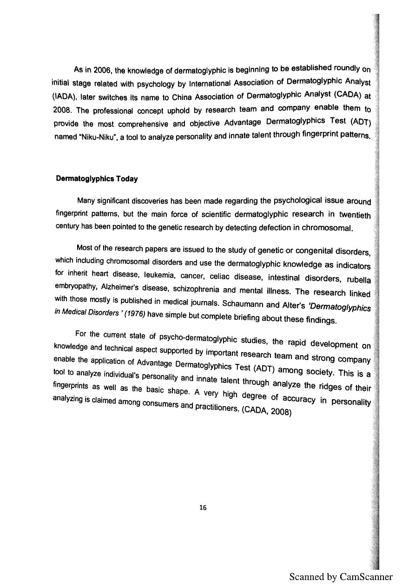

```text
tablished roundly on |
. hic is beginning to be est
As in 2006, he knowledge nines val ‘Association of Dermatoglyphic Analyst |
io
Fie a99 fleted with psychology by Item jation of Dermatoglyphic Analyst (CADA) at
(IADA), later switches its name to China Associ team and company enable them to |
arct ]
2008, The profesional concept upheld By sive Advantage Dermatoglyphics Test (ADT) |
jective |
Brovide the mast comprehensh@ and ety \d innate talent through fingerprint patterns, |
named “Niku-Niku", a tol to analyze personality and in
|
Dermatoglyphics Today /
i logical issue around
Many significant discoveries has been made regarding the psycholog he wee |
sani ic research in twenties
fingerprint patterns, but the main force of scientific dermatoglyphic resi. |
: " ion in chromosomal.
century has been pointed to the genetic research by detecting defection in cl |
Most of the research papers are issued to the study of genetic or congenital disorders,
which including chromosomal disorders and use the dermatoglyphic knowledge as indicators
for inherit heart disease, leukemia, cancer, celiac disease, intestinal disorders, rubella
embryopathy, Alzheimer’s disease, schizophrenia and mental illness. The research linked
with those mostly is published in medical journals. Schaumann and Alter’s ‘Dermatoglyphics
in Medical Disorders ' (1976) have simple but complete briefing about these findings.
For the current state of Psycho-dermatoglyphic Studies, the rapid development on |
knowledge and technical aspect supported by important research team and strong company
enable the application of Advantage Dermatoglyphics Test (ADT) among society. This is a |
tool to analyze individual's Personality and innate talent through analyze the ridges of their
fingerprints as well as the basic shape. A very high degree of accuracy in Personality
analyzing is claimed among consumers and Practitioners. (CADA, 2008)
16
Scanned by CamScanner
```

## Page 27


```text
4.2 Research Objective. To investigate the distribution of fingerprint patterns among pianist as well as their atd
angle.

e To determine the relationship between frequencies of fingerprint patterns, distribution
of atd angle and pianists. Emphasis will be put on Thumbs, middle and ring finger.

. To obtain a source of reference about the characteristic of potential pianists in terms of
their dermatoglyphic patterns.

1.3 Hypothesis

+ Fingerprint patterns represent inner talent of a person. In musical study, which required
highly specified skill on controlling muscle and hearing, the data collected is expected
to have some differences from usual statistic.

«Due to the hypothesis above, certain groups of fingerprint is expected to appear in a
higher frequency than others. This also reflects the personality that is required to
succeed in a particular field of career.

1.4 Problem Statements

«Limited number of variables studies per research paper: Small number of sampling

«Statistical methodology errors might be occurring due to limited number of sample.

1.5 Thesis Outline
Chapter (1) is an introduction displaying general concepts about fingerprint patterns

(under the study of dermatoglyphics), the function of brain in specific areas, and fingerprint
patterns according to brain sections. This chapter also exposes the objectives and problems
faced over this research.

Chapter (2) further explains fingerprint patterns and atd angle in detail. Figures and
brief explanations are provided to help readers distinguish the differences between various
Patterns of fingerprint and positions of atd angle.

v7
Scanned by CamScanner
```

## Page 28

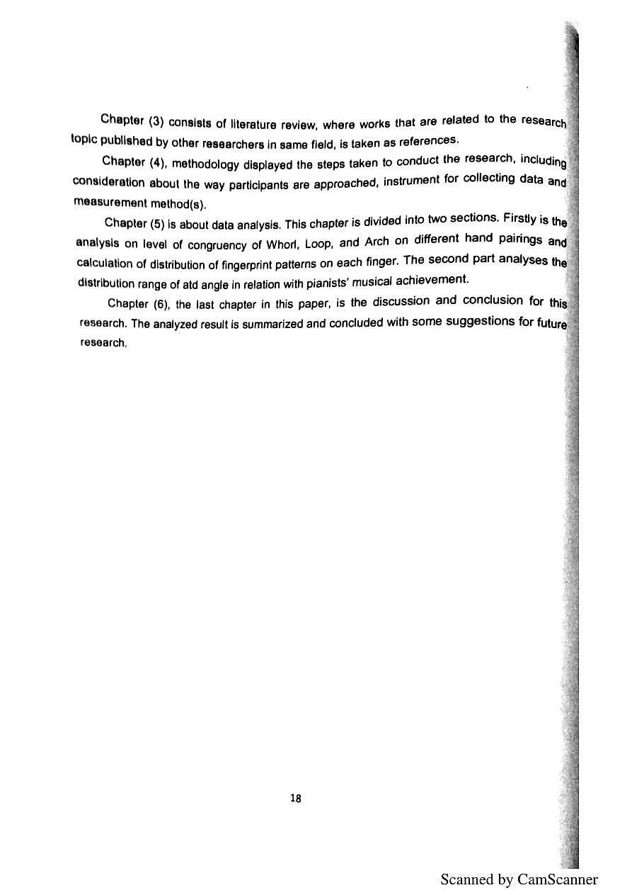

```text
Chapter (3) consists of literature review, where works that are related to the research:
‘opic published by other researchers in same field, is taken as references. ,
Chapter (4), methodology displayed the steps taken to conduct the research, including ”
consideration about the way participants are approached, instrument for collecting data and:
Measurement method(s). . ; 4

Chapter (8) is about data analysis. This chapter is divided into two sections. Firstly is the
analysis on level of congruency of Whorl, Loop, and Arch on different hand pairings ang
Calculation of distribution of fingerprint patterns on each finger. The second part analyses the
distribution range of atd angle in relation with pianists’ musical achievement.

Chapter (6), the last chapter in this paper, is the discussion and conclusion for this
research. The analyzed result is summarized and concluded with some suggestions for future.
research, F

18
Scanned by CamScanner
```

## Page 29

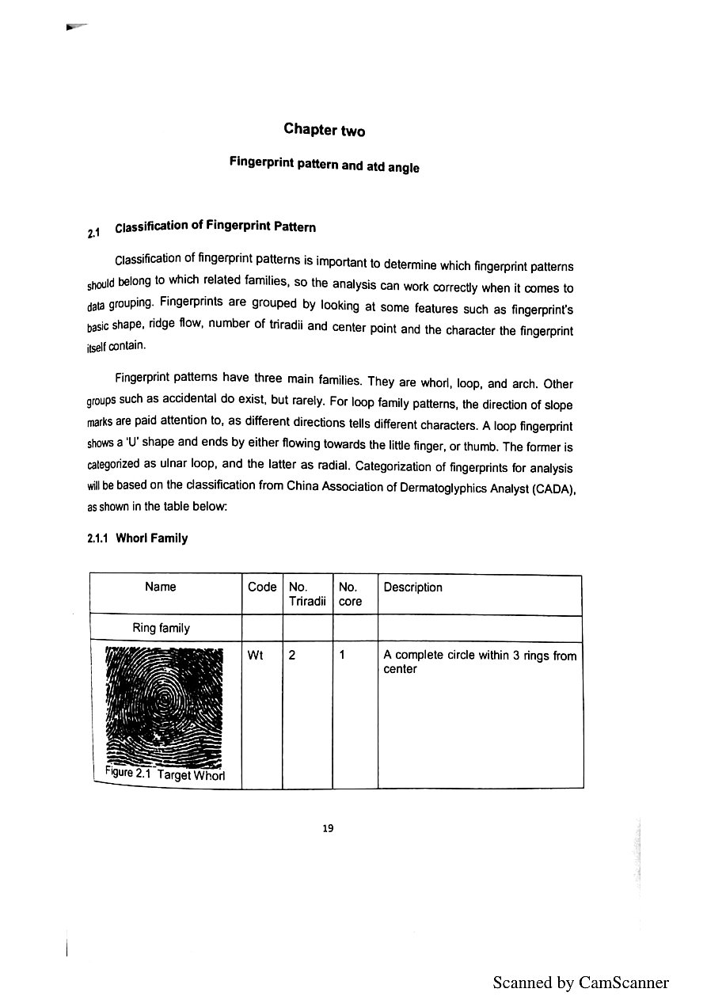

```text
=
Chapter two
Fingerprint pattern and atd angle
21 Classification of Fingerprint Pattern

Classification of fingerprint patterns is important to determine which fingerprint patterns
should belong to which related families, so the analysis can work correctly when it comes to
gata grouping. Fingerprints are grouped by looking at some features such as fingerprint's
basic shape, ridge flow, number of triradii and center point and the character the fingerprint
itself contain.

Fingerprint pattems have three main families. They are whorl, loop, and arch. Other
groups such as accidental do exist, but rarely, For loop family patterns, the direction of slope
marks are paid attention to, as different directions tells different characters. A loop fingerprint
shows a 'U' shape and ends by either flowing towards the little finger, or thumb. The former is
categorized as ulnar loop, and the latter as radial. Categorization of fingerprints for analysis
will be based on the classification from China Association of Dermatoglyphics Analyst (CADA),
as shown in the table below:

24.4, Whorl Family
Code | No. Description
Triradii

eZee A complete circle within 3 rings from
| tit{Ere center

TA e=N
| Besa
|_Figure 21 Target Whot

19
|
Scanned by CamScanner
```

## Page 30

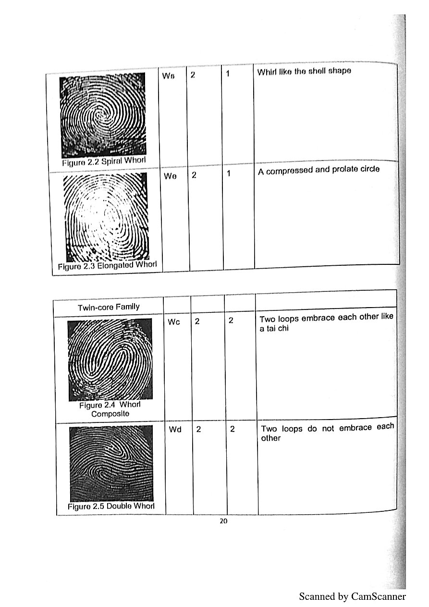

```text
pprereeey (We | 2 1 Whit like tho ahollshapo SS |
Ei HES, 9 the aholl shape |
"@))
N
WRN 2022
Figure 2.2 Spiral Whorl ee |
: Yaw Wo |2 1 A compressed and prolate circle
My SSN
ean) NN
weed)
ees
Se
Figuro 2.3 Elongated Whorl
—Tymcooranty | ||
_ Oe —
WH Zo We |2 2 be pital embrace each other like
HH}
(i
MWR
WI)
Figuro 2.4 Whorl
Composit
Figuro 2.5 Double Wher |
OO 20 _
Scanned by CamScanner
```

## Page 31

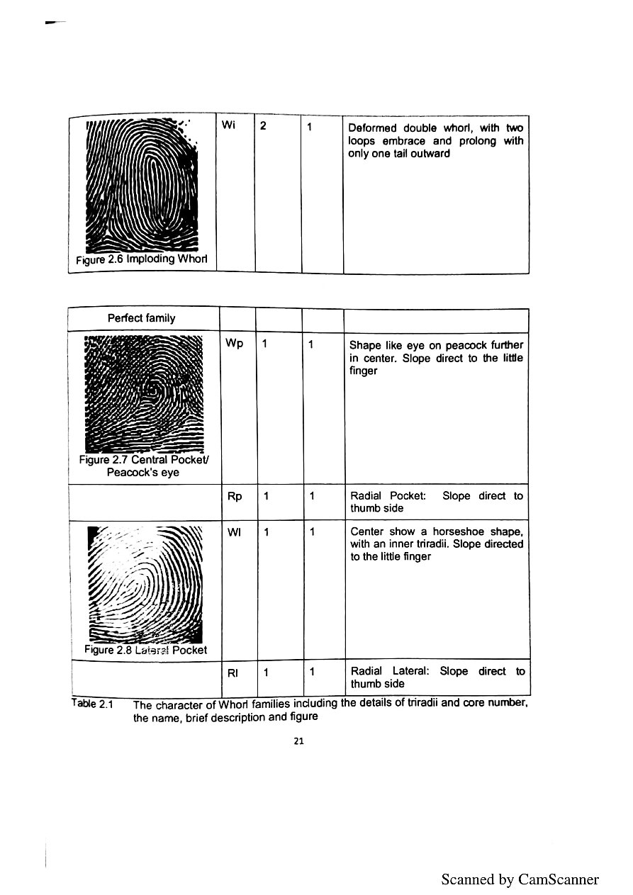

```text
y lj wi |2 1 Deformed double whorl, with two
lH} WW: . loops embrace and prolong with
=$W~ XN
} yy Ge only one tail outward
wy (\ yi
Why } MN)
UH it | AH WN
INU
| ZESs2ezz
Figure 2.6 imploding Whorl
| ppm se. | wp 1 Sh: k furth
| ees ape like eye on peacock further
| Bae ENS in center. Slope direct to the little
Ugo EIGEN NS
| Bape NNS finger
| Figure 2.7 Central Pocket’
| Peacock's eye
| 1 Radial Pocket: Slope direct to
| thumb side
a 2 = “Yi 1 Center show a horseshoe shape,
| Zz or \\ with an inner triradii. Slope directed
j Y Ze \\ to the litte finger
Gye
| BEY
Figure 2.8 Laisr2t Pocket
Radial Lateral: Slope direct to
thumb side
Table 21 The character of Whorl families including the details of trradii and core number,
the name, brief description and figure
a
Scanned by CamScanner
```

## Page 32

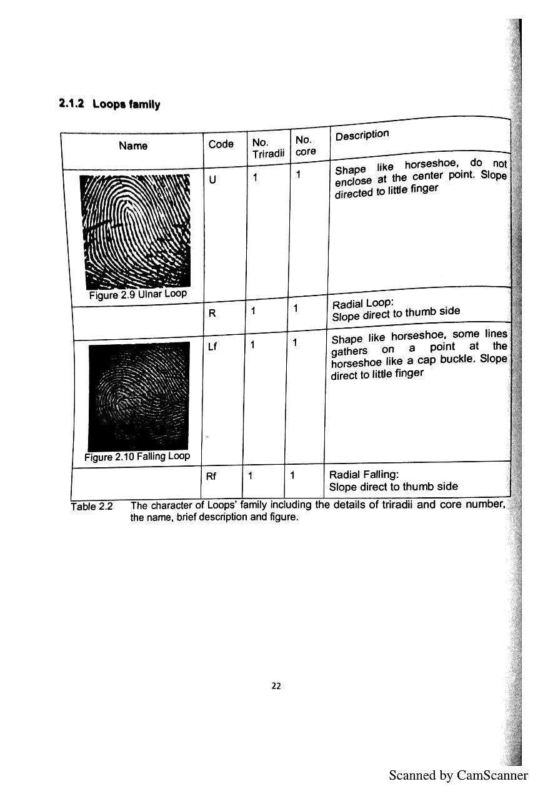

```text
2.1.2 Loops family |
Name Code | No. No. Description |
Triradii | core 4
7 " Shape like horseshoe, do not} |
WEN. \\\\ u 1 ' Sneose at the center point. Slope | |
vy} H( \ \\ directed to little finger
Mi \
AAS,
SY =
SS b
Figure 2.9 Ulnar Loop E
Radial Loop: . FE
Slope direct to thumb side:
Lf 1 Shape like horseshoe, some lines
WS gathers on @ point at the}
WAN horseshoe like a cap buckle. Slope | ”
i. AWS direct to little finger #
Figure 2.10 Falling Loop |
1 1 Radial Falling: |
Slope direct to thumb side |
Table 22 The character of Loops’ family including the details of triradi
the name, brief description and figure. firadii and core number,
|
|
|
|
|
22 1
i
j
Scanned by CamScanner
```

## Page 33

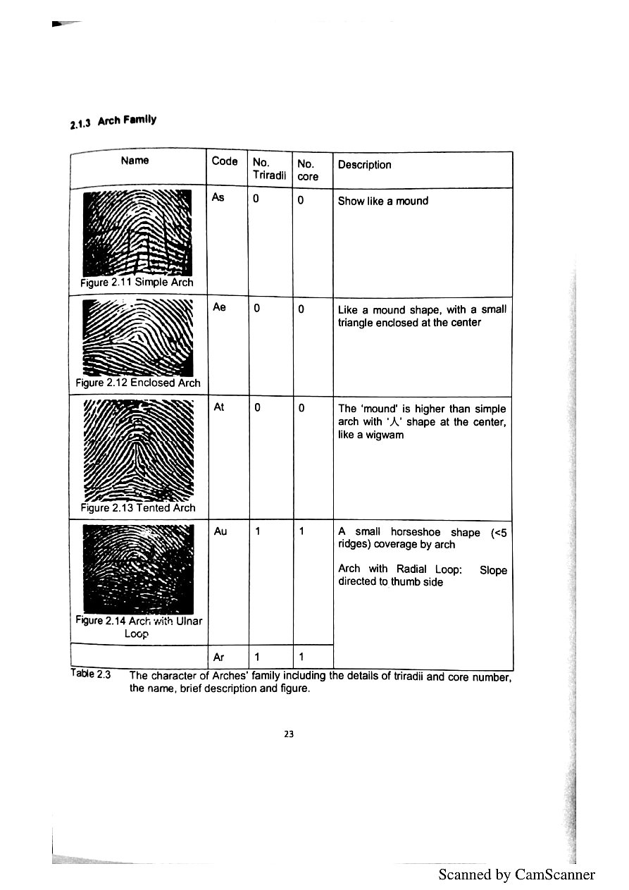

```text
—
2.4.3 Arch Family
[ Name Code |No. |No. | Description
Triradii | core
YEIE--ATwN ES
iy NS ‘Show like a mound
Taga
\ (gees:
Bg Bree!
Figure 2.11 Simple Arch
a \\ Ae Like a mound shape, with a small
triangle enclosed at the center
Z A
Figure 2.12 Enclosed Arch
WP NEES The ‘mound’ is high it
i igher than simple
Wj Ys N arch with “A' shape at the center,
YY Yi EWN like a wigwam
Y IW
LEN S
g
Figure 2.13 Tented Arch
EEE | AU ‘A. small horseshoe shape (<5
% NN ridges) covera
ZENS | ge by arch
TEESRRS Arch with Radial Loop: Slope
aS: directed to thumb side
Figure 2.14 Arch with Ulnar
| Loep
ee oe
Table 23 The character of Arches’ family including the details of tradi and core number,
the name, brief description and figure.
2
|
Scanned by CamScanner
```

## Page 34

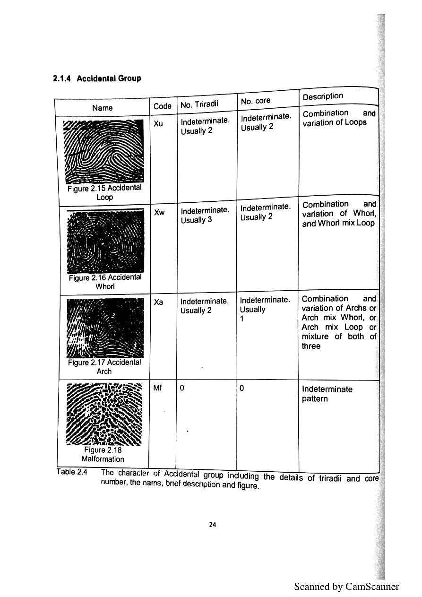

```text
4
2.1.4 Accidental Group:
Name No Triradil | No. core vm
i Combination and
Peg aSSy | Xv | Indeterminate. indeterminate. cormmon of Loops
YWyeW Usually 2 Isually
Figure 2.15 Accidental
Loop sail |
inate. | Indeterminate. Combination and
peered |%" | nce ally 2 variation of Whod,
NEBR SC sually and Whorl mix Loop
Figure 2.16 Accidental
Whorl |
i rs Xa | indeterminate. | Indeterminate. | Combination and |
ore eo Usually 2 Usually variation of Archs or | |
Hibs 2 1 Arch mix Who, or} |
YH a ora Arch mix Loop or| |
i mixture of both of| |
Uh eee three
fi LS }
Figure 2.17 Accidental |
Arch |
GR 0 Indeterminate
pattern |
ZA Bw
Figure 2.18 |
Malformation |
Table 24 The character of Accidental includi
a ci group including thi il jradii:
number, the nama, bref description and figure, @ detals of tradi and core |
24 |
j
j
Scanned by CamScanner
```

## Page 35

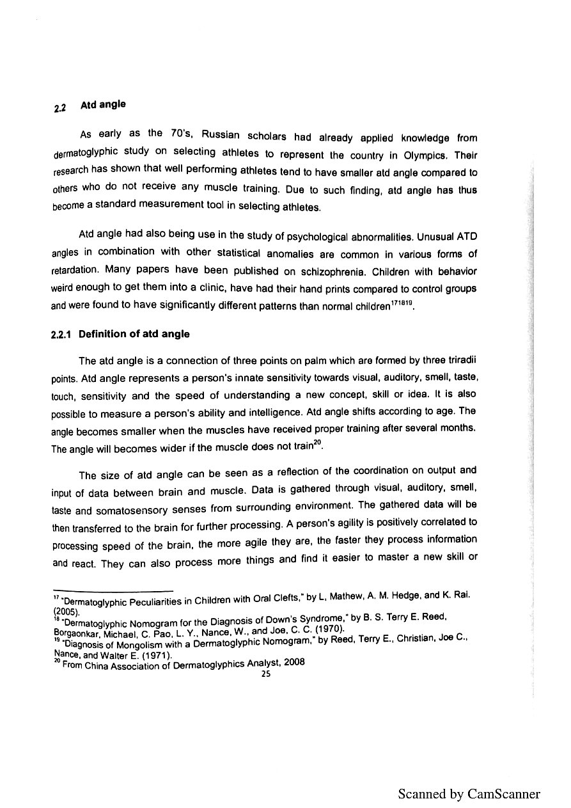

```text
22 Atd angle
as 1! ?

As carly s the 70's, Russian scholars had already applied knowledge from
dermatoglyphic study on selecting athletes to represent the country in Olympics, Their
research has shown that wel Performing athletes tend to have smaller atd angle compared to
others who do not receive any muscle training. Due to such finding, atd angle has thus
become a standard measurement tool in selecting athletes.

Atd angle had also being use in the study of psychological abnormalities, Unusual ATD
angles in combination with other statistical anomalies are common in various forms of
retardation. Many papers have been published on schizophrenia. Children with behavior
weird enough to get them into a clinic, have had their hand prints compared to control groups
and were found to have significantly different patterns than normal children’”"",

2.24 Definition of atd angle

The atd angle is a connection of three points on palm which are formed by three triradii
points. Atd angle represents a person's innate sensitivity towards visual, auditory, smell, taste,
touch, sensitivity and the speed of understanding a new concept, skill or idea. It is also
possible to measure a person's ability and intelligence. Atd angle shifts according to age. The
angle becomes smaller when the muscles have received proper training after several months.
The angle will becomes wider if the muscle does not train?®,

The size of atd angle can be seen as a reflection of the coordination on output and
input of data between brain and muscle. Data is gathered through visual, auditory, smell,
laste and somatosensory senses from surrounding environment. The gathered data will be
then transferred to the brain for further processing. A person's agility is positively correlated to
Processing speed of the brain, the more agile they are, the faster they process information
and react. They can also process more things and find it easier to master a new skill or
eamermatoalyphic Peculiarites in Children with Oral Clefts,” by L, Mathew, A, M, Hedge, and K. Ral.

(2005),
te? * by B. S. Terry E. Reed,
‘Dermatoglyphic Nomogram for the Diagnosis of Down's Syndrome,” by B. S. Terry
Borgaonkar, Michael, @ Pao. L. ¥., Nance, W., and Joe, C. C. (1970). ;
“Diagnosis of Mongolism with a Dermatoglyphic Nomogram.” by Reed, Terry E., Christian, Joe C.
Nance, and Walter E. (1971).
From China Association of Dermatoglyphics Analyst, 2008
25
Scanned by CamScanner
```

## Page 36

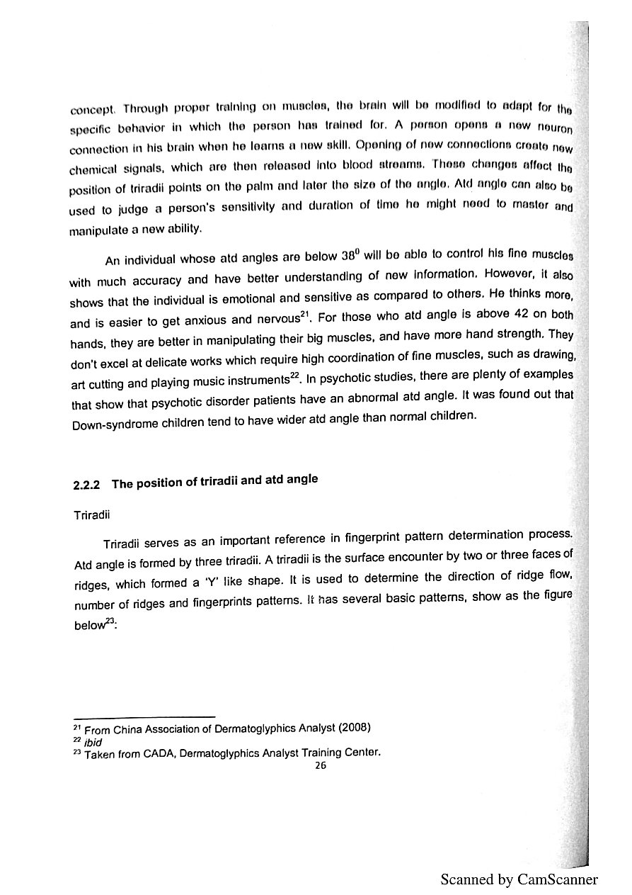

```text
concept, Through propor training on muscles, the brain will bo modifid to adapt for the
specific behavior in which the person has trained for, A porson opens a new nouron
connection int his brain when he loams a new skill, Opening of new connoctions croate now
chemical signals, which are then released Into blood atroams, Thoso changos affoct th
position of trradii points on the palm and later tho sizo of the anglo, Ald angio can also by
used to judge a person's sensitivity and duration of timo he might noad to mastor ang
manipulate a new ability.

[An individual whose atd angles are below 38° will bo ablo to control his fine musclos
with much accuracy and have better understanding of new Information. However, it also
shows that the individual is emotional and sensitive as compared to others. He thinks more,
and is easier to get anxious and nervous”. For those who atd angle is above 42 on both
hands, they are better in manipulating their big muscles, and have more hand strength. They
don't excel at delicate works which require high coordination of fine muscles, such as drawing,
art cutting and playing music instruments”. In psychotic studies, there are plenty of examples
that show that psychotic disorder patients have an abnormal atd angle. It was found out that
Down-syndrome children tend to have wider atd angle than normal children.
2.2.2 The position of triradii and atd angle
Triradii

Tritadii serves as an important reference in fingerprint pattern determination process.
‘Atd angle is formed by three triradii. A triradii is the surface encounter by two or three faces of
ridges, which formed a ‘Y’ like shape. It is used to determine the direction of ridge flow,
number of ridges and fingerprints patterns. lt has several basic patterns, show as the figure
below”:
2 from China Association of Dermatoglyphics Analyst (2008)
® Taken from CADA, Dermatoglyphics Analyst Training Center.

26
Scanned by CamScanner
```

## Page 37

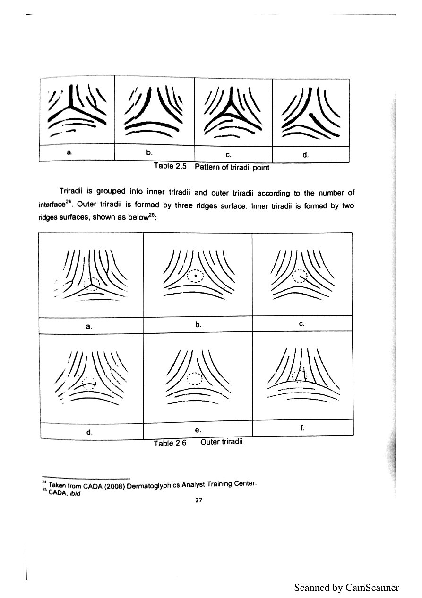

```text
ZENUNUNUA
‘able 2.5 Pattern of triradi point

Triradii is grouped into inner triradii and outer triradii according to the number of
interface’. Outer triradii is formed by three ridges surface. Inner triradii is formed by two
ridges surfaces, shown as below”:

(= —_— YS =_—
A

HI\\\W
L ee |
- Table 2.6 Outer triradii
1 Tgig ton CAD 008) Darmatogiphies Analyst Training Center.

| Scanned by CamScanner
```

## Page 38

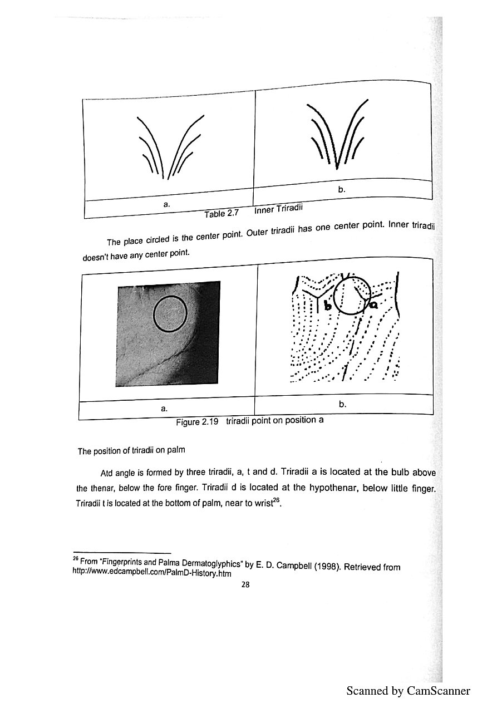

```text
y | We
“. Table 27 inner Teiradil
‘radii int. Inner triradit
i triradii has one center poi fi
The place circled is the center point Outer
doesn't have any center point.
ee One 8 op E ES &
Figure 2.19 triradii point on position a
The position of triradii on palm
Atd angle is formed by three triradii, a, t and d. Triradii a is located at the bulb above
the thenar, below the fore finger. Triradii d is located at the hypothenar, below little finger.
Triradil tis located at the bottom of palm, near to wrist”,
* From “Fingerprints and Palma Dermatoglyphics* ;
htuNowe Scanpbellcomanb tae ne by E. D. Campbell (1998). Retrieved from
28
Scanned by CamScanner
```

## Page 39

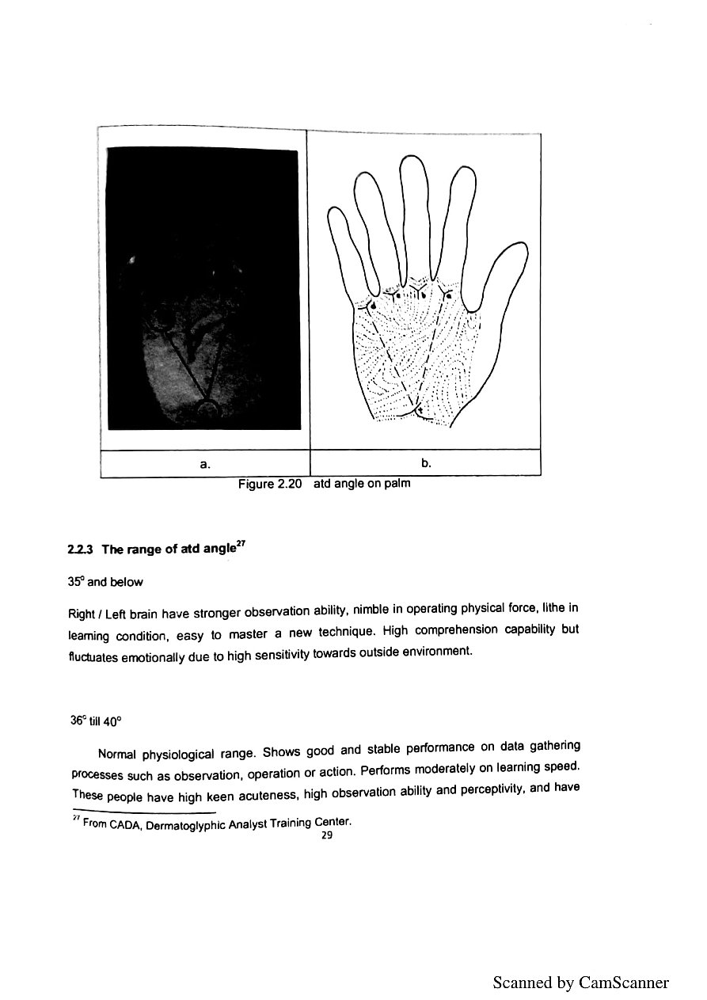

```text
| . NBOAY
=
E ee
Figure 2.20 atd angle on palm

223 The range of atd angle”
35° and below
Right / Left brain have stronger observation ability, nimble in operating physical force, lithe in
leaming condition, easy to master a new technique. High comprehension capability but
fluctuates emotionally due to high sensitivity towards outside environment.
36° till 40°

Normal physiological range. Shows good and stable performance on data gathering
processes such as observation, operation or action. Performs moderately on learning speed.
These people have high keen acuteness, high observation ability and perceptivly, and have

From CADA, Dermatoglyphic Analyst Training Center.
2
Scanned by CamScanner
```

## Page 40

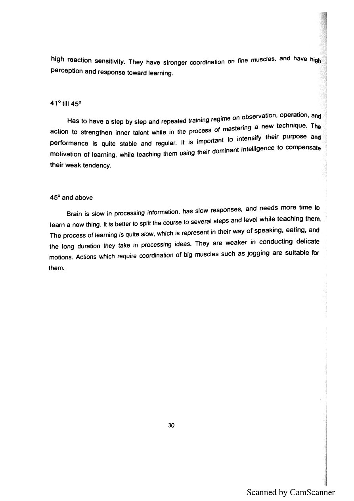

```text
q
high i —
igh reaction sensitivity. They have stronger coordination on fine muscles. and have high
Perception and response toward learning.
41° till 45°
Has to have a step by step and repeated training regime on observation, operation, ang
action to strengthen inner talent while in the process of mastering a new technique. The
Performance is quite stable and regular. It is important to intensify their purpose ang
Motivation of learning, while teaching them using their dominant intelligence to compensate
their weak tendency.
45° and above
Brain is slow in processing information, has slow responses, and needs more time to
learn a new thing. It is better to split the course to several steps and level while teaching them.
The process of learning is quite slow, which is represent in their way of speaking, eating, and
the long duration they take in processing ideas. They are weaker in conducting delicate
motions. Actions which require coordination of big muscles such as jogging are suitable for
them.
30
|
|
Scanned by CamScanner
```

## Page 41

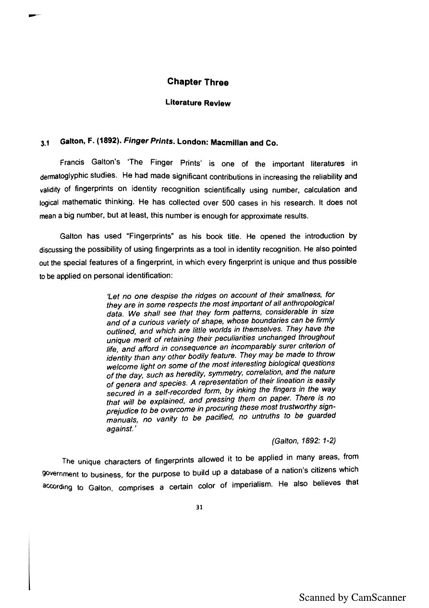

```text
Chapter Three
Literature Review
3.4 Galton, F. (1892). Finger Prints. London: Macmillan and Co.

Francis Galton’s ‘The Finger Prints’ is one of the important literatures in
dermatoglyphic studies. He had made significant contributions in increasing the reliability and
validity of fingerprints on identity recognition scientifically using number, calculation and
logical mathematic thinking. He has collected over 500 cases in his research. It does not
mean a big number, but at least, this number is enough for approximate results.

Galton has used “Fingerprints" as his book title. He opened the introduction by
discussing the possibility of using fingerprints as a tool in identity recognition. He also pointed
out the special features of a fingerprint, in which every fingerprint is unique and thus possible
tobe applied on personal identification:

‘Let no one despise the ridges on account of their smaliness, for
they are in some respects the most important of all anthropological
data. We shall see that they form patterns, considerable in size
and of a curious variety of shape, whose boundaries can be firmly
‘outlined, and which are little worlds in themselves. They have the
unique merit of retaining their peculiarities unchanged throughout
life, and afford in consequence an incomparably surer criterion of
identity than any other bodily feature. They may be made to throw
welcome light on some of the most interesting biological questions
of the day, such as heredity, symmetry, correlation, and the nature
of genera and species. A representation of their lineation is easily
‘secured in a self-recorded form, by inking the fingers in the way
that will be explained, and pressing them on paper. There is no
prejudice to be overcome in procuring these most trustworthy signmanuals, no vanity to be pacified, no untruths to be guarded
against.’

(Galton, 1892: 1-2)

The unique characters of fingerprints allowed it to be applied in many areas, from
government to business, for the purpose to build up a database of a nation’s citizens which
according to Galton, comprises a certain color of imperialism. He also believes that

31
Scanned by CamScanner
```

## Page 42

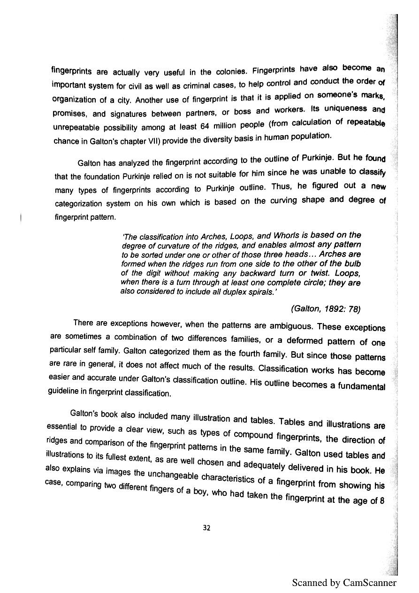

```text
; i fe also become an
fingerprints are actually very useful in the colonies. Fingerprints hav |
i mit to help control and conduct the order of |
important system for civil as well as criminal cases, to, |
int is that it is applied on someone's marks,
organization of a city. Another use of fingerprin;
i boss and workers. Its uniqueness ang
Promises, and signatures between partners, or; (
4 million people (from calculation of repeatable
unrepeatable possibility among at least 64 mi "
i diversity basis in human population.
chance in Galton’s chapter VI!) provide the
i i tine of Purkinje. But he found
Galton has analyzed the fingerprint according to the out "
jt is itable for him since he was unable to classify
that the foundation Purkinje relied on is not suitat
i kinje outline. Thus, he figured out a new
many types of fingerprints according to Purkinj rape and degree 24
ich i ing sha|
categorization system on his own which is based on the curving pe
| fingerprint pattern.
ification ir is based on the
‘The classification into Arches, Loops, and Whoris is
degree of curvature of the ridges, and enables almost any pattern
to be sorted under one or other of those three heads... Arches are
formed when the ridges run from one side to the other of the bulb
of the digit without making any backward turn or twist. Loops,
when there is a turn through at least one complete circle; they are
also considered to include all duplex spirals.’
(Galton, 1892: 78)

There are exceptions however, when the patterns are ambiguous. These exceptions
are sometimes a combination of two differences families, or a deformed pattern of one
Particular self family. Galton categorized them as the fourth family. But since those Patterns
are rare in general, it does not affect much of the results. Classification works has become
easier and accurate under Galton’s classification outline. His outline becomes a fundamental
guideline in fingerprint classification.

. oo mn also included many illustration and ables. Tables and illustrations are
sential to provide a. .
ridges and m ‘ oe Ws Sih 28 ypes Of compound fingerprints, the direction of
comparis i. .
ilustrations t - i ten of ihe fingerprint patterns in the same family. Galton used tables and
's to its fullest exte ‘
also explains via i nts 28 are well chosen and adequately delivered in his book. He |
explains via images the unchangeable characteristi ‘ . .
i eristics of a fingerprint from showing hi
case, comparing two different fingers of a boy, who h; m showing his: who had taken the fingerprint at the age of 8
32 |
|
Scanned by CamScanner
```

## Page 43

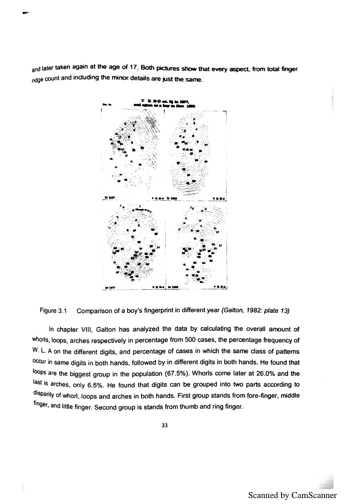

```text
and later taken again at the age of 17. Both pictures show that every aspect. from total finger
fidge count and including the minor details are just the same.
Re,
TAT 5
SS z
BOS re.
oh x ary
ah ae Fy
Pee eT age
> aoe ee the
== Say
z - ae. ae
‘me ee! al
ee eat es
pes oo"
ene ak j
Figure 3.1 Comparison of a boy's fingerprint in different year (Galton, 1982: plate 13)

In chapter Vill, Galton has analyzed the data by calculating the overall amount of
whorls, loops, arches respectively in percentage from 500 cases, the percentage frequency of
W. L. Aon the different digits, and percentage of cases in which the same class of pattems
Occur in same digits in both hands, followed by in different digits in both hands. He found that
‘oops are the biggest group in the population (67.5%). Whorls come later at 26.0% and the
last is arches, only 6.5%. He found that digits can be grouped into two parts according to
isparity of whorl, loops and arches in both hands. First group stands from fore-finger, middle
finger, and litte finger. Second group is stands from thumb and ring finger.

33
Scanned by CamScanner
```

## Page 44

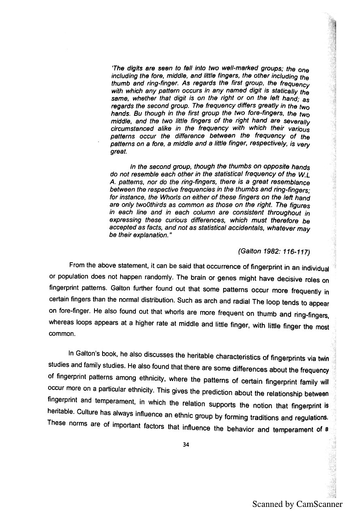

```text
i
‘The digits are seen {0 fall into two well-marked groups; the one
including the fore, middle, and little fingers, the other including the
thumb and ring-finger. As regards the first group, the frequency
with which any pattern occurs in any named digit Is statically the
same, whether that digit is on the right or on the left hand; as
regards the second group. The frequency differs greatly in the two
hands. Bu though in the first group the two fore-fingers, the two
middie, and the two little fingers of the right hand are severally
circumstanced alike in the frequency with which their various
patterns occur the difference between the frequency of the
patterns on a fore, a middle and a little finger, respectively, is very
great.
In the second group, though the thumbs on opposite hands
do not resemble each other in the statistical frequency of the W.L
A. patterns, nor do the ring-fingers, there is a great resemblance
between the respective frequencies in the thumbs and ring-fingers;
for instance, the Whoris on either of these fingers on the left hand
are only two0thirds as common as those on the right. The figures
in each line and in each column are consistent throughout in
expressing these curious differences, which must therefore be
accepted as facts, and not as statistical accidentals, whatever may
be their explanation.”
(Galton 1982: 116-117)

From the above statement, it can be said that occurrence of fingerprint in an individual
or population does not happen randomly. The brain or genes might have decisive roles on
fingerprint pattems. Galton further found out that some patterns occur more frequently in
Certain fingers than the normal distribution. Such as arch and radial The loop tends to appear
on fore-finger. He also found out that whorls are more frequent on thumb and ting-fingers,
whereas loops appears at a higher rate at middle and little finger, with little finger the most
common.

In Galton's book, he also discusses the heritable characteristics of fingerprints via twin
Studies and family studies. He also found that there are some differences about the frequency
of fingerprint patterns among ethnicity, where the patterns of certain fingerprint family will
Occur more on a particular ethnicity. This gives the prediction about the relationship between
fingerprint and temperament, in which the elation supports the notion that fingerprint is
heritable. Culture has always influence an ethnic group by forming traditions and regulations.
These norms are of important factors that influence the behavior and temperament of 8

34
Scanned by CamScanner
```

## Page 45

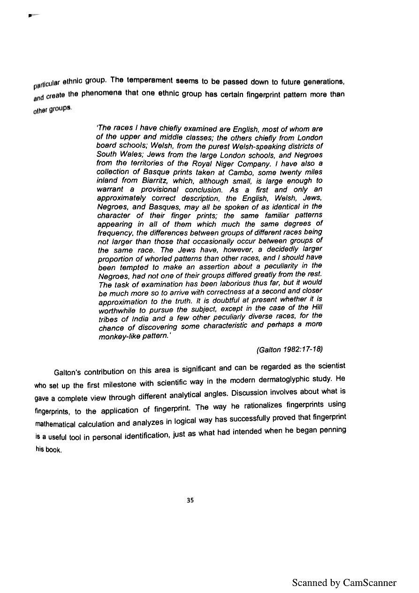

```text
,
paricular thio, Group. The temperament seems to be passed down to future generations,
and create the phenomena that one ethnic group has certain fingerprint pattern more than
ther groups:
‘The races | have chiefly examined are English, most of whom are
of the upper and middle classes; the others chiefly from London
board schools; Welsh, from the purest Welsh-speaking districts of
South Wales; Jews from the large London schools, and Negroes
from the territories of the Royal Niger Company. | have also @
collection of Basque prints taken at Cambo, some twenty miles
inland from Biarritz, which, although small, is large enough to
warrant a provisional conclusion. As a first and only an
approximately correct description, the English, Welsh, Jews,
Negroes, and Basques, may all be spoken of as identical in the
character of their finger prints; the same familiar patterns
appearing in all of them which much the same degrees of
frequency, the differences between groups of different races being
not larger than those that occasionally occur between groups of
the same race. The Jews have, however, a decidedly larger
proportion of whorled patterns than other races, and | should have
been tempted to make an assertion about a peculiarity in the
Negroes, had not one of their groups differed greatly from the rest.
The task of examination has been laborious thus far, but it would
be much more so to arrive with correctness at a second and closer
approximation to the truth. it is doubtful at present whether it is
worthwhile to pursue the subject, except in the case of the Hill
tribes of India and a few other peculiarly diverse races, for the
chance of discovering some characteristic and perhaps a more
monkey-like pattern.’
(Galton 1982:17-18)
Galton's contribution on this area is significant and can be regarded as the scientist
who set up the first milestone with scientific way in the modern dermatoglyphic study. He
gave a complete view through different analytical angles. Discussion involves about what is
fingerprints, to the application of fingerprint. The way he rationalizes fingerprints using
mathematical calculation and analyzes in logical way has successfully proved that fingerprint
is a useful tool in personal identification, just as what had intended when he began penning
his book.
35
Scanned by CamScanner
```

## Page 46

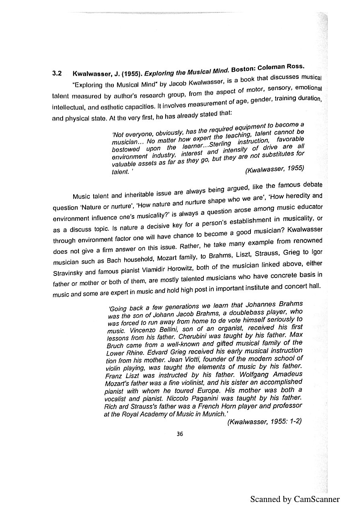

```text
3.2 Kwalwassor, J. (1985). Exploring the Musical Mind. Boston: Coleman Ross.
“Exploring th Musical Mind” by Jacob Kwalwassor, is 2 book that discusses musical
talent moasured by author's research group, from the aspect of motor, sensory, emotional
intollectual, and osthotic capacities. It involves measurement of age, gender, training duration,
and physical state. At tha vary frst, he has already stated that:
F i t fo become a
‘Not everyone, obviously, has the raquired equipmen
ne tame 'No matter how oxpert (he teacnind: talent cannot be
postowed upon the learner...Stering instruction, favorable
environment industry, interest and intensity of drive it ie a
criabio assots as far as they go, but they 27° not substitutes for
talent.’ (Kwalwasser, 1955)
Music talent and inherilable issue are always being argued, like the famous debate
question ‘Nature or nurture’, ‘How nature and nurture shape who we are’, ‘How heredity and
sanvironment influence one's musically?” is always @ question F0Se among music educator
as a discuss topic. Is nalure 3 decisive key for a person's establishment in musicality, or
through environment factor one will have chance to become a good musician? Kwalwasser
does not give a firm answer on this issue. Rather, he take many example from renowned
musician such as Bach household, Mozart family, to Brahms, Liszt, Strauss, Grieg to Igor
Stravinsky and famous pianist Viamidir Horowitz, both of the musician linked above, either
father or mother or both of them, are mostly talented musicians who have concrete basis in
musi¢ and some are expert in music and hold high post in important institute and concert hall.
‘Going back a few generations we learn that Johannes Brahms
was the son of Johann Jacob Brahms, a doublebass player, who
was forced to run away from home to de vote himself seriously to
music. Vincenzo Bellini, son of an organist, received his first
jessons from his father. Cherubini was taught by his father. Max
Bruch came from a well-known and gifted musical family of the
Lower Rhine. Edvard Grieg received his early musical instruction
tion from his mother. Jean Viott, founder of the modern school of
vt playing, was taught the elements of music by his father.
ranz Liszt was instructed by his father. Wolfgang Amadeus
Mozen's father was a fine violinist, and his sister an accomplished
pianist with whom he toured Europe. His mother was oth
vocalist and pianist. Niccolo Paganini was taught by his father
fhch ord Strause's father was a French Horn player and rofessor
at the Royal Academy of Music in Munich.’ _—
(Kwalwasser, 1955: 1-2)
36
Scanned by CamScanner
```

## Page 47

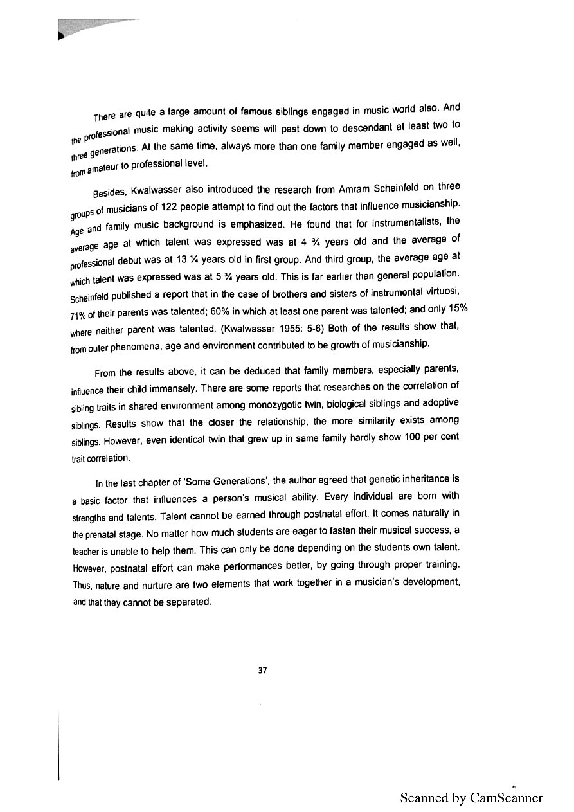

```text
»

qhere are quite a large amount of famous siblings engaged in music world also. And
is professional music making activity seems will past down to descendant al least two to
ree generations: Al the same time, always more than one family member engaged as well,
fromamateut to professional level.

pesides, Kwalwasser also introduced the research from Amram Scheinfeld on three
youns of musicians of 122 people attempt to find out the factors that influence musicianship.
Age and family music background is emphasized. He found that for instrumentalists, the
average age at which talent was expressed was at 4 % years old and the average of
professional debut was at 13 1% years old in first group. And third group, the average age at
which talent wes: expressed was at 5% years old. This is far earlier than general population.
cheinfeld published a report that in the case of brothers and sisters of instrumental virtuosi,
71% of their parents was talented; 60% in which at least one parent was talented; and only 15%
where neither parent was talented. (Kwalwasser 1955: 5-6) Both of the results show that,
from outer phenomena, age and environment contributed to be growth of musicianship.

From the results above, it can be deduced that family members, especially parents,
influence their child immensely. There are some reports that researches on the correlation of
sibling taits in shared environment among monozygotic twin, biological siblings and adoptive
siblings. Results show that the closer the relationship, the more similarity exists among
siblings. However, even identical twin that grew up in same family hardly show 100 per cent
tvail correlation.

In the last chapter of ‘Some Generations’, the author agreed that genetic inheritance is
2 basic factor that influences a person's musical ability. Every individual are born with
stengths and talents. Talent cannot be earned through postnatal effort. It comes naturally in
the prenatal stage. No matter how much students are eager to fasten their musical success, a
leacher is unable to help them. This can only be done depending on the students own talent.
However, postnatal effort can make performances better, by going through proper training,
Thus, nature and nurture are two elements that work together in a musician's development,
and that they cannot be separated.

37
Scanned by CamScanner
```

## Page 48

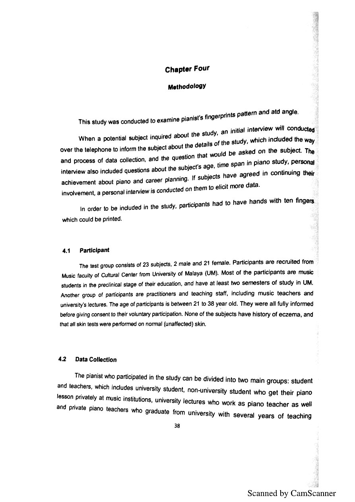

```text
|
Chapter Four
Methodology
ey tern and atd angle.
This study was conducted to examine pianists fingerprints patt 3
initial interview will con
When a potential subject inquired about the study, an initial ine fs ve aed
r ict e
cover the telephone to inform the subject about the details of the study, ° Way
- ion that would be asked on the subject. The
and process of data collection, and the question. in piano study, per:
interview also included questions about the subject's age. time Span IP) ma con ing tet
achievement about piano and career planning. if subjects have 2972 ° ving tel
involvement, a personal interview is conducted on them to elicit more data.
in order to be induded in the study, participants had to have hands with ten ingen
which could be printed.
44 Participant
The test group consists of 23 subjects, 2 male and 21 female. Participants are recruited from
Music faculty of Cultural Center from University of Malaya (UM). Most of the participants are music
students in the preclinical stage of their education, and have at least two semesters of study in UM.
‘Another group of participants are practitioners and teaching staff, including music teachers and
university's lectures. The age of participants is between 21 to 38 year old. They were all fully informed
before giving consent to their voluntary participation. None of the subjects have history of eczema, and
that all skin tests were performed on normal (unaffected) skin.
42 Data Collection
The pianist who partici
ipated in the study can be divided i i
and teachers, which includes university student, oy ie, Non-unir i a,
'esson privately at music institutions, university | ae he ont Het thet plane, univers -
2nd private piano teachers who graduate to saree tote 38 Bano teacher as wel
from i it i
university with several years of teachin:
9
38
Scanned by CamScanner
```

## Page 49

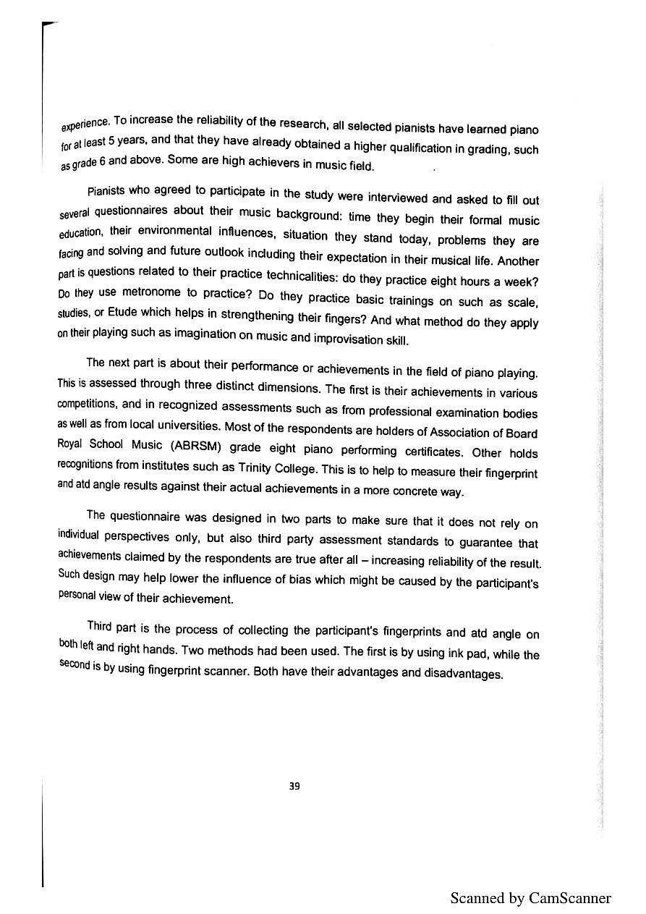

```text
. experience. To increase the reliability of the research, all selected pianists have learned Piano
foratleast 5 years, and that they have already obtained a higher qualification in grading, such
asgrade 6 and above. Some are high achievers in music field,

Pianists who agreed to participate in the Study were interviewed and asked to fill out
several questionnaires about their music background: time they begin their formal music
education, their environmental influences, situation they stand today, problems they are
facing and solving and future outlook including their expectation in their musical life. Another
part is questions related to their practice technicalities: do they practice eight hours a week?
Do they use metronome to practice? Do they Practice basic trainings on such as scale,
studies, or Etude which helps in strengthening their fingers? And what method do they apply
on their playing such as imagination on music and improvisation skill.

The next part is about their performance or achievements in the field of piano playing.
This is assessed through three distinct dimensions. The first is their achievements in various
competitions, and in recognized assessments such as from professional examination bodies
as well as from local universities. Most of the respondents are holders of Association of Board
Royal School Music (ABRSM) grade eight piano performing certificates. Other holds
recognitions from institutes such as Trinity College. This is to help to measure their fingerprint
and atd angle results against their actual achievements in a more concrete way.

The questionnaire was designed in two parts to make sure that it does not rely on
Individual perspectives only, but also third party assessment standards to guarantee that
achievements claimed by the respondents are true after all - increasing reliability of the result,
Such design may help lower the influence of bias which might be caused by the participant's
Personal view of their achievement.

Third part is the process of collecting the participant's fingerprints and atd angle on
both left and right hands. Two methods had been used. The first is by using ink pad, while the
Second is by using fingerprint scanner. Both have their advantages and disadvantages.

39
| Scanned by CamScanner
```

## Page 50

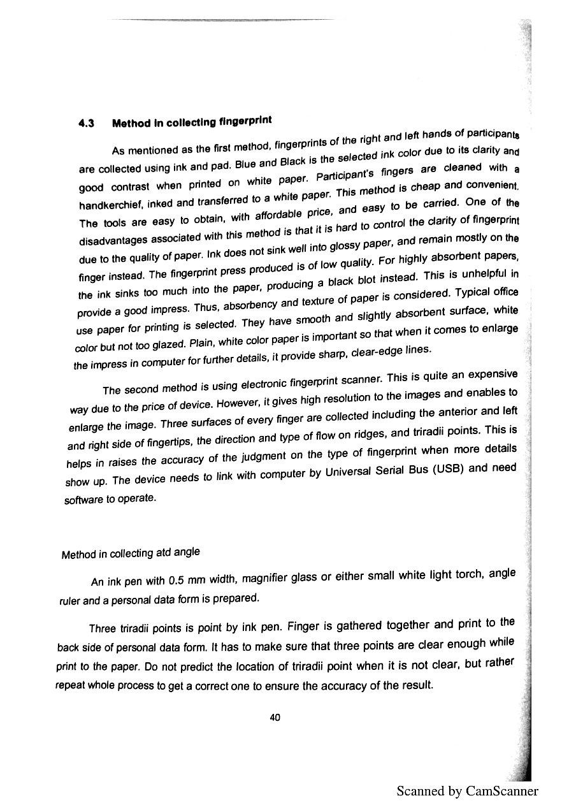

```text
]
4.3 Method In collecting fingerprint
‘As mentioned as the first method, fingerprints of the right and left hands of participants
are collected using ink and pad. Blue and Black is the selected ink color due to its clarity ang
good contrast when printed on white paper. Participant's fingers are cleaned with a
handkerchief, inked and transferred to a white paper. This method is cheap and convenient,
The tools are easy to obtain, with affordable price, and easy to be carried. One of the
disadvantages associated with this method is that it is hard to control the larity of fingerprint
due to the quality of paper. Ink does not sink well into glossy Pape’, and remain mostly on the
finger instead. The fingerprint press produced is of low quality. For highly absorbent papers,
the ink sinks too much into the paper, producing a black blot instead. This is unhelpful in
provide a good impress. Thus, absorbency and texture of paper is considered. Typical office
use paper for printing is selected. They have smooth and slightly absorbent surface, white
color but not too glazed. Plain, white color paper is important so that when it comes to enlarge
the impress in computer for further details, it provide sharp, clear-edge lines.

The second method is using electronic fingerprint scanner. This is quite an expensive
way due to the price of device. However, it gives high resolution to the images and enables to
enlarge the image. Three surfaces of every finger are collected including the anterior and left
and right side of fingertips, the direction and type of flow on ridges, and triradii points. This is
helps in raises the accuracy of the judgment on the type of fingerprint when more details

show up. The device needs to link with computer by Universal Serial Bus (USB) and need

software to operate. |
Method in collecting atd angle

‘An ink pen with 0.5 mm width, magnifier glass or either small white light torch, angle
ruler and a personal data form is prepared.
— incl poen ete sain nm ne Finger is gathered together and print to the |
print to the paper. Do not predic the lo is ‘ va we ae, aimeanipelaiens m
repeat whole process to get a corect cation of triradii point when it is not clear, but rather
one to ensure the accuracy of the result.
40
Scanned by CamScanner
```

## Page 51

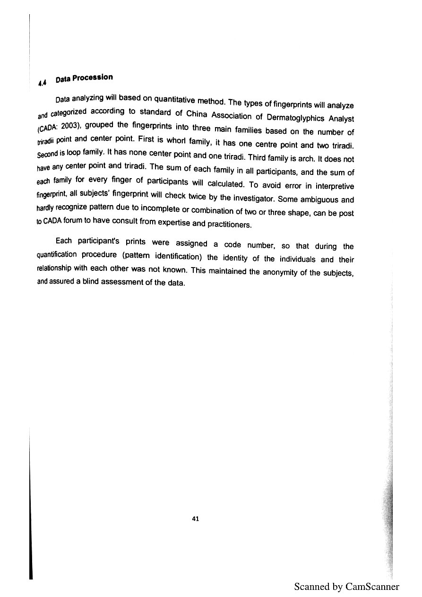

```text
44 Data Procession
Data analyzing will based on quantitative method, The types of fingerprints will analyze
and cotegorized according to standard of China Association of Dermatoglyphics Analyst
(caDh: 2003), grouped the fingerprints into three main families based on the number of
rriadii point and center point. First is whorl family, it has one centre Point and two triradi.
second is loop family. It has none center point and one triradi. Third family is arch. It does not
have any center point and triradi. The sum of each family in all participants, and the sum of
each family for every finger of participants will calculated. To avoid error in interpretive
fingerprint, all subjects’ fingerprint will check twice by the investigator. Some ambiguous and
hardly recognize pattern due to incomplete or combination of two or three shape, can be post
to CADA forum to have consult from expertise and Practitioners,
Each participant's prints were assigned a code number, so that during the
quantfication procedure (pattem identification) the identity of the individuals and their
relationship with each other was not known. This maintained the anonymity of the subjects,
and assured a blind assessment of the data.
41 |
|
Scanned by CamScanner
```

## Page 52

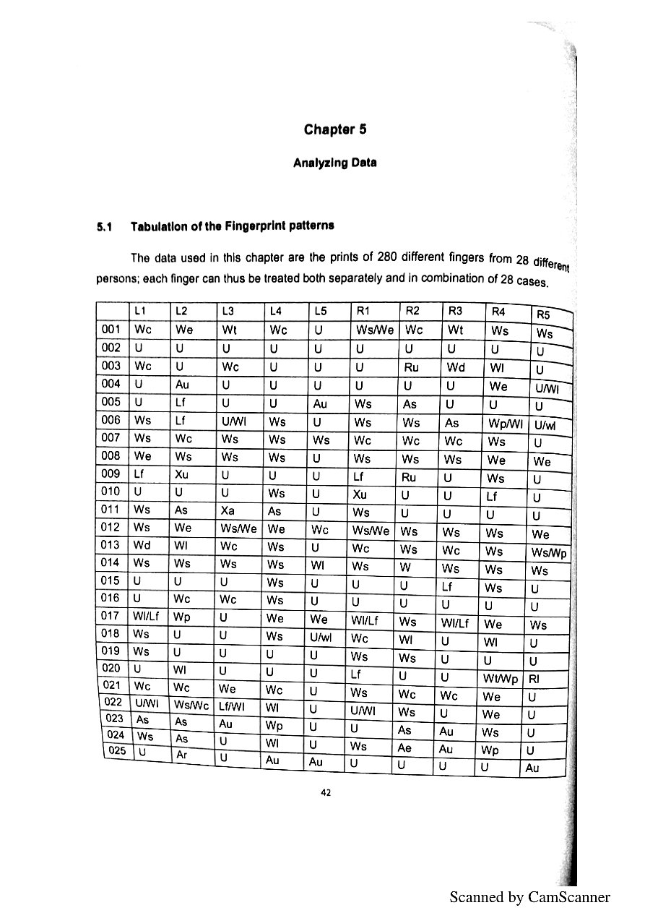

```text
|
Chapter 5 i
Analyzing Data
5.1 Tabulation of the Fingerprint patterns:

The data used in this chapter are the prints of 280 different fingers from 28 Gifferen,
persons; each finger can thus be treated both separately and in combination of 28 cases,
[_[u fie Tis fia Tis Trt fre [rs Tra Ts
[oor [we [We [we [We [u [wsnwe[We [wi ws [ws |
oo2 fu fu fu fe fe fu fe fe feo
002 [we fu [we [uu [ure [we [wr uJ
foo [u [ar fu [uu fu fo fo inet
foos fu fur fu fu Tau [ws fas [ufo
[oos [ws [ur [umm [ws [u [we [Ws [As [Wen [una |
[oor [we we [ws [Ws [ws [we [we [we [ws Tu —|
[00s [We [ws [ws [Ws |v [we [ws [ws | We we
[ooe [ur few fu fu ofr ru fu ws
u |
[or2 [Ws [we |wawe|We |we|wewe|ws [ws [we [we]
[ors [Ufo fu ws fu fu ors
[ors [u__[We [we [ws [uu fu jou fo
wit wilt | wa [ WF
jez [uw fu fu fer fo pe]
|ozt |we |
[eee fee fees [uote [Uwe Ju

jas [as fas [we [0 [ua paws fo)

{ee phe fas fo Tw [owes fae awe po
oe CC
a2
Scanned by CamScanner
```

## Page 53

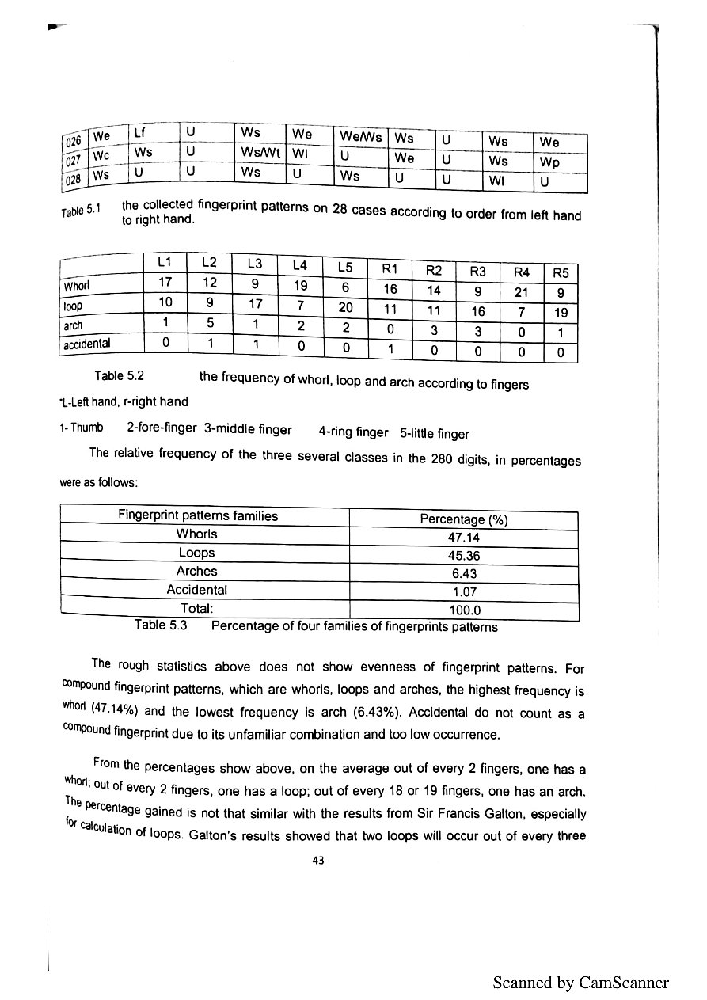

```text
>
(i we [ue [uy [ws 7] |We | WeNWs| Ws vu] Ws We _
fare (wef [wee wh 10 we ToL wep
faajve 1U TU |Ws fu Twe fo fof fo
1 the collected fingerprint patterns on 28 Cases accor
table 5. to right hand. ‘ding to order from left hand
eee
‘Wi jw |e [es fe Te ep Pe pape |
108 ee
arch ee |
Table 5.2 the frequency of whorl, loop and arch according to fingers
“L-Left hand, r-right hand |
1-Thumb 2-fore-finger 3-middle finger 4-ring finger Suttle finger |
. |
The relative frequency of the three several classes in the 280 digits, in percentages |
|
were as follows: |
Fingerprint pattems families Percentage (%) |
Accidental [07
Total: EX
Table 5.3 Percentage of four families of fingerprints patterns
The rough statistics above does not show evenness of fingerprint patterns. For
compound fingerprint patterns, which are whorls, loops and arches, the highest frequency is
whorl (47. 14%) and the lowest frequency is arch (6.43%). Accidental do not count as a
“ompound fingerprint due to its unfamiliar combination and too low occurrence.
From the Percentages show above, on the average out of every 2 fingers, one has a
“hot; out of every 2 fingers, one has a loop; out of every 18 or 19 fingers, one has an arch.
The 7, .
‘ * Percentage gained is not that similar with the results from Sir Francis Galton, especially
*T eedlaion of loops. Galton’s results showed that two loops will occur out of every three
43
Scanned by CamScanner
```

## Page 54

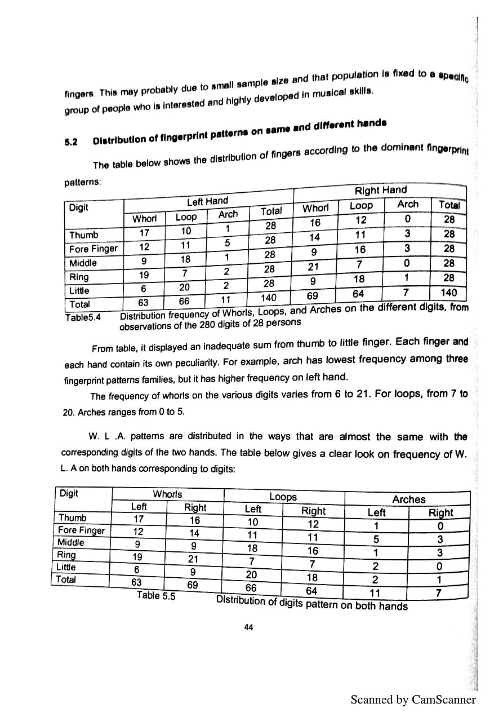

```text
to small sample size and that population Is fixed to a Spacing
fingers. This may probably due ighly developed I musical skills.
group of people who is Interested and highly
d different hands
5.2. Distribution of fingerprint patterns on same an
dominant fin,
fingers according to the 9erprint
The table below shows the distribution of fing
patterns:
Right Hend
ray Lei jan
pwr ae Lae ee [8 te
[wate [9 [| 1 | [eH
ie ep pe pe
zp | 9 | 8 | | 26 |
[twe [6 |
a a
Table5.4 Distribution frequency of Whorls, Loops, ‘and Arches on the different digits, from
observations of the 280 digits of 28 persons
From table, it displayed an inadequate sum from thumb to little finger. Each finger and
each hand contain its own peculiarity. For example, arch has lowest frequency among three
fingerprint patterns families, but it has higher frequency on left hand.

The frequency of whorls on the various digits varies from 6 to 21. For loops, from 7 to
20. Arches ranges from 0 to 5.

W. L.A. pattems are distributed in the ways that are almost the same with the
corresponding digits of the two hands. The table below gives a clear look on frequency of W.
L. Aon both hands corresponding to digits:

ee a
Se
[Fore Finger | 12 —[ a 9 ——
[mite [8 3 gp 3 + 8 3
[Ring] a
foe —} pf a
tra [ae] ef ee

Distribution of digits pattern on bath hands {

44 |

Scanned by CamScanner
```

## Page 55

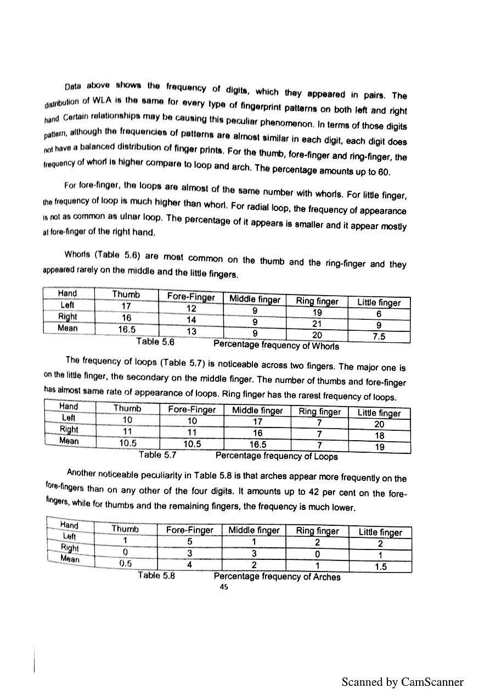

```text
Data above shows the fraquency of digits, which they appeared in pairs. The
gisuibution of WLA is the game for avery type of fingerprint patterns on both left and right
pond Contain rolationships may be causing this peculiar phenomenon. In terms of those digits
patton, although the frequencies of patterns are almost similar in each digit, each digit does
not have @ balanced distribution of finger prints, For the thumb, fore-finger and ring-finger, the
fraquency of whorl Is higher compara to loop and arch. The percentage amounts up to 60.

For fore-finger, the loops are almost of the same number with whorls. For lithe finger,
the frequency of loop is much higher than whorl, For radial loop, the frequency of appearance
is not as common as ulnar loop. The Percentage of it appears is smaller and it appear mostly
al fore-fingor of the right hand.

Whorls (Table 5.6) are most common on the thumb and the ring-finger and they
appeared rarely on the middle and the little fingers,

Hand [Thumb Middle finger [Ring finger | Little finger_]

Loft Ls 9 ee

Right 16 14 a |

Mesn a 8 [___20 [75]
Table 5.6 Percentage frequency of Whorls

Tho frequency of loops (Table 5.7) is noticeable across two fingers. The major one is
on the litte finger, the secondary on the middle finger. The number of thumbs and fore-finger
has almost same rato of appearance of loops. Ring finger has the rarest frequency of loops.

Hand | Thumb_ Fore-Finger | Middle finger | Ring finger | Little finger
_Loft 10 fof a 20]
Right a te 8
(Mean fog ___| 105 [4657 7?
Table 5.7 Percentage frequency of Loops

Another noticeable peculiarity in Table 6.8 is that arches appear more frequently on the
‘ore-tingers than on any other of the four digits. It amounts up to 42 per cent on the fore-
‘ingers, while for thumbs and the remaining fingers, the frequency is much lower.

[Wand] Thame —[-Fora-Fingar [dae tnger [Ring finger_| Lite finger
let 5 a es a
p— Right of a
‘Meant —~95 Se
‘Table 58 Percentage frequency of Arches
45
| Scanned by CamScanner
```

## Page 56

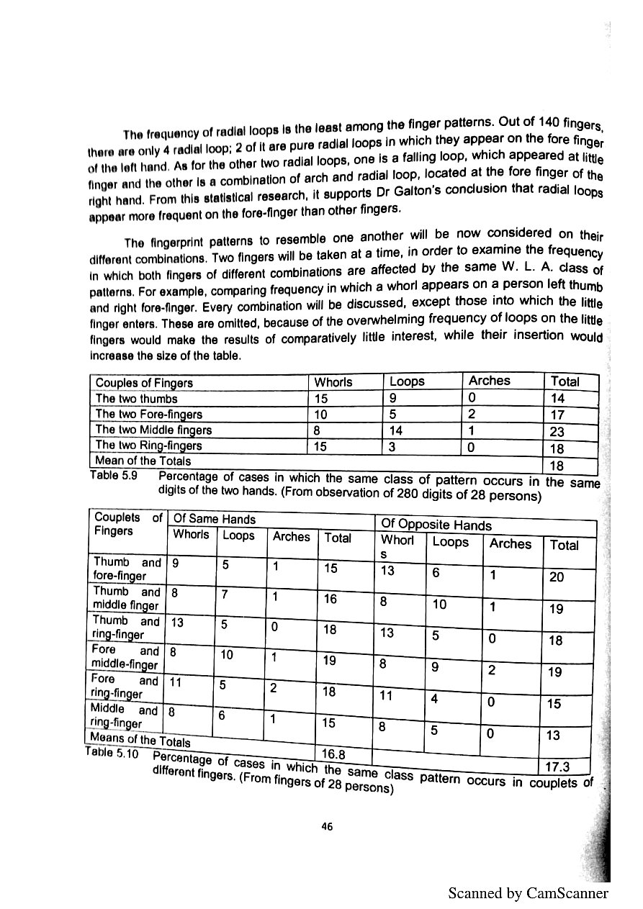

```text
. Out of 140 finger:
mong the finger patterns. 8,
of radial loops Is the least a i ar on the fore fi
there ony 4 radial loop; 2 of it are pure radial loop wating Wop, which appeared atte
ar loops, one 4
for the other two radial. he fore finger
we ante other ‘a combination of arch and radial loop, scat clon _ radial woe
tact nand. From this statistical research, it supports r Galton
nppoar ‘more frequent on the fore-finger than other fingers. idered
P ler ‘
The fingerprint patterns to resemble one another will be Halen the frequen
different combinations. Two fingers will be taken at a time, in or the same W. L. A. clase Ks
in which both fingers of different combinations are affected by wars on a person left thump
patterns. For example, comparing frequency in wich awnot meont those into which the lite
i i ill be discussed,
and right fore-inger. Every combination wil b helming frequency of loops on the little
finger enters. These are omitted, because of the overwhel t, while their insertion would
fingers would make the results of comparatively little interest,
increase the size of the table.
Couples of Fingers
The two thumbs a a
The two Fore-fingers ce Ce ©
The two Middle fingers a x |
[The twoRing-ingers 1S Cd BY
[MeanoftheTotals «dB ‘Yd
Table 5.9 Percentage of cases in which the same class of pattern occurs in the same
digits of the two hands. (From observation of 280 digits of 28 persons)
/Couplets of | Of Same Hands Of Opposite Hands
s
Thumb and 15 13
Thumb and 7 1 7
Thumb and
gee
Fore — and 1 i
mie-ingor a
Fore and |
Middle “and 7 |
leans of the Totals
Tobie 8.10" Percentage of cases wha ee LJ
differant fi ) which the same class i
lingers. (From fingers of 28 persons) Pattern occurs in couplets of |
46
Scanned by CamScanner
```

## Page 57

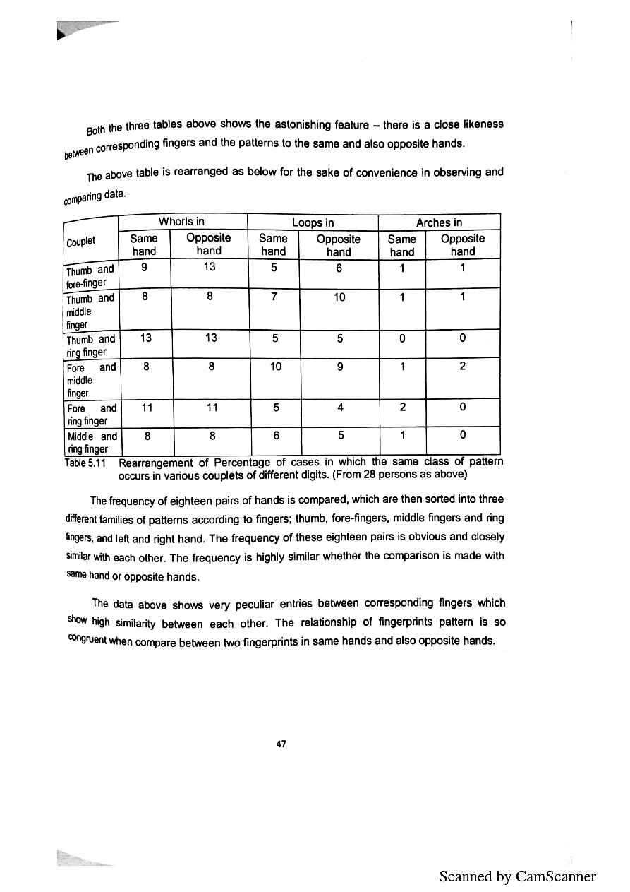

```text
goth the three tables above shows the astonishing feature — there is a close likeness
veo corresponding fingers and the patterns to the same and also opposite hands.

The above table is rearranged as below for the sake of convenience in observing and
comparing data.

[_Whoisin | __Leopsin | _Archesin—_]
Same Opposite Same Opposite Same | Opposite
hand hand hand hand hand hand
fore-finger
Thumb and 7
middle
finger
Thumb and| 13 13
fing finger
Fore and 1
middle
finger
Fore and] 11 "1 5 2
ring finger
Middle and
ting finger
Table 5.11 Rearrangement of Percentage of cases in which the same class of pattern
occurs in various couplets of different digits. (From 28 persons as above)

The frequency of eighteen pairs of hands is compared, which are then sorted into three
diferent families of patterns according to fingers; thumb, fore-fingers, middle fingers and ring
fingers, and left and right hand. The frequency of these eighteen pairs is obvious and closely
similar with each other. The frequency is highly similar whether the comparison is made with
same hand or opposite hands.

The data above shows very peculiar entries between corresponding fingers which
‘Show high similarity between each other. The relationship of fingerprints pattern is so
“ongruent when compare between two fingerprints in same hands and also opposite hands.

47
Scanned by CamScanner
```

## Page 58

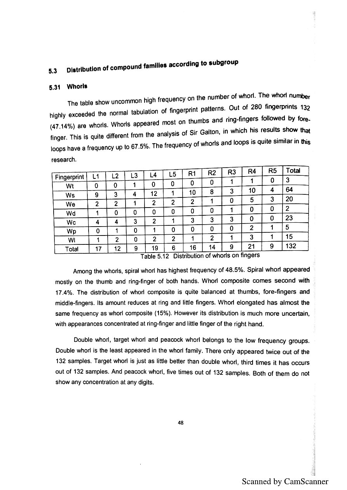

```text
subgrouy
5.3 Distribution of compound families according to subgroup
5.31 Whorls
The table show uncommon high frequency on the number of hon ~ ‘whort number
i of erprini
highty exceeded the normal tabulation of fingerprint patterns. oe 28 on * m2
ing- Jers: lower _
(47.14%) are whorls. Whorls appeared most on thumbs and ring: inaet m by fore.
finger. This is quite different from the analysis of Sir Galton, in which ns resul; ne " that
loops have a frequency up to 67.5%. The frequency of whorls and loops fe quite Sirsarin Bi
research.
[Re as [Re | RS [To]
Fingerprint us [ Ri | re
w LopopT+pofo,ofofat | He
[we Pe fa Patel pote fee ac
[we [2[2[1{2f2 fats | ="
Lowe pepe fe fe foto fr foto f2 |
[we [eta tate[+[al[sf[sfoto ja |
[we fof pe ft fofofofota ts [s |
[ow ft petol2t2{+{etrtats [is |
(to [pets tols [wl] se [ato fia |
Table 5.12 Distribution of whoris on fingers
‘Among the whorls, spiral whorl has highest frequency of 48.5%. Spiral whorl appeared
mostly on the thumb and ring-finger of both hands. Whol composite comes second with
17.4%. The distribution of whorl composite is quite balanced at thumbs, fore-fingers and
middle-fingers. Its amount reduces at ring and little fingers. Whorl elongated has almost the
same frequency as whorl composite (15%). However its distribution is much more uncertain,
with appearances concentrated at ring-finger and little finger of the right hand.
Double whorl, target whorl and peacock whorl belongs to the low frequency groups.
Double whorl is the least appeared in the whorl family. There only appeared twice out of the
132 samples. Target whorl is just as little better than double whorl, third times it has occurs
out of 132 samples. And peacock whorl, five times out of 132 samples. Both of them do not
show any concentration at any digits.
43
Scanned by CamScanner
```

## Page 59

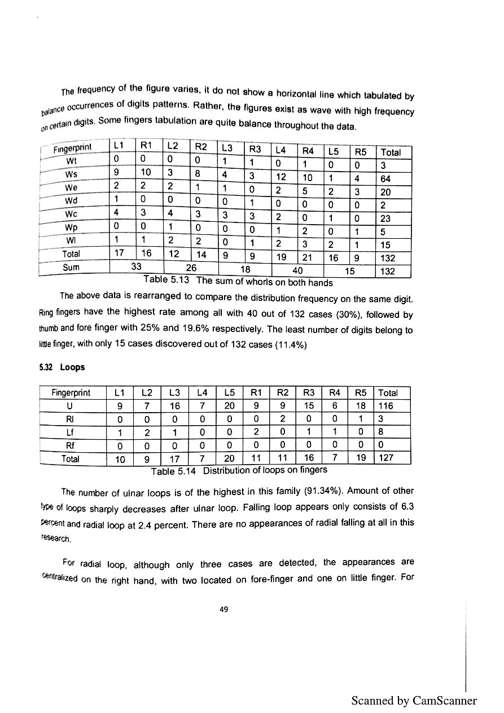

```text
The frequency of the figure varies, it do not show a horizontal line which tabulated by
paance occurrences of digits patterns, Rather, the figures exist as wave with high frequency
oncertain digits Some fingers tabulation are quite balance throughout the data.

ur_|[Rt [l2 [Re [is [Ra Ra RET
Fingerprint R3 |t4 [Ra [is [RS
mw fo fo fo fo Ta tt to fo fo Ps]
ws [sto [3 Te Ta Tas ae ea a ee |
we [2 2 2 to ae Ts a ta a0]
—owe ft fo fo fo fot Jo Jo fo fo fa
we 4 [3 a3 ae oo as]
nH [2 [s [2 [7 fas
toa fae fe [aes fe ae [ae fee]
(sum 38 a6 is aot a

Table 5.13, The sum of whorls on both hands

The above data is rearranged to compare the distribution frequency on the same digit.
Ring fingers have the highest rate among all with 40 out of 132 cases (30%), followed by
thumb and fore finger with 25% and 19.6% respectively. The least number of digits belong to
litte finger, with only 15 cases discovered out of 132 cases (11.4%)

532 Loops

[Fageroint [C1 [12 [13 [ta [1s [RIP Re | RS RA | RS [Tol]
vu [st7fwl7fotele {ste | tlie |
Rl fofolofovofof2{ofofi{s |
uf fif2{afotofa2vtoli{ifofe |
yw [olofofolofofofofofofo |

Toa [ao [9 | 7 [7 | 20] ai [i [ie] 7 | 9 fra

Table 5.14 Distribution of loops on fingers

The number of ulnar loops is of the highest in this family (91.34%). Amount of other
‘yee of loops sharply decreases after ulnar loop. Falling loop appears only consists of 6.3
Fervent and radial loop at 2.4 percent. There are no appearances of radial falling at all in this,
‘€Search,

For radial loop, although only three cases are detected, the appearances are
“ttralized on the right hand, with two located on fore-finger and one on litle finger. For

49
Scanned by CamScanner
```

## Page 60

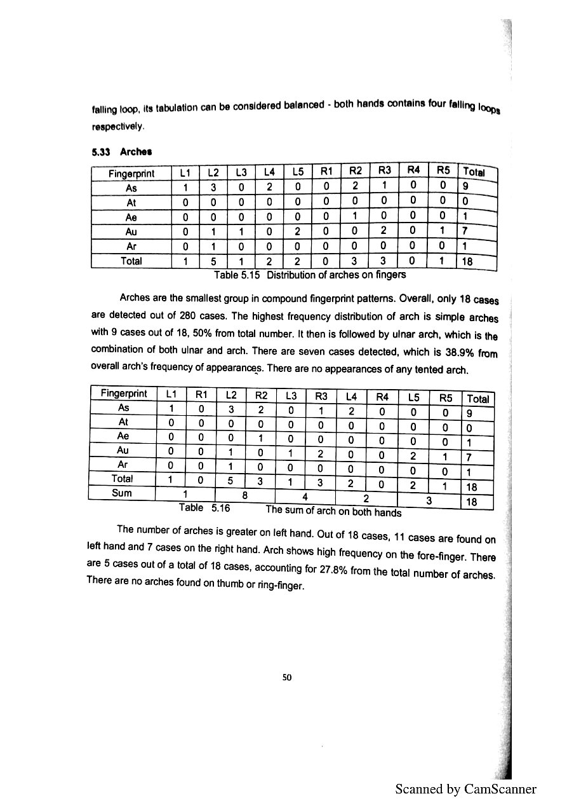

```text
\
falling toop, its tabulation can be considered balanced - both hands contains four falling loopy
respectively.

5.33 Arches
[Fingerprint [tt [tz [us [ua [ts [rt [rz | ro | Ra | RS [Total
rn [olofolofofofofofolo 7
[at fo |
[ae fo fo fo fo fofotsfototo tir 7
[ea pepe pete fo fete fot
[ar ott fpofototofofotofo fi
[toa ifs [1 t2;2tot3s{sftot: fw
Table 5.15 Distribution of arches on fingers
Arches are the smallest group in compound fingerprint pattems. Overall, only 18 cases
are detected out of 280 cases. The highest frequency distribution of arch is simple arches
with 9 cases out of 18, 50% from total number. It then is followed by ulnar arch, which is the
combination of both ulnar and arch. There are seven cases detected, which is 38.9% from
overall arch’s frequency of appearances. There are no appearances of any tented arch.
[Fogemint ToT at [ie [Res Ree [eS | RS To]
pa [a folstT2toti{2fofolo sp |
pa fo fo fofotolotofofolo fo]
jae fo fools tofofofololot—
JP aw fo Poti ols te [ope feta pr
p—& _fo Poti fo foots fofote tr
[toa [Po fs Ts tits tepoletr te |
[sum J [es
Table 5.16 The sum of aa terres — |
‘The number of arches is greater on left hand. Out of 18 cases, 11 cases are found on |
teff hand and 7 cases on the right hand. Arch shows high frequency on the fore-finger. There
are § cases out ofa total of 18 cases, accounting for 27.8% from the total number of arches.
There are no arches found on thumb or ring-finger. |
50 |
Scanned by CamScanner
```

## Page 61

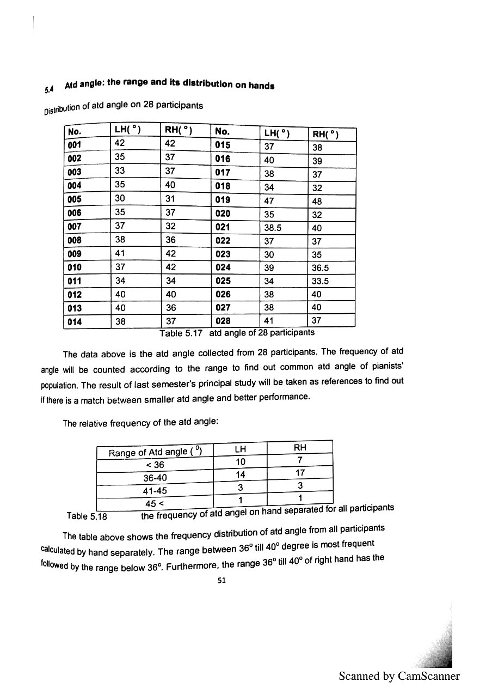

```text
54. Atd angle: the range and its distribution on hands
pistribution of atd angle on 28 participants
3
[No J LH(*) (°) [Now Tat?) TRA) _]
joon [42 faz
Cre [oo [39]
003 o7 [38 far |
a
[aos [20 [31__[ore [ar aa]
[oos fas [37 [ozo [as [an _]
jet fe fee fat fees to
woe [s8_(36 oo far far |
[ooo [a1 [42 [ozs [a0 as |
[oo fav aa fae a9 65
[or [se [3a ozs [aes
[oi [40 [ao [oe [se [ao |
[ors [ao a6 oar fae tao
[oa se s7_ ozs at [7
Table 5.17 ald angle of 28 participants
The data above is the atd angle collected from 28 participants. The frequency of atd
angle will be counted according to the range to find out common atd angle of pianists’
population. The result of last semester's principal study will be taken as references to find out
if there is a match between smaller atd angle and better performance.
The relative frequency of the atd angle:
Range tAdange() [tH [RH
= 36 a |
Table 5.18 the frequency of aid angel on hand separated for all participants
The table above shows the frequency distribution of atd angle from all participants
Calculated by hand separately. The range between 36° till 40° degree is most teaver
folowed by the range below 36°. Furthermore, the range 36” til 40" of right hand has he
51
j
Scanned by CamScanner
```

## Page 62

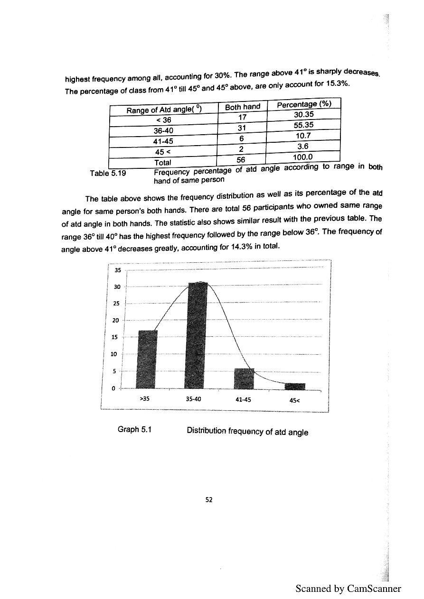

```text
highest frequency among all, accounting for 30%. The range above 41° is sharply decreases,
The percentage of class from 41° till 45° and 45° above, are only account for 15.3%.
Range of Atd angle( °) Both hand | Percentage (%)
Table 5.19 Frequancy percentage of atd angle according to range in both
hand of same person
The table above shows the frequency distribution as well as its percentage of the atd
angle for same person's both hands. There are total 56 participants who owned same range
of atd angle in both hands. The statistic also shows similar result with the previous table. The
range 36° til 40° has the highest frequency followed by the range below 36°. The frequency of
angle above 41° decreases greatly, accounting for 14.3% in total.
Pas — |
| |
| as | _- — - . |
| | |
fof |
| 10 \ _
| \
ro — |
| 0 |x a
| >35 35-40 41-45 a5< |
|
Graph 5.1 Distribution frequency of atd angle
52
i
Scanned by CamScanner
```

## Page 63

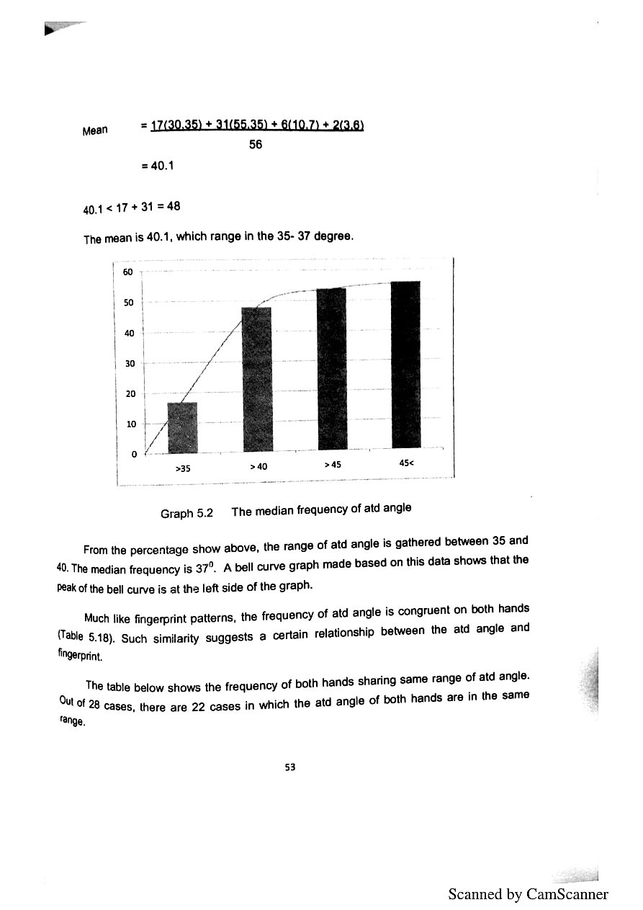

```text
B=
Mean = 17(30,35) + 3155.35) + 6(10,7) + 2(3,6)
56
=40.1
40.1<17 +31 =48
‘The mean is 40.1, which range in the 35- 37 degree.
| 60
| 50 | Pa
|
| ao |
\
\ /
| 30 f
20 |
|
lof;
235 >40 >45 ae
Graph 5.2 The median frequency of atd angle
From the percentage show above, the range of atd angle is gathered between 35 and
40. The median frequency is 37°. A bell curve graph made based on this data shows that the
Peak of the bell curve is at the left side of the graph.
Much like fingerprint patterns, the frequency of atd angle is congruent on both hands
(Table 5.18), Such similarity suggests a certain relationship between the atd angle and
fingerprint.
The table below shows the frequency of both hands sharing same range of atd angle.
Out of 28 cases, there are 22 cases in which the atd angle of both hands are in the same 4
‘ange.
53
Scanned by CamScanner
```

## Page 64

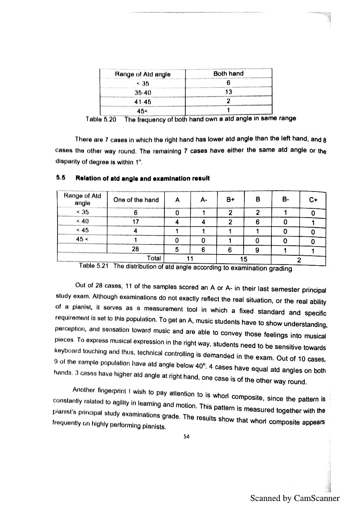

```text
Range of Atd angle Both hand _
<38 6 —
36-40 es a
41-45 a 2
fos canay at baie Rand a ‘angle in same range
Table 6.20 The frequency of both hand own a
the left hand, a
There are 7 cases In which the right hand has lower atd angle than denn nd 8
the same atd angle or 1
cases the other way round. The remaining 7 cases have either he
disparity of degree is within 1°.
5.6 Relation of atd angle and examination result
<a éfof+tet2{[r7{[o
a0 ar Pe
<45 4 re
cn 1 [oo | o | a to fo fo |
| 8 ps te |e [oe far]
__ Toft
~~ Table 5.21 The distribution of atd angle according to examination grading
Out of 28 cases, 11 of the samples scored an A or A- in their last semester principal
Study exam. Although examinations do not exactly reflect the real situation, or the real ability
of @ planist, lt serves as a measurement tool in which a fixed standard and specific
Fequiremant is set to this population, To get an A, music students have to show understanding,
Perception, and sensation toward music and are able to convey those feelings into musical
Pieces. To express musical expression in the right way, students need to be sensitive towards
Keyboard touching and thus, technical controlling is demanded in the exam. Out of 10 cases,
9 of the sample population have atd angle below 40°. 4 cases have equal atd angles on both
hands. 3 casos have higher atd angle at right hand, one case is of the other way round.
Another fingerprint | wish to pay attention to is whorl composite, since the Pattern is
Constantly related to agility in learning and motion. This Pattern is measured together with the
Planist’s principal study examinations grade. The results show that whorl composite appears
froquantly on highly performing pianists,
54
i
Scanned by CamScanner
```

## Page 65

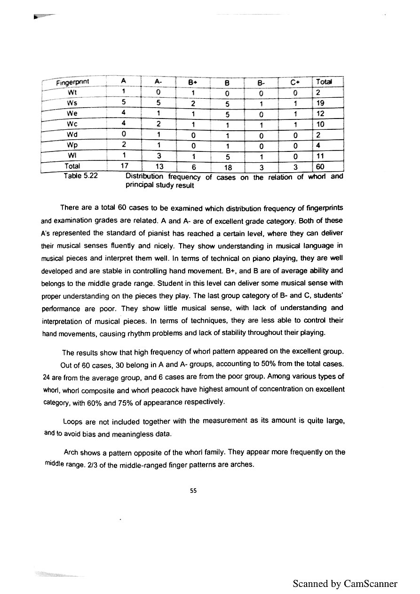

```text
—
Ws 5 | 5 2 5 1 1 19 |
we 4 [2 7 4 1 | 1 | 1 +<(|10 |
wd o | 1 {| 0 7 ].0 | 0
wp 20) 4 0 1 o | o [4
Tos A
Table 5.22 Distribution frequency of cases on the relation of whorl and
Principal study result

There are a total 60 cases to be examined which distribution frequency of fingerprints
and examination grades are related. A and A- are of excellent grade category. Both of these
As represented the standard of pianist has reached a certain level, where they can deliver
their musical senses fluently and nicely. They show understanding in musical language in
musical pieces and interpret them well. In terms of technical on piano playing, they are well
developed and are stable in controlling hand movement. B+, and B are of average ability and
belongs to the middle grade range. Student in this level can deliver some musical sense with
proper understanding on the pieces they play. The last group category of B- and C, students’
performance are poor. They show little musical sense, with lack of understanding and
interpretation of musical pieces. In terms of techniques, they are less able to control their

hand movements, causing rhythm problems and lack of stability throughout their playing.
The results show that high frequency of whorl pattern appeared on the excellent group.
Out of 60 cases, 30 belong in A and A- groups, accounting to 50% from the total cases.
24 are from the average group, and 6 cases are from the poor group. Among various types of
whorl, whorl composite and whorl peacock have highest amount of concentration on excellent

category, with 60% and 75% of appearance respectively.
Loops are not included together with the measurement as its amount is quite large,
and to avoid bias and meaningless data.
Arch shows a pattern opposite of the whorl family. They appear more frequently on the
middle range. 2/3 of the middle-ranged finger palterns are arches.
5S
Scanned by CamScanner
```

## Page 66

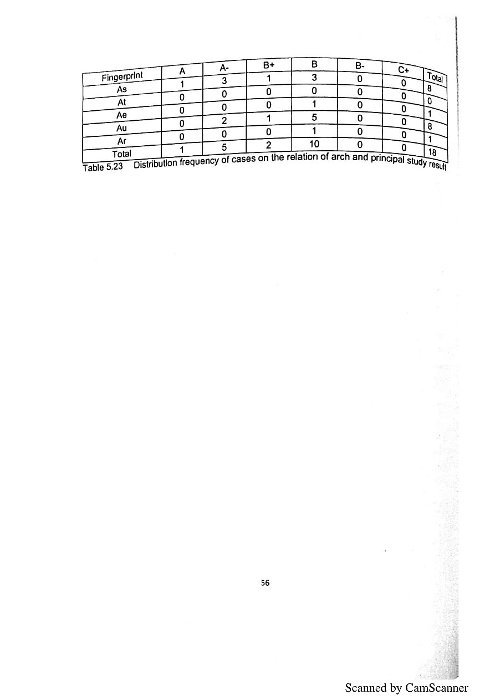

```text
B+

B-

A

C+

Fingerprint

AS

j~——

At

Ae

‘Au

0

0

Ar

1

10

Total

Table 5.23 Distribution frequency of cases on the relation of arch and principal study result

56

]
```

## Page 67

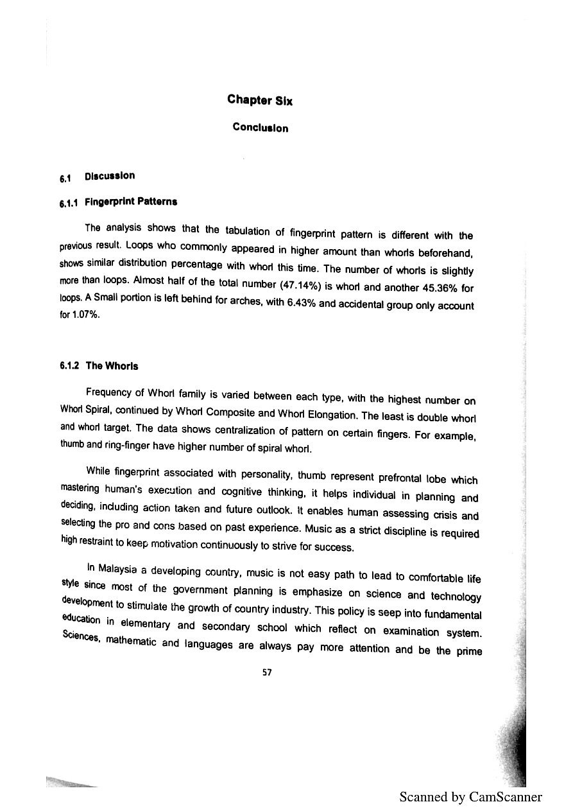

```text
Chapter Six
Conclusion

61 Discussion
6.1.4 Fingerprint Patterns

The analysis shows that the tabulation of fingerprint pattern is different with the
previous result. Loops who commonly appeared in higher amount than whorls beforehand,
shows similar distribution percentage with whorl this time. The number of whorls is slightly
more than loops. Almost half of the total number (47.14%) is whorl and another 45.36% for
loops. A Small portion is left behind for arches, with 6.43% and accidental group only account
for 1.07%.
6.4.2 The Whorls

Frequency of Whori family is varied between each type, with the highest number on
Whorl Spiral, continued by Whorl Composite and Whorl Elongation. The least is double whorl
and whorl target. The data shows centralization of pattern on certain fingers. For ‘example,
thumb and ring-finger have higher number of spiral whorl.

While fingerprint associated with personality, thumb represent prefrontal lobe which
mastering human's execution and cognitive thinking, it helps individual in planning and
deciding, including action taken and future outlook. it enables human assessing crisis and
Selecting the pro and cons based on Past experience. Music as a strict discipline is required
high restraint to keep: motivation continuously to strive for success.

In Malaysia a developing country, music is not easy path to lead to comfortable life
Sle since most of the government Planning is emphasize on science and technology
‘evelopment to stimulate the growth of country industry. This policy is seep into fundamental
Sducation in elementary and Secondary school which reflect on examination system.
Sciences, mathematic. and anguages are always pay more attention and be the prime |

7 |
=— Scanned by CamScanner
```

## Page 68


```text
subjects in school. These subjects can promises better future career, government alsg
Prepare many working chance in these fields, sciences and technology students have more
choices on their way out. Contrasting, the art stream students have to depend on themselves
more. Music students need to find their way out after graduated to earn living cost. Fewer
working chance are prepare or arrange by government agent. Most of the times, music
student is lying on themselves to seek the chance for work, by gives lesson in music institute,
Public composition, run their performance routinely, establish music school and so on. Some
may involve in other career which is not much relate to music. As times goes by, follow with
growing in experience and professional level, income usually will increase proportionately. As
a young musician who newly graduated from conservatory and enter social, the salary is
always uncertain. What is to be is, parent do not encourage their child further ‘study in music,

In Malaysia, the maturity in music field still required time to establish. Moreover, this field
fequired special skill to be mastered which ask for long diligent and self motivate. Due to this
situation, the people who involved in this area, their personality should have some similarity is
shared.

Music student who bold enough to chose music as his/her career, from the
questionnaire, the factor they chose music as a subject to continue study, basically based on
‘wo reasons, one is self interest, anather one is due to encouragement of parents and family
members.

Out of 28 cases, 10 admit that they are encourages by parent; 10 are due to self
interest since young age; 8 cases share both situation. And many of them note that, their
interest in music stert to grow in themselves at primary school phase although have received
the encouragement from parent at young age. Orie cass admits she has influenced by her
sister. One case admits that he influenced hy peers in secondary school.

For an individual keep continuing to pursue accomplish result in music education until
university level, this is not an easy matter. Determination and endurance in the Practice
process and the investment on time and money cost great sum. In fact, many people cannot
hold on and drop the music class at the half way. From here, to continuing leaming music to a
high level, apart from the encouragement of family member, the personality is the factors that
cannot neglect.

58
Scanned by CamScanner
```

## Page 69

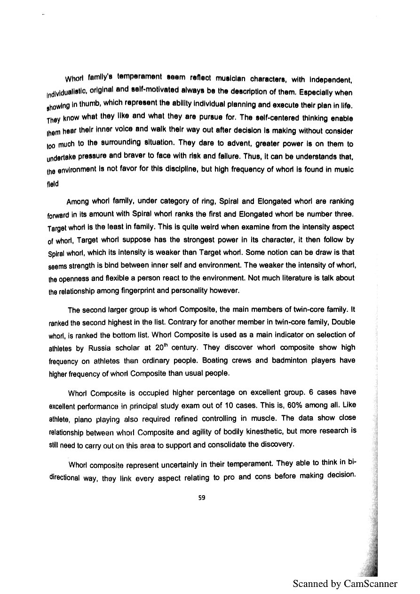

```text
Whor family's temperament seem reflect musician characters, with independent,
individualistic, original and self-motivated always be the description of them. Especially when
showing In thumb, which represent the ability individual planning and execute their plan In life.
They know what they llke and what they are pursue for. The self-centered thinking enable
thom heer thelr inner voice and walk thelr way out after decision Is making without consider
too much to the ‘surrounding situation. They dare to advent, greater power is on them to
undertake pressure and braver to face with risk and fallure. Thus, It can be understands that,
the environment Is not favor for this discipline, but high frequency of whorl Is found in music
fleld

Among whorl family, under category of ring, Spiral and Elongated whorl are ranking
forward In Its amount with Spiral whorl ranks the first and Elongated whorl be number three.
Target whorl Is the least in family. This Is quite weird when examine from the intensity aspect
‘of whorl, Target whorl suppose has the strongest power in its character, it then follow by
Spiral whorl, which its intensity is weaker than Target whorl. Some notion can be draw is that
seems strength is bind between inner self and environment. The weaker the intensity of whorl,
the openness and flexible a person react to the environment. Not much literature is talk about
the relationship among fingerprint and personality however.

The second larger group is whorl Composite, the main members of twin-core family. It
ranked the second highest in the list. Contrary for another member in twin-core family, Double
whorl, is ranked the bottom list. Whol Composite is used as a main indicator on selection of
athletes by Russia scholar at 20" century. They discover whorl composite show high
frequency on athletes than ordinary people. Boating crews and badminton players have
higher frequency of whorl Composite than usual people.

Whorl Composite is occupied higher percentage on excellent group. 6 cases have
excellent performance in principal study exam out of 10 cases. This is, 60% among all. Like
athlete, piano playing also required refined controlling in muscle, The data show close
telationship betwean whorl Composite and agility of bodily kinesthetic, but more research is
sill need to carry out on this area to support and consolidate the discovery.

Whorl composite represent uncertainly in their temperament. They able to think in bidirectional way, they link every aspect relating to pro and cons before making decision.

59 1
|
Scanned by CamScanner
```

## Page 70

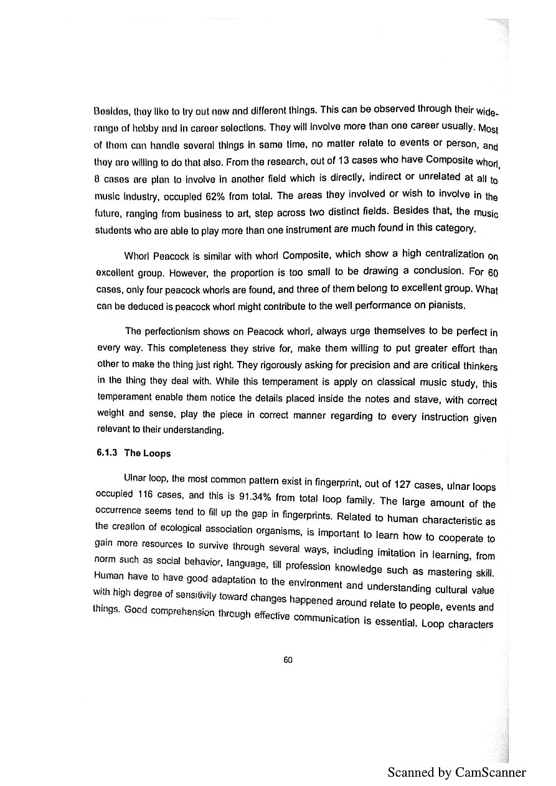

```text
Bosldos, thoy like to try out new and different things. This can be observed through their wide.
rango of hobby and in career selections. They will involve more than one career usually. Most
of thom ean hana soveral things in same time, no matter relate to events oF person, ang
thoy aro wiling o do that also, From the research, out of 13 cases who have Composite whor,
8 casos are plan to involve In another field which is directly, indirect ef uneeleted otal to
music Industry, occupled 62% from folal. The areas they involved or wish to involve in the
futuro, ranging from business to art, step across two distinct fields. Besides that, the music
studonts who are able to play more than one instrument are much found in this category,

Whorl Peacock is similar with whod Composite, which show a high centralization on
excellent group, However, the proportion is too small to be drawing @ conclusion. For 69
cases, only four peacock whorls are found, and three of them belong to excellent group. What
can be deduced is peacock whorl might contribute to the well performance on pianists,

The perfectionism shows on Peacock whorl, always urge themselves to be perfect in
every way. This completeness they strive for, make them willing to put greater effort than
other to make the thing just right. They rigorously asking for precision and are critical thinkers
in the thing they deal with. While this temperament is apply on classical music study, this
temperament enable them notice the delails placed inside the notes and stave, with correct
weight and sense, play the piece in correct manner regarding to every instruction given
relevant lo their understanding.

6.1.3 The Loops

Ulnar loop, the most common pattern exist in fingerprint, out of 127 cases, ulnar loops
Sccupied 116 cases, and this is 91.34% from total loop family. The large amount of the
occurrence seems tend to fil up the gap in fingerprints, Related to human characteristic as
the creation of ecological association organisms, is important to learn how to cooperate to
gain more resources lo survive through several ways, including imitation in learning, from
norm such as social behavior, language, til profession knowledge such as mastering skill.
Human have to have good adaptation to the environment and understanding cultural value

with high degrae of sensitvily toward changes happened around relate to people, events and
things. Good comprekension through effective communication is essential. Loop characters
60
Scanned by CamScanner
```

## Page 71

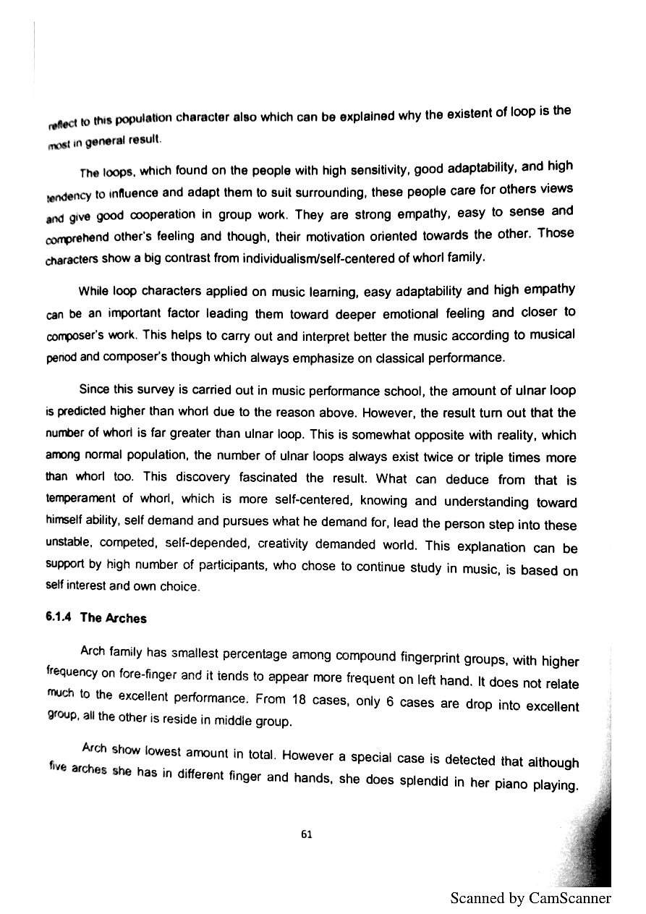

```text
is is the
to this population character also which can be explained why the existent of loop is
most in general result.

The loops, which found on the people with high sensitivity, good adaptability, and high
tendency to influence and adapt them to suit surrounding, these people care for others views
and give good cooperation in group work. They are strong empathy, easy to sense and
comprehend other's feeling and though, their motivation oriented towards the other. Those
characters show a big contrast from individualism/self-centered of whorl family.

While loop characters applied on music leaming, easy adaptability and high empathy
can be an important factor leading them toward deeper emotional feeling and closer to
composer's work. This helps to carry out and interpret better the music according to musical
period and composer's though which always emphasize on classical performance.

Since this survey is carried out in music performance school, the amount of ulnar loop
is predicted higher than whorl due to the reason above. However, the result turn out that the
number of whorl is far greater than ulnar loop. This is somewhat opposite with reality, which
among normal population, the number of ulnar loops always exist twice or triple times more
than whorl too. This discovery fascinated the result. What can deduce from that is
temperament of whorl, which is more self-centered, knowing and understanding toward
himself ability, self demand and pursues what he demand for, lead the person step into these
unstable, competed, self-depended, creativity demanded world. This explanation can be
support by high number of participants, who chose to continue study in music, is based on
Self interest and own choice.

6.1.4 The Arches

Arch family has smallest Percentage among compound fingerprint groups, with higher
frequency on fore-finger and it tends to appear more frequent on left hand. It does not relate
much to the excellent performance. From 18 cases, only 6 cases are drop into excellent
9'0up, all the other is reside in middie group.

' Arch show lowest amount in total. However a special case is detected that although
Wve arche i
eS she has in different finger and hands, she does splendid in her piano playing.
61
Scanned by CamScanner
```

## Page 72

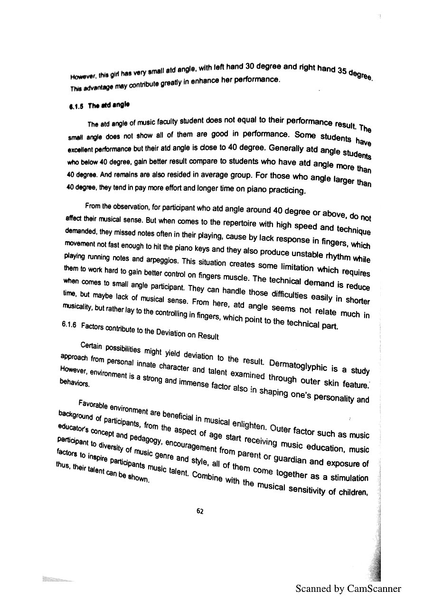

```text
11 atd angle, with left hand 30 degree and right hang 35 degree,
a:
, this gid has very smal tly in enhance her performance.
However, contribute greatly
This advantage may
fe
61.5 The etd ang! ity student does not equal to their performance FO8Ult. The
" st
The atd angle of music oe nen are in performance. Some students have
not show all of a
small angle does but their atd angle is close to 40 degree. Generally ata angle Students
excellent performance jain better result compare to students who have atd angle more than
who below 40 — 9 also resided in average group. For those who angle larger than
40 degree. And remains are iano practicing,
40 degree, they tend in pay more effort and longer time on piano pr: ig
From the observation, for participant who atd angle around 40 degree or above, do Not
affect their musical sense. But when comes to the repertoire with high speed and technique
demanded, they missed notes often in their Playing, cause by lack response in fingers, which
movement not fast enough to ht the piano keys and they also produce unstable rhythm white
laying running notes and arpeggios. This situation Creates some limitation which requires
them to work hard to gain better control on fingers muscle. The technical demand is feduce
when comes to small angle participant. They can handle those difficulties easily in shorter
time, but maybe lack of musical sense, From here, atd angle seems not felate much in
‘musicality, but rather lay to the controlling in fingers, which point to the technical part,
6.1.6 Factors Contribute to the Deviation on Result
Certain possiblitiag Might yield deviation to the result, Dermatoglyphic is a study
@pPrOach from Personal innate character ang talent examined thy ir
Hovese ° rough outer skin feature.
. environment is a strong and immense factor also j i?
behaviors, $0 'N shaping one's Personality and
Favorable environment ay
re beneficial in musi i
backgroung of Participants, from the asp 4 coe ante. Outer factor Such as music, ect of - :
tucators concept ang Pedagogy encon age start Teceiving Music education, music
Perpant {© diversity of Music genta a om parent or Suardian and exposure of
i. Style, all.
for 1 itbite partcipanta Music talent i al of them come together as a stimulation
8, their talent can be nt. Combing with th i ‘tiv
shown, © Musical Sensitivity of children,
62 i
|
Scanned by CamScanner
```

## Page 73

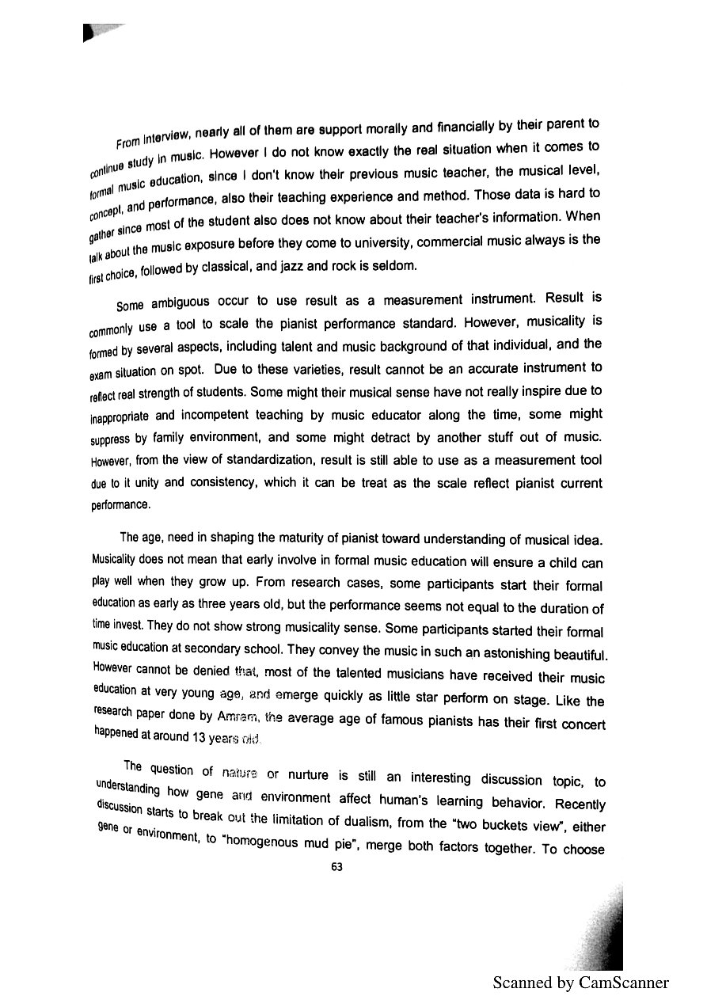

```text
B
jew, nearly all of tham are support morally and financially by their parent to

Fr er ic, However | do not know exaclly the real situation when it comes to
rinse sud non sinca | don't know thelr previous music teacher, the musical level,
formal music erence also their teaching experience and method. Those data is hard to
eo are al the student also does not know about their teacher's information. When
goer “ evel exposure before they come to university, commercial music always is the
“ i followed by classical, and jazz and rock is seldom.

some ambiguous occur to use result as a measurement instrument. Result is
commonly use @ tool to scale the pianist performance standard. However, musicality is
formed by several aspects, including talent and music background of that Indhidual, and the
exam situation on spot. Due to these varieties, result cannot be an accurate instrument to
telact real strength of students. Some might their musical sense have not really inspire due to
inappropriate and incompetent teaching by music educator along the time, some might
suppress by family environment, and some might detract by another stuff out of music.
However, from the view of standardization, result is still able to use as a measurement tool
due lo it unity and consistency, which it can be treat as the scale reflect pianist current
performance.

The age, need in shaping the maturity of pianist toward understanding of musical idea.
Musicality does not mean that early involve in formal music education will ensure a child can
play well when they grow up. From research cases, some participants start their formal
education as early as three years old, but the performance seems not equal to the duration of
time invest. They do not show strong musicality sense. Some participants started their formal
music education at secondary school. They convey the music in such an astonishing beautiful.
However cannot be denied that, most of the talented musicians have received their music
@ducation at very young age, and emerge quickly as little star perform on stage. Like the
esearch paper done by Amami, the average age of famous pianists has their first concert
happened al around 13 years cid
a cesion of nature - nurture is still an interesting discussion topic, to
Siscussion Suen a a environment affect human's learning behavior. Recently

wo omens oa the limitation of dualism, from the “two buckets view’, either, lomogenous mud pie”, merge both factors together. To choose
63
Scanned by CamScanner
```

## Page 74

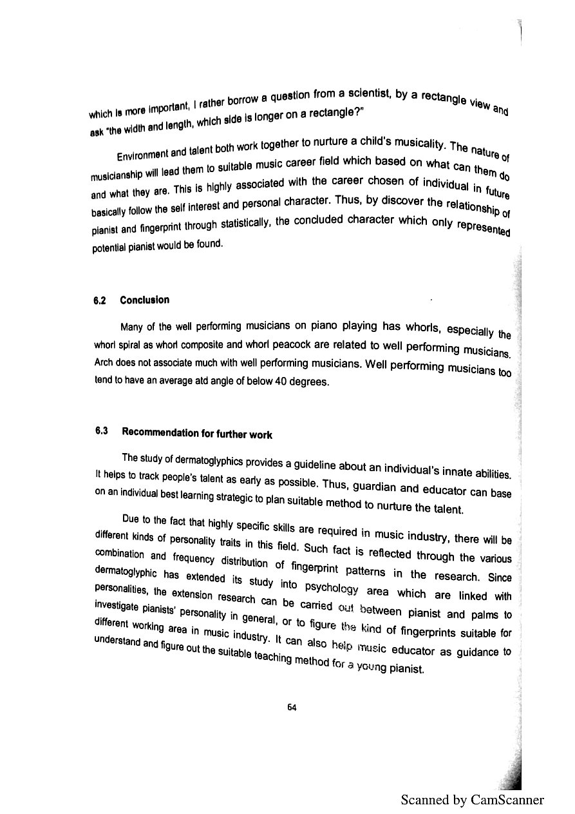

```text
|
from a scientist, by a fectangle, | rather borrow @ question tangle?” “ew ang
nt, ect
wich ie ore importa th, which side is longer on & 1
ask ‘the width and length, « together to nurture a child's musicality, The Mature of
jh worl 5
Environment and talent * ble music career field which based on what can them do
i them to suital chosen of individual;
musicianship will lead is highly associated with the career. idual in future
and what they are. This Is 1d personal character. Thus, by discover the Felationship of
self interest an ich ont
basicaly folow thes through statistically, the concluded character which only Fepresentag
pianist and fingerprint ’
potential pianist would be found.
6.2 Conclusion

any of the well performing musicians on piano playing has whorls, especially the
whorl g an whorl composite and whorl peacock are related to well Performing Musicians,
Arch does not associate much with well performing musicians. Well performing musicians tog
tend to have an average atd angle of below 40 degrees.

6.3 Recommendation for further work

The study of dermatoglyphics Provides a guideline about an individual's innate abilities,
Mthelps to track people's talent as early as possible. Thus, guardian and educator can base
on an individual best learning strategic to plan suitable Method to nurture the talent.

Dus to the fact that highly specific skills are required in music industry, there will be
different kinds of personality traits in this field. Such fact is eflected through the various
Combination and frequency distribution of fingerprint Patterns in the research. Since
omer has extended its Study into Psychology area which are linked with

ersonalit:

pense _s ev research can be carried uf between pianist and palms to

Pianists’ ity ir

i Personality in general, or to figure the kind of fingerprints suitable for
diferent working area in ™usic industry. 1t: A

understand and fue outtne Itcan also heip "usic educator as guidance to

18 Suitable teaching Method for a young pianist.
64
Scanned by CamScanner
```

## Page 75

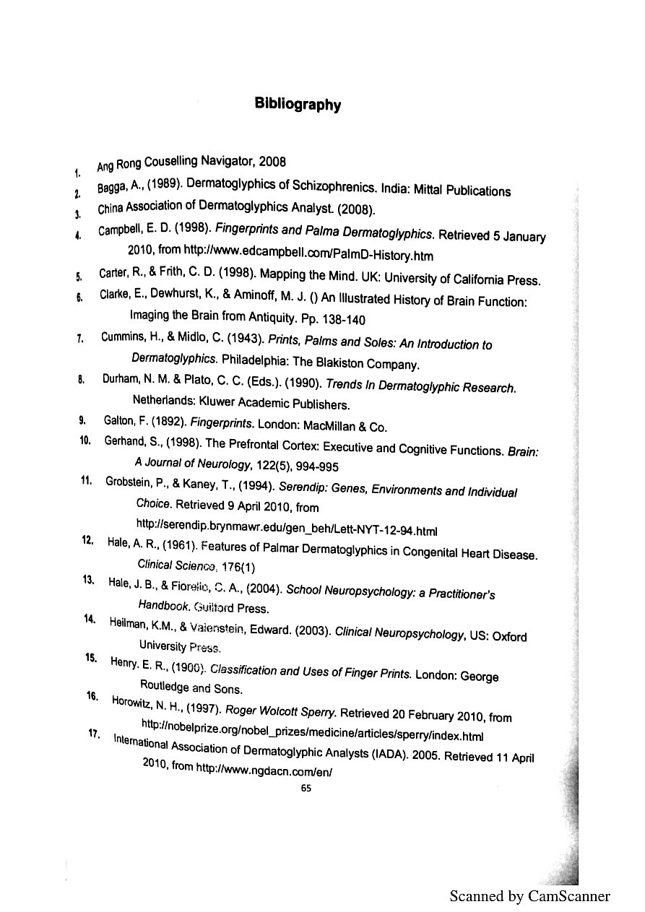

```text
Bibliography
‘ng Rong Couselling Navigator, 2008
‘ Bega, A.. (1989). Dermatoglyphics of Schizophrenics. India: Mittal Publications: china Association of Dermatoglyphics Analyst. (2008).
1 Campbell, E. D. (1998). Fingerprints and Palma Dermatoglyphics. Retrieved 5 January
2010, from http://www.edcampbell.com/PalmD-History. htm
5, Carter, R., & Frith, C. D. (1998). Mapping the Mind. UK: University of California Press.
4, Clarke, E., Dewhurst, K., & Aminoff, M. J. () An Illustrated History of Brain Function:
Imaging the Brain from Antiquity. Pp. 138-140
1, Cummins, H., & Midlo, C. (1943). Prints, Palms and Soles: An Introduction to
Dermatoglyphics. Philadelphia: The Blakiston Company.
§ Durham, N. M. & Plato, C. C. (Eds.). (1990). Trends In Dermatogiyphic Research.
Netherlands: Kluwer Academic Publishers.
9. Galton, F. (1892). Fingerprints. London: MacMillan & Co.
10. Gerhand, S., (1998). The Prefrontal Cortex: Executive and Cognitive Functions. Brain:
A Journal of Neurology, 122(5), 994-995
11. Grobstein, P., & Kaney, T., (1994). Serendip: Genes, Environments and Individual
Choice. Retrieved 9 April 2610, from
http://serendip. brynmawr.edu/gen_beh/Lett-NYT-12-94.htm!
1 Hale, A.R., (1961). Features of Palmar Dermatoglyphics in Congenital Heart Disease.
Clinical Science, 176(1)
13. Hale, J. B., & Fiorstio, ©, A., (2004). Schoo! Neuropsychology: a Practitioner's
Handbook. Guiltord Press,
"4. Heilman, KIM, & Valenstein, Edward. (2003). Clinical Neuropsychology, US: Oxford
University Praga,
15, Henry. E. R., (1906). Classification and Uses of Finger Prints. London: George
% Routledge and Sons.
* Aerowitz, N.H., (1997). Roger Wolcott Sperry. Retrieved 20 February 2010, from
nem http-inobelprize.orginobel |_prizes/medicine/articles/sperry/index.htm! |
‘ational Association of Dermatoglyphic Analysts (IADA). 2005, Retrieved 11 April |
2010, from http:/Awww.ngdacn.comven/
65 q
Scanned by CamScanner
```

## Page 76

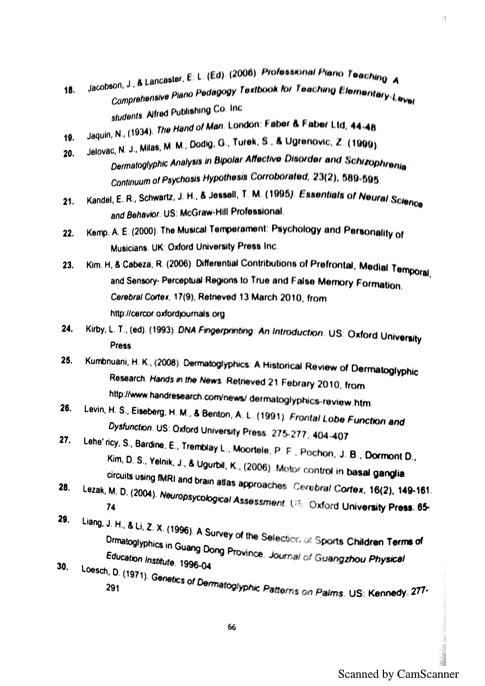

```text
n p
a Lancaster, € & (Ed) (2006) Professional Plano Teaching 4
48, Jacobson, J henave P20 Pedagogy Textbook for Teaching Elementary Love)
Compre! ‘nto Publishing Co. Inc
ae The Hand of Man. London’ Faber & Faber Ltd, 44.49
49. Jaquin, ee MM, Dodig, G., Turek, 8. & Ugrenovic, 2 (1999)
N. J., Milas, ‘
20. ee matogiyphic Analysis in Bipolar Affective Disorder and Schizophronia
Continuum of Psychosis Hypothesia Corroborated, 23(2), 880-606
01
M. (1995). Essentials of
24, Kandel, E. R., Schwartz, J. H., & Jessell, T. M. (1905) Nourat Science
‘and Behavior. US: McGraw-Hill Professional
22. Kemp. A. E. (2000). The Musical Temperament: Paychology and Personality of
Musicians. UK: Oxford University Press Inc
23, Kim. H, & Cabeza, R. (2006). Differential Contributions of Prefrontal, Medial Temporal,
and Sensory- Perceptual Regions to True and False Memory Formation,
Cerebral Comtex, 17(9), Retrieved 13 March 2010, from
hitp://cercor oxfordjournals org
24. Kirby, L. T., (ed). (1993). DNA Fingerpnnting: An introduction. US Oxford Univer
y raity
Press
25, Kumbnuani, H. K., (2008), Dermatoglyphics: A Historical Review of Dermatoglyphic
Research. Hands n the News Retrieved 21 Febrary 2010, from
hitp/Awww.handresearch Convinews/ dermatoglyphics-review htm
26. Levin, H.S., Eiseberg, HM. & Benton, AL (1991) Frontal Lobe Function and
Dysfunction. US: Oxtord University Press. 275-277, 404-407
27. Lehe'ricy, S., Bardine, E Tremblay L., Moortele, PF Pochon, J. B., Dormont 0.,
Kim, 0. S. Yelnik, J. & Uguiba, K., (2006). Motor control in basal ganglia
Circui
0 teseka OT oon {MRI and brain atlas approaches Cerebral Cortex, 16(2), 149-161
" " (2004), Neuropsycological Assessment. (i: Oxford University Press. 6570, Liang. JH, 8 Ui
me BL ZX. (4)
Ometogherin ( a, A Survey of the Selectior, «: Sports Children Terms of
in
Eeveaton nseg 1209 Dong Province. Journal of Guangzhou Physical
30. Loesch, p (1971), Genes
of
201 Pormetogiypne Petters on Paims. US: Kennedy. 277
66
Scanned by CamScanner
```

## Page 77

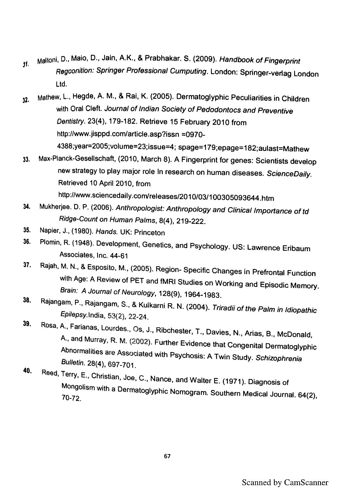

```text
Maltoni, D.. Maio, D., Jain, A.K., & Prabhakar. S. (2009). Handbook of Fingerprint
ah Regconition: Springer Professional Cumputing. London: Springer-verlag London
Ltd.
L., Hegde, A. M., & Rai, K. (2005). Dermatoglyphic Peculiarities in Children

3. Mathew, ; ”

with Oral Cleft. Journal of Indian Society of Pedodontocs and Preventive
Dentistry. 23(4), 179-182. Retrieve 15 February 2010 from
http:/Awww.jisppd.com/article.asp?issn =09704388;year=2005;volume=23;issue=4; spage=179;epage=182;aulast=Mathew

33, Max-Planck-Gesellschaft, (2010, March 8). A Fingerprint for genes: Scientists develop

new strategy to play major role In research on human diseases. ScienceDaily.
Retrieved 10 April 2010, from
http:/mww.sciencedaily.com/releases/2010/03/100305093644.htm

34, Mukherjee. D. P. (2006). Anthropologist: Anthropology and Clinical Importance of td
Ridge-Count on Human Palms, 8(4), 219-222.

35. Napier, J., (1980). Hands. UK: Princeton

36. Plomin, R. (1948). Development, Genetics, and Psychology. US: Lawrence Eribaum
Associates, Inc. 44-61

37. Rajah, M.N., & Esposito, M., (2005). Region- Specific Changes in Prefrontal Function
with Age: A Review of PET and fMRI Studies on Working and Episodic Memory.
Brain: A Journal of Neurology, 128(9), 1964-1983.

38. Rajangam, P., Rajangam, S., & Kulkarni R. N. (2004). Triradii of the Palm in Idiopathic
Epilepsy.India, 53(2), 22-24.

38. Rosa, A., Farianas, Lourdes., Os, J., Ribchester, T., Davies, N., Arias, B., McDonald,
A., and Murray, R. M. (2002). Further Evidence that Congenital Dermatoglyphic
Abnormalities are Associated with Psychosis: A Twin Study. Schizophrenia
Bulletin. 28(4), 697-701,

40. Reed, Terry, E., Christian, Joe, C., Nance, and Walter E. (1971). Diagnosis of
Mongolism with a Dermatoglyphic Nomogram. Southern Medical Journal. 64(2),
70-72,

67
Scanned by CamScanner
```

## Page 78

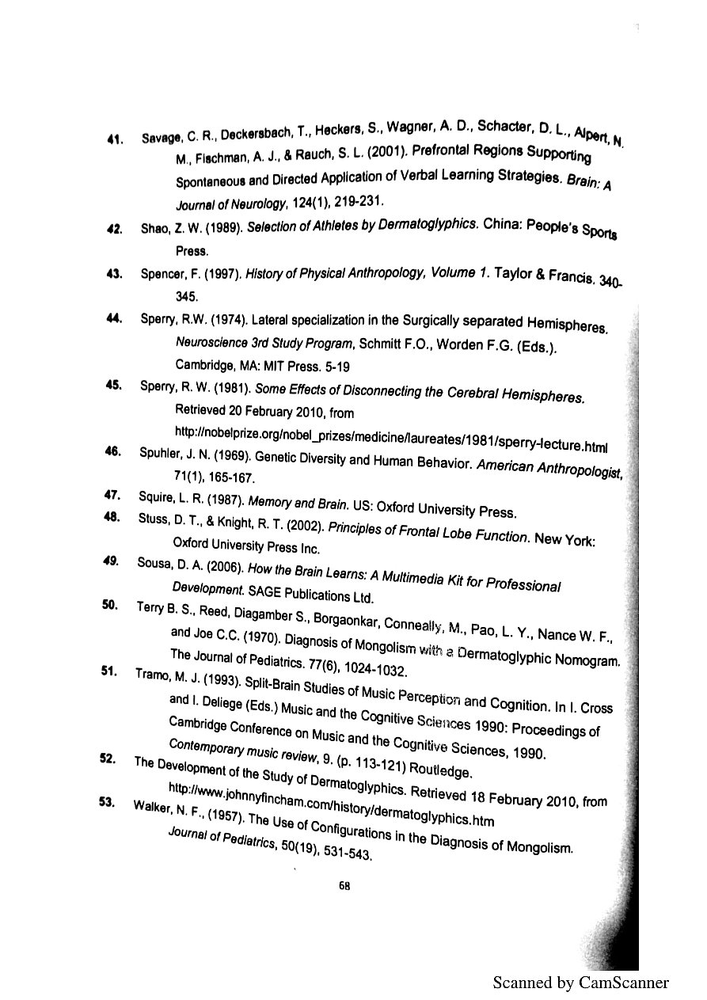

```text
sbach, T., Heckers, S., Wagner, A. D., Schacter, D. L., Alpert,
41. Savage, C. R., Decker ‘ Rauch, S. L. (2001). Prefrontal Regions Supporting
M, Fiachman, A.J solic 1 Verbal Learning Strategies. Brain. 4
\d Directed Application of
Spontaneous an 210-231
124(1), .
Journal of Neurology, ics, China: People’
by Dermatoglyphics. : People’s Sports
42, Shao, Z. W. (1989). Selection of Athletes by
Press. A
ogy, Volume 1. Taylor & Francis,
43. Spencer, F. (1997). History of Physical Anthropology, 340.
“4. Spar, RW. (1974), Lateral specialization in the Surgically Separated Hemispheres,
Neuroscience 3rd Study Program, Schmitt F.O., Worden F.G. (Eds. ), |
Cambridge, MA: MIT Press. 5-19
45. Sperry, R. W. (1981). Some Effects of Disconnecting the Cerebral Hemispheres,
Retrieved 20 February 2010, from
http://nobelprize.org/nobel |_prizes/medicine/laureates/1981/sperry-lecture, html.
46. Spuhler, JN. (1969). Genetic Diversity and Human Behavior. American Anthropologist,
71(1), 165-167.
47. Squire, L. R. (1987). Memory and Brain, US: Oxford University Press,
48. Stuss, D.T., & Knight, R. T. (2002). Principles of Frontal Lobe Function. New York: q
Oxford University Press Inc,
49. Sousa, D. A. (2006). How the Brain Learns: A Multimedia Kit for Professional
Development. SAGE Publications Ltd. §
50. Terry B. S., Reed, Diagamber S., Borgaonkar, Conneaily, M., Pao, L, Y.,NanceW.F., |
and Joe C.C, (1970), Diagnosis of Mongolism with a Dermatoglyphic Nomogram.
The Journal of Pediatrics, 77(6), 1024-1032, F
4. OT i
Famo, “ : ( 1823), Split-Brain Studies of Music Perception and Cognition. In |. Cross
a noe (Eds.) Music and the Cognitive Sciences 1990: Proceedings of
on ridge Conference on Music and the Cognitive Sciences, 1990,
2 ton, femporary music review, 9, (p, 113-121) Routledge,
* ‘elopment of the St
hphnmtjohneyasa | Ce™EOONPhics. Retioved 18 February 2010, from
x ‘www johnnyfincham, ‘Convhistory/der; i
53. Walker, N, (1957), The Use ofc ry! ™matoglyphics, htm
‘ . °f Configurations in the Diagnosis i
iS of Mongolism. q
Journal of Pediatrics, 50(19), 531-543, ig of Mongol
68
Scanned by CamScanner
```

## Page 79

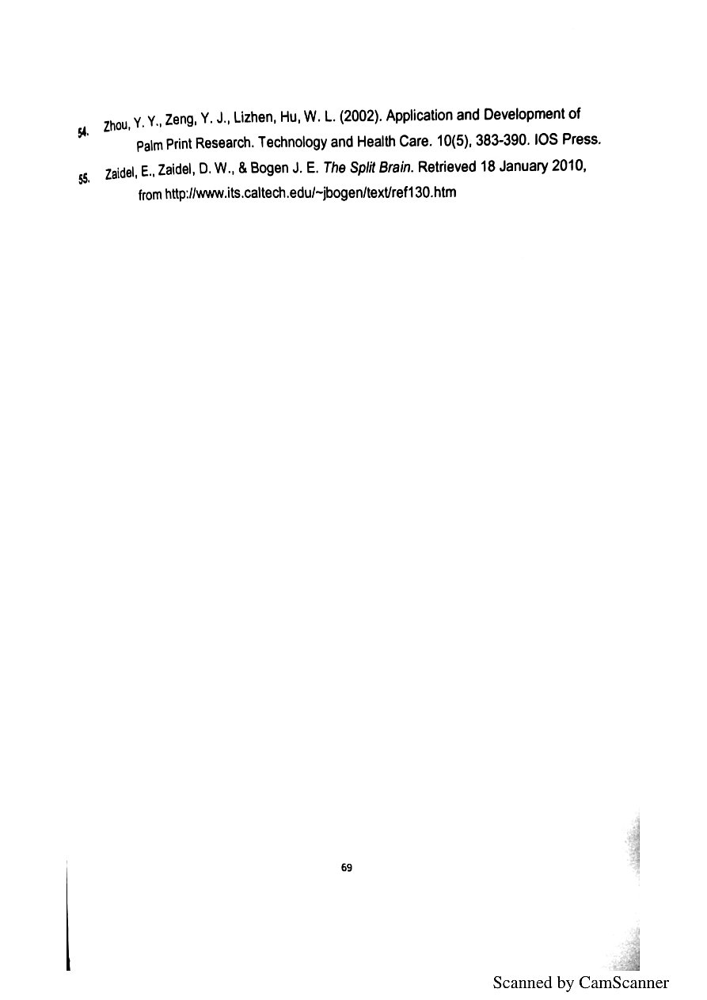

```text
Zhou, Y. Y., Zeng, Y. J., Lizhen, Hu, W. L. (2002). Application and Development of
Palm Print Research. Technology and Health Care. 10(5), 383-390. IOS Press.
6 Zaidel, E., Zaidel, D. W., & Bogen J. E. The Split Brain. Retrieved 18 January 2010,
from http://www. its.caltech.edu/~jbogen/text/ref130.htm

69

i
```

## Page 80


```text
APPENDIX
Today's date: —
Name: ee
Address: Occupation: Se
Phone Number: ___——_ grey. ————____Dat of i enn sumtin,
Note ™
[[rescn se
[1. | ‘Do you practice with metronome? [vemnof Sd
[2 [bo you practioe scale? [Yesinmof
[3 [Boyourractoo Bhouraday? —[ves/nof
I‘ Do picture come out in your mind Yes /no
when you are playing piano?
[5. [How fast you memorize one piece? |_|
‘Are you good in improvise? Por 123456789 10
Excellent
Private music Sector: ‘ABRSM Practical;
Trinity
Other: -——
Theory:
University Principal Study result; AA Be BB Gre
Do you receive any achievement | Yes
in music competition? If yes,
Please kindly state in the blank
space. —..
i
—
wen you slarted your formal musio education? Note
Are you study musi er
7
Scanned by CamScanner
```

## Page 81


```text
Futuro Outlook Nt
f Fr you ba continuing to working In ths area after” | You! No
1.
VY graduation® oe
L What is your outlook In your future music journey?
5 Excopt tho principal study currantly, do you Involve | Yes! No
inanother aay _
Tf wil you plan to Involve In another aroa? Yas! No
[_ [Aa [Noto
What is the main problem you facing in piano.
study? ee es es
| How do you curb the problem?
3. | How long have you been taken to solve the
problem?
Dermatoglyphic can quickly raveal the advantage | Yes! No
and disadvantage of a person. So to provide a
better exploration in the future. How much do you
understand this study?
5. | Through fingerprint, strong and weak point of a Yes/ No
ig!
Person can be showed, how much do you
understand this study?
Fingerprint Code
Atd angle: L: R:
~~ Thank you far your pantcipation. We are appreciating your cooperation ~~
n
Scanned by CamScanner
```

## Page 82


```text
—————

VDM pubtishing house Itd.
Scientific Publishing House
offers
free of charge publication
of current academic research papers,
Bachelor’s Theses, Master's Theses,
Dissertations or Scientific Monographs
If you have written a thesis which satisfies high content as
well as formal demands, and you are interested in a remunerated publication of your work, please send an e-mail with
some initial information about yourself and your work to

info@vdm-publishing-house.com.
Our editorial office will get in touch with you shortly.
VDM Publishing House Ltd.
Meldrum Court 17.
Beau Bassin
Mauritius
www.vdm-publishing-house.com
Scanned by CamScanner
```

## Page 83

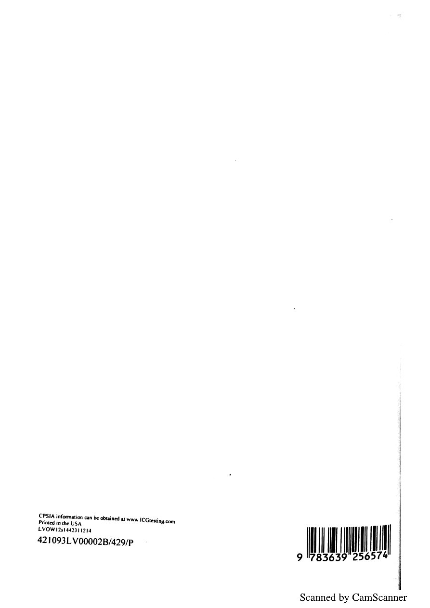

```text
CPSIA information can be obtained at www ICGtesting com
Printed in the USA

LVOW1251482311214

421093LV00002B/429/P

MQM
```

## Page 84

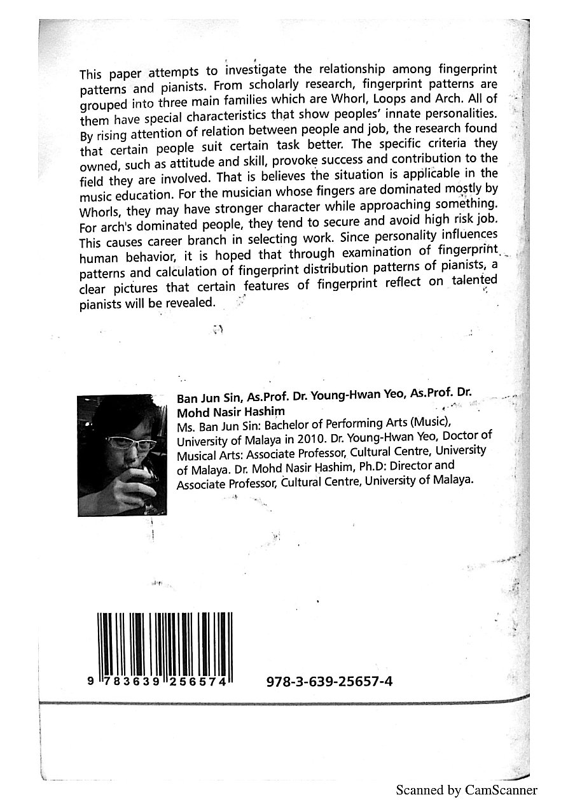

```text
I q
|
This paper attempts to investigate the relationship among fingerprint.,,
patterns and pianists. From scholarly research, fingerprint patterns are
grouped into three main families which are Whorl, Loops and Arch. All of ~~"
them have special characteristics that show peoples’ innate personalities. |
By rising attention of relation between people and job, the research found
that certain people suit certain task better. The specific criteria they
owned, such as attitude and skill, provoke success and contribution to the
field they are involved. That is believes the situation is applicable in the
music education. For the musician whose fingers are dominated mostly by {
Whorls, they may have stronger character while approaching something.
For arch's dominated people, they tend to secure and avoid high risk job. t
This causes career branch in selecting work. Since personality influences
human behavior, it is hoped that through examination of fingerprint, _ |
patterns and calculation of fingerprint distribution patterns of pianists, a
clear pictures that certain features of fingerprint reflect on talented
pianists will be revealed. if *
a
= Ban Jun Sin, As.Prof. Dr. Young-Hwan Yeo, As.Prof. Dr. -.
Mohd Nasir Hashim ae
*. | Ms. Ban Jun Sin: Bachelor of Performing Arts (Music),
Ee University of Malaya in 2010. Dr. Young-Hwan Yeo, Doctor of
A Ye Musical Arts: Associate Professor, Cultural Centre, University
c= Wa of Malaya. Dr. Mohd Nasir Hashim, Ph.D: Director and
™, Associate Professor, Cultural Centre, University of Malaya. :
'
8 89699) | 5657 | 978-3-639-25657-4
SSE at
_ a
Scanned by CamScanner
```

