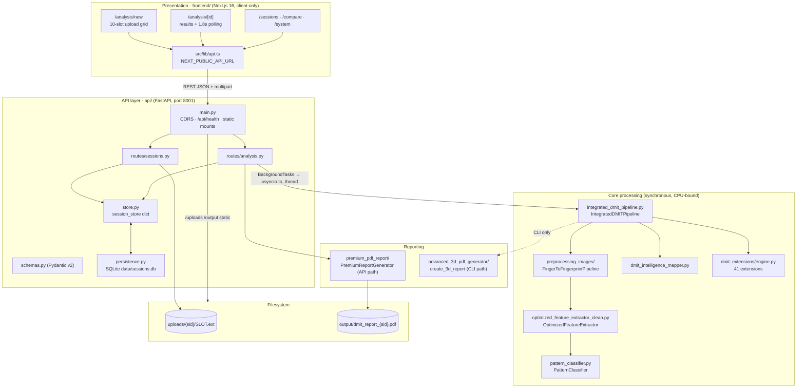
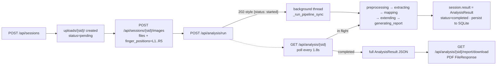
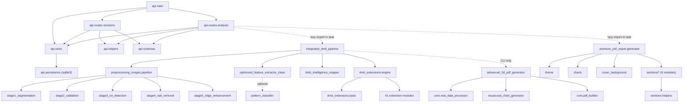
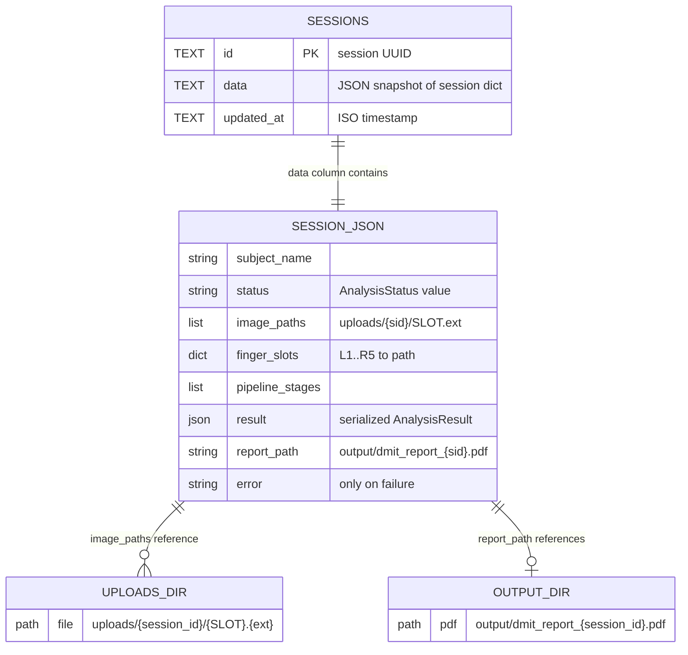
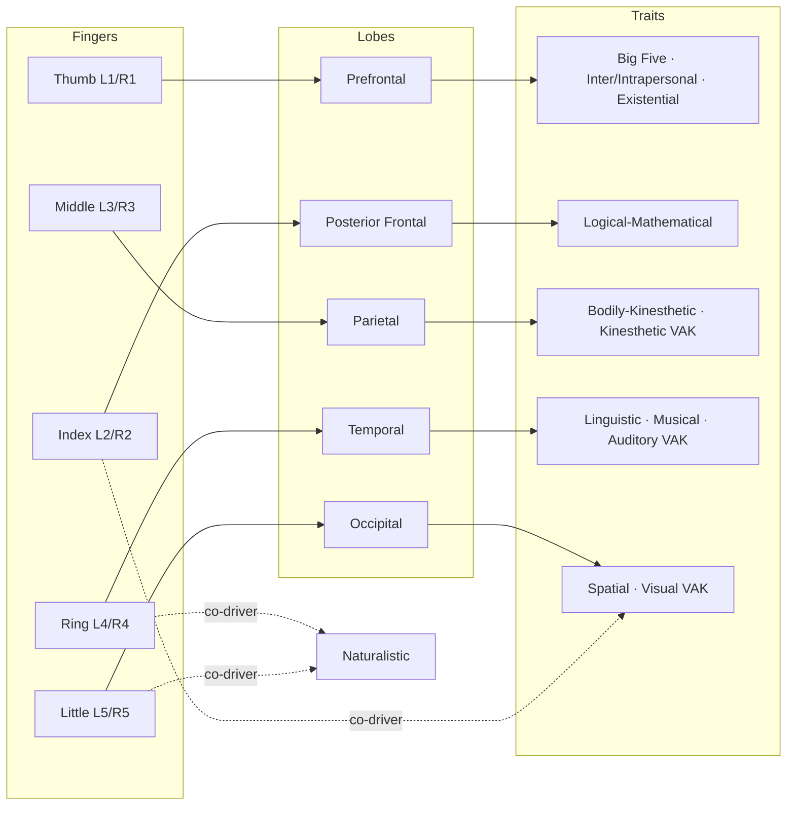
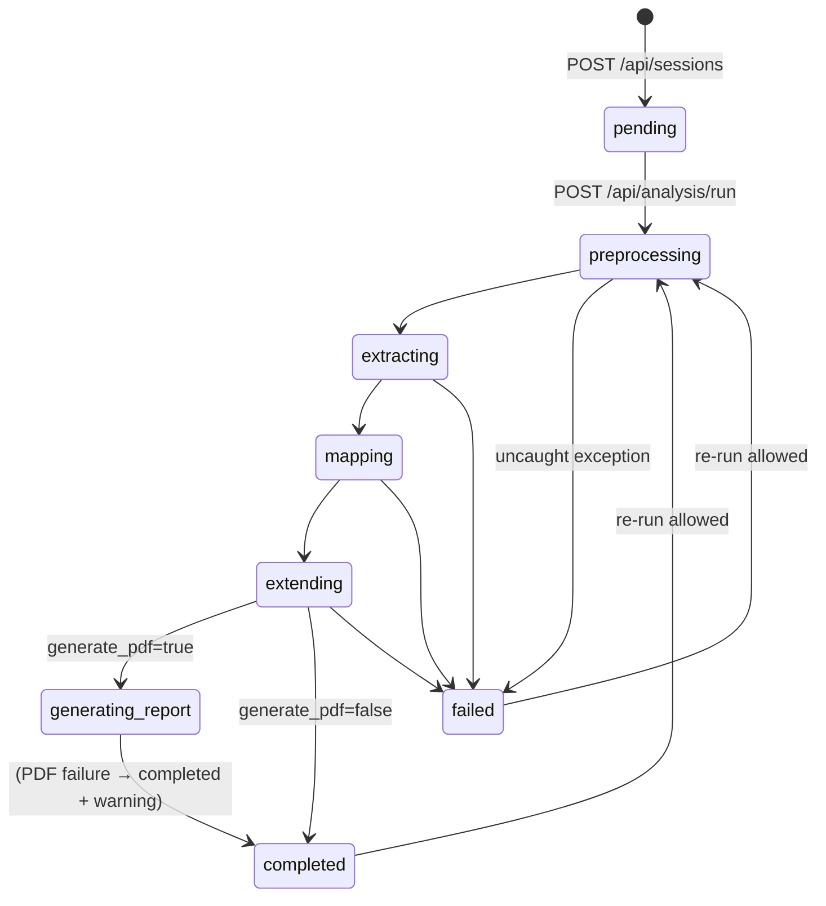

# Diagrams

> All diagrams are Mermaid and reflect the code as-is. Names match real modules/classes/endpoints.

## 1. System architecture



## 2. Request / data flow (analysis lifecycle)



## 3. Component dependency graph



## 4. Sequence diagram — main workflow

```mermaid
sequenceDiagram
    autonumber
    participant UI as frontend /analysis/new
    participant API as FastAPI api/
    participant BG as Worker thread (_run_pipeline_sync)
    participant IDP as IntegratedDMITPipeline
    participant FE as OptimizedFeatureExtractor
    participant MAP as dmit_intelligence_mapper
    participant ENG as DMITExtensionsEngine
    participant PDF as PremiumReportGenerator
    participant DB as SQLite + uploads/ output/

    UI->>API: POST /api/sessions {subject…}
    API->>DB: mkdir uploads/{sid}; upsert session
    API-->>UI: AnalysisSession (pending)
    UI->>API: POST /api/analysis/{sid}/upload (files, finger_positions)
    API->>DB: save L1.bmp…R5.bmp; update image_paths
    UI->>API: POST /api/analysis/run
    API->>BG: BackgroundTasks → to_thread
    API-->>UI: {status: "started"}

    loop per image (≤10)
        BG->>IDP: analyze_single_finger(path)
        IDP->>IDP: FingerToFingerprintPipeline.process (optional)
        IDP->>FE: extract_optimized_features(image)
        FE->>FE: PatternClassifier.classify (cores/deltas, family, TFRC)
        FE-->>IDP: consolidated_features (~85)
        IDP->>MAP: map_features_to_dmit_profile(features, finger_type)
        MAP-->>IDP: MI / lobes / VAK / Big Five
        IDP->>ENG: run_all_extensions(features ∪ MI)
        ENG-->>IDP: {ExtensionClassName: scores}
    end
    BG->>IDP: _aggregate_results_scientifically (Table 1.1)
    IDP->>ENG: run_all_extensions(holistic MI)
    IDP-->>BG: full_result

    BG->>BG: normalize → AnalysisResult
    BG->>PDF: create_report(full_result, output_path, session_meta)
    PDF->>DB: output/dmit_report_{sid}.pdf
    BG->>DB: persist session (result, report_path, completed)

    loop poll every 1.8 s
        UI->>API: GET /api/analysis/{sid}
        API-->>UI: status + pipeline_stages (then full result)
    end
    UI->>API: GET /api/analysis/{sid}/report/download
    API-->>UI: PDF
```

## 5. Storage / schema diagram



## 6. Table 1.1 scientific mapping (finger → lobe → traits)



## 7. Pipeline stage state machine (per session)


