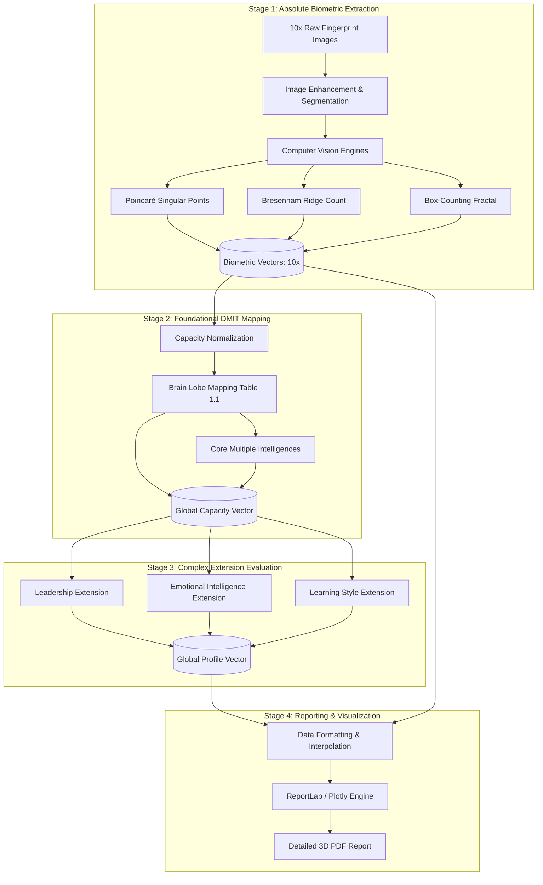

# Comprehensive DMIT System Architecture & Vector Data Flow

This document provides a highly detailed, step-by-step blueprint of the entire DMIT (Dermatoglyphics Multiple Intelligence Test) system architecture. It outlines every algorithmic transformation from the moment raw fingerprint pixels enter the system to the final generation of the psychological profile PDF.

This architecture strictly enforces a one-way deterministic data flow, ensuring a rigid wall separates **Objective Biometric Measurement** (Math & Physics) from **DMIT Interpretation** (Psychology & Theory).

---

## 1. High-Level System Topology

The system operates in four distinct, sequential stages:



---

## 2. Stage-by-Stage Detailed Breakdown

### STAGE 1: Absolute Biometric Extraction
**Goal:** Extract undeniable mathematical truths from 10 fingerprint images. Every metric must be scientifically verifiable against the raw image data. No psychological interpretation occurs here.

#### 1.A Input & Preprocessing
*   **Inputs:** 10 individual high-resolution grayscale images (`L1` to `L5` for Left Hand, `R1` to `R5` for Right Hand). Thumb is `1`, Little finger is `5`.
*   **Module:** [preprocessing_images/stage1_segmentation.py](file:///c:/Users/BAPS/Documents/space/brain-dmit-analysis/preprocessing_images/stage1_segmentation.py) -> [stage5_ridge_enhancement.py](file:///c:/Users/BAPS/Documents/space/brain-dmit-analysis/preprocessing_images/stage5_ridge_enhancement.py)
*   **Operations:**
    *   **Segmentation:** Isolates the fingerprint from the background using adaptive thresholding.
    *   **Enhancement:** Applies Contrast Limited Adaptive Histogram Equalization (CLAHE) and Gabor filters tuned to the local ridge frequency to clarify ridge structures.

#### 1.B Core Feature Extraction Logic
*   **Module:** [pattern_classifier.py](file:///c:/Users/BAPS/Documents/space/brain-dmit-analysis/pattern_classifier.py) and [optimized_feature_extractor_clean.py](file:///c:/Users/BAPS/Documents/space/brain-dmit-analysis/optimized_feature_extractor_clean.py)
    
1.  **Singular Point Detection (Poincaré Index):**
    *   *Algorithm:* Computes the orientation field of the image using image gradients. Calculates the Poincaré index along closed curves in the orientation field.
    *   *Core:* Detected where the index is +0.5 (or +180 degrees).
    *   *Delta (Triradius):* Detected where the index is -0.5 (or -180 degrees).
    *   *Output:* Exact (x, y) pixel coordinates of all cores and deltas.

2.  **Ridge Counting (TFRC - Total Finger Ridge Count):**
    *   *Algorithm:* Draws a theoretical line (using Bresenham's line algorithm or similar) connecting the exact center of a Core to the exact center of a Delta.
    *   *Counting:* Analyzes the 1D pixel intensity profile along this line. Every zero-crossing (or peak-to-valley transition) counts as exactly 1 ridge.
    *   *Rules:* Arches have 0 ridges (no true cores/deltas). Loops have 1 count. Whorls have 2 counts (typically, the higher count is used, or both are recorded).

3.  **Pattern Classification (CADA Rules):**
    *   *Arch:* 0 Deltas, 0 Cores.
    *   *Loop:* 1 Delta, 1 Core.
    *   *Whorl:* 2 Deltas, 1+ Cores.

4.  **Fractal Dimension (Box-Counting):**
    *   *Algorithm:* Overlays grids of decreasing box sizes (`epsilon`) onto the binarized image. Counts the number of boxes containing at least one ridge pixel (`N`).
    *   *Calculation:* Calculates the fractal dimension $D = \lim_{\epsilon \to 0} \frac{\log N(\epsilon)}{\log(1/\epsilon)}$. Measures pattern complexity and "space-filling" density.

#### 1.C Stage 1 Output: The `Biometric Vector`
Produced for *each* of the 10 fingers.
```json
{
  "finger_id": "L1", // Left Thumb
  "pattern_type": "Whorl",
  "singular_points": {
    "cores": [{"x": 120, "y": 150}],
    "deltas": [{"x": 40, "y": 200}, {"x": 200, "y": 210}]
  },
  "ridge_count": 18, // Physical count of ridges
  "fractal_dimension": 1.62,
  "atd_angle": null // Explicitly null as this requires a palm print
}
```

---

### STAGE 2: Foundational DMIT Mapping
**Goal:** Translate physical measurements (Stage 1) into biological capabilities and core intelligences using standard DMIT mappings (Table 1.1).

#### 2.A Capacity Normalization
*   **Module:** [dmit_intelligence_mapper.py](file:///c:/Users/BAPS/Documents/space/brain-dmit-analysis/dmit_intelligence_mapper.py)
*   **Concept:** Raw ridge counts (typically ranging from 0 to ~30 per finger) must be converted into a standardized "Capacity Percentage" (0.0 to 1.0).
*   **Formula:** `capacity_score = min(1.0, ridge_count / 25.0)` (Assuming 25 is a high baseline for a single finger).

#### 2.B Brain Lobe Mapping (Table 1.1 Standard)
The normalized capacity scores are mapped strictly to brain lobes based on the established DMIT finger-lobe correlation:
*   **L1 (Left Thumb) / R1 (Right Thumb) $\rightarrow$ Prefrontal Lobe** (Executive functions, interpersonal/intrapersonal intelligence).
*   **L2 (Left Index) / R2 (Right Index) $\rightarrow$ Frontal Lobe** (Logical-mathematical, linguistic reasoning).
*   **L3 (Left Middle) / R3 (Right Middle) $\rightarrow$ Parietal Lobe** (Bodily-Kinesthetic, gross motor skills).
*   **L4 (Left Ring) / R4 (Right Ring) $\rightarrow$ Temporal Lobe** (Auditory, musical, language absorption).
*   **L5 (Left Little) / R5 (Right Little) $\rightarrow$ Occipital Lobe** (Visual-spatial observation).

#### 2.C Core Intelligence Mapping (Howard Gardner's MI)
*   **Interpersonal:** Driven strongly by L1 (Left Prefrontal).
*   **Intrapersonal:** Driven strongly by R1 (Right Prefrontal).
*   **Logical-Mathematical:** Driven strongly by L2/R2 (Frontal).
*   **Linguistic:** Distributed across Frontal and Temporal lobes.
*   **Bodily-Kinesthetic:** Driven strictly by L3/R3 (Parietal).
*   **Spatial:** Driven strongly by L5/R5 (Occipital).

#### 2.D Pattern Modifiers (Heuristics)
Patterns influence *how* the capacity is expressed, not *how much* capacity there is:
*   **Whorl:** +0.1 to "Independence" or "Self-Driven" traits.
*   **Loop:** +0.1 to "Sociability" or "Environment-Driven" traits.

#### 2.E Stage 2 Output: The Global `Capacity Vector`
```json
{
  "brain_lobes": {
    "prefrontal": {"raw_score": 0.72, "dominant_pattern": "Whorl"},
    "frontal": {"raw_score": 0.65, "dominant_pattern": "Loop"},
    "parietal": {"raw_score": 0.88, "dominant_pattern": "Whorl"},
    ...
  },
  "multiple_intelligences": {
    "interpersonal": 0.75, // Derived via Prefrontal capacity
    "logical_mathematical": 0.65, // Derived via Frontal capacity
    "bodily_kinesthetic": 0.88, // Derived via Parietal capacity
    ...
  }
}
```

---

### STAGE 3: Complex Extension Evaluation
**Goal:** Synthesize the foundational capacities (Stage 2) into complex, real-world behavioral profiles and skills.

#### 3.A Strict Rule Engine
*   **Location:** `dmit_extensions/`
*   **Rule:** Extensions **MAY NOT** use raw physical features like "entropy" or "graph density" multiplied by arbitrary weights.
*   **Rule:** Extensions **MUST** derive their scores purely through logical combinations of the Brain Lobe and Core Intelligence capacities defined in Stage 2.

#### 3.B Example Calculations

**1. Leadership Potential ([leadership.py](file:///c:/Users/BAPS/Documents/space/brain-dmit-analysis/dmit_extensions/leadership.py))**
*   *Theory:* Leadership requires strategic vision (Executive function), logical planning, and the ability to influence.
*   *Formula:*
    $Leadership = (Prefrontal\_Capacity \times 0.5) + (Frontal\_Capacity \times 0.3) + (Interpersonal\_Intelligence \times 0.2)$

**2. Emotional Intelligence ([emotional_intelligence.py](file:///c:/Users/BAPS/Documents/space/brain-dmit-analysis/dmit_extensions/emotional_intelligence.py))**
*   *Theory:* EQ relies on self-awareness (Intrapersonal) and understanding others (Interpersonal), heavily rooted in the Prefrontal lobe.
*   *Formula:*
    $Self\_Awareness = Intrapersonal\_Intelligence$
    $Empathy = Interpersonal\_Intelligence$
    $Overall\_EQ = (Self\_Awareness \times 0.6) + (Empathy \times 0.4)$

**3. Learning Style (VAK) ([learning_style.py](file:///c:/Users/BAPS/Documents/space/brain-dmit-analysis/dmit_extensions/learning_style.py))**
*   *Visual (V):* Based strictly on Occipital lobe capacity (L5/R5).
*   *Auditory (A):* Based strictly on Temporal lobe capacity (L4/R4).
*   *Kinesthetic (K):* Based strictly on Parietal lobe capacity (L3/R3).
*   *Formula:* The V/A/K scores are normalized to sum to 100%.

#### 3.C Stage 3 Output: The Global `Profile Vector`
Contains the final, calculated behavioral percentages ready for presentation.

```json
{
  "leadership_potential": {
    "strategic_vision": 0.70,
    "influence": 0.68,
    "overall": 0.69
  },
  "emotional_intelligence": {
    "self_awareness": 0.72,
    "empathy": 0.65,
    "overall_eq": 0.69
  },
  "learning_style": {
    "visual": 0.35, // 35%
    "auditory": 0.25, // 25%
    "kinesthetic": 0.40 // 40%
  }
}
```

---

### STAGE 4: Reporting and Visualization
**Goal:** Generate a comprehensive, interactive, and visually stunning PDF report that accurately reflects the calculated vectors without misrepresentation.

#### 4.1 Rendering Engine
*   **Module:** `advanced_3d_pdf_generator/`
*   **Technologies:** Uses ReportLab to construct the document structure and Plotly to generate high-quality, embedded charts (radar charts, bar graphs, 3D surface plots where applicable).

#### 4.2 Data Integration & Flattening
*   The `RealDataProcessor` (or equivalent) ingests both the raw `Biometric Vectors` and the synthesized `Profile Vector`.
*   It flattens the nested JSON structures into [(key, value)](file:///c:/Users/BAPS/Documents/space/brain-dmit-analysis/dmit_intelligence_mapper.py#66-68) pairs compatible with Plotly and ReportLab templates.

#### 4.3 Visual Transparency & Integrity
*   **Biometric Fact vs. DMIT Theory:** The PDF is structured to clearly separate raw measurements (e.g., "Page 2: Your Fingerprint Patterns & Ridge Counts") from psychological mapping (e.g., "Page 4: Your Multiple Intelligences Profile").
*   **Missing Data Graceful Degradation:** If [atd_angle](file:///c:/Users/BAPS/Documents/space/brain-dmit-analysis/optimized_feature_extractor_clean.py#971-979) is `null` (as it should be for fingerprints), the PDF templates employ conditional logic to **omit** ATD-based graphs entirely or replace them with text explaining that palm prints are required for that specific metric. The system will *never* graph a fake default value like `0.5`.

#### 4.4 Final Output
A multi-page PDF document detailing:
1.  Introduction & Methodology.
2.  Raw Biometric Summary (Patterns and Ridge Counts for all 10 fingers).
3.  Brain Lobe Capacity Analysis (Bar charts).
4.  Core Multiple Intelligences (Radar chart).
5.  Learning Style Assessment (Pie chart).
6.  Complex Profiles (Leadership, EQ, Career Guidance based strictly on the formulas).
